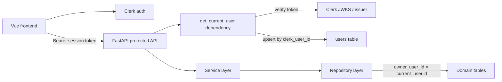
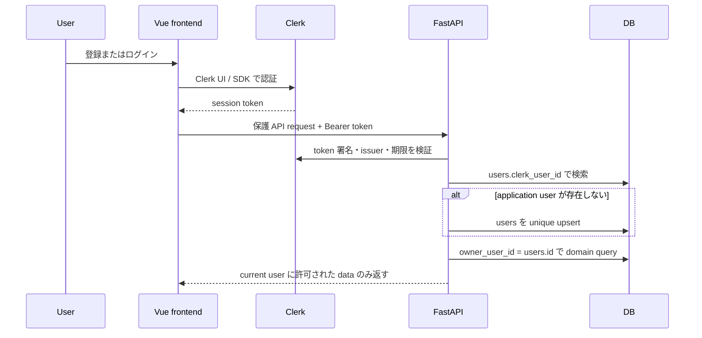
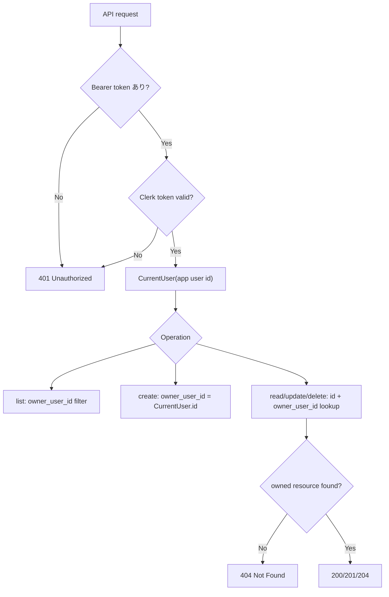

# Brief: auth-authorization-foundation

## Problem
Green Mate は今後、植物登録だけでなく水やり記録、成長写真、今日のお世話など、ユーザーごとのデータを扱う機能を追加していく。現状の API は単一ユーザー MVP として動作しており、認証済みユーザーの判定、アプリケーション内部ユーザーの管理、所有者によるデータ分離がまだ存在しない。

このまま機能追加を進めると、各 feature が個別に認証・認可を実装し、`Clerk User ID` を直接ドメインテーブルへ持ち込むリスクがある。将来の全ドメイン機能が同じ方式で「誰のデータか」を判断できる共通基盤が必要である。

## Current State
- Frontend は Vue 3 / Vite / TypeScript / Vue Router で、API client は `frontend/src/api/` に集約されている。
- Backend は FastAPI / SQLModel / SQLAlchemy Session / Alembic で、Router / Service / Repository / Database の layered architecture を採用している。
- DB は Turso/libSQL を本番想定、SQLite を local/test/CI で利用する方針である。
- 既存の `plant-registration` spec はログイン、複数ユーザー、user ownership を明示的に out of scope としている。
- 現在の `plants` table には所有者列がなく、`/plants` API は全データを単一ユーザーのように扱っている。

## Desired Outcome
- ユーザー登録、ログイン、ログアウト、セッション管理は Clerk を認証基盤として利用して提供される。
- Backend の保護 API は Clerk session token を検証し、認証できないリクエストを 401 として拒否する。
- 初回ログインまたは初回保護 API アクセス時に、Clerk user と対応する application user が `users` table に冪等に作成される。
- アプリケーション内部では `users.id` を current user として扱い、ドメインテーブルは `users.id` を所有者 FK として参照する。
- クライアントから `userId` / `ownerId` を受け取らず、所有者は必ず認証コンテキストから決定する。
- ユーザー A はユーザー B のデータを一覧、参照、更新、削除できない。
- Plant だけでなく、今後の全ドメインテーブルで再利用できる認可モデルになる。

## Approach
推奨案は **Clerk JWT 検証 + application user lazy upsert + owner-scoped repository** である。

Frontend は Clerk の Vue SDK を導入し、登録・ログイン・ログアウト・セッション状態を Clerk に委譲する。API client は Clerk session token を `Authorization: Bearer <token>` として Backend に送る。Backend は FastAPI dependency で token を検証し、Clerk の `sub` を `users.clerk_user_id` に対応付け、存在しなければ unique constraint 付き upsert で `users` を作成する。

各保護 API は `CurrentUser` を dependency として受け取り、Service / Repository へ `current_user.id` を渡す。Repository は list/get/update/delete の全 query を `owner_user_id = current_user.id` で絞り、create 時の owner は payload ではなく current user から設定する。単一リソースの他ユーザー所有データは存在を漏らさないため 404 として扱う。

Clerk webhook は必須の作成経路ではなく、プロフィール同期・削除/無効化の補助経路として使う。これにより webhook 遅延や再送があっても、初回ログイン時の application user 作成要件を満たせる。

### 比較した案

#### 案 A: Lazy upsert + webhook 補助同期（推奨）
- **仕組み**: 保護 API で Clerk token を検証し、`users.clerk_user_id` の unique upsert で application user を作成する。Webhook は email/name/deleted 状態などの同期に使う。
- **Pros**: 初回ログイン直後に user が必ず作成される。Webhook 遅延に強い。Backend の current user 取得方式が全 API で再利用しやすい。
- **Cons**: 初回保護 API 呼び出し時に DB write が発生する。Clerk profile 変更の同期は webhook か定期補正が必要。
- **Scope**: medium

#### 案 B: Webhook-first 同期
- **仕組み**: `user.created` webhook で application user を作成し、API は既存 user を参照する。
- **Pros**: 通常 API request で user 作成 write が発生しにくい。Clerk event を同期の中心にできる。
- **Cons**: 初回ログイン直後に webhook が未到達だと保護 API が失敗する可能性がある。再送・重複・順序逆転への設計が必須。
- **Scope**: medium

#### 案 C: Clerk User ID をドメインテーブルで直接参照
- **仕組み**: `plants.clerk_user_id` のように Clerk ID を各 domain table に保存する。
- **Pros**: 初期実装は単純。
- **Cons**: アプリケーション固有 user 管理を DB 側に持つ方針に反する。将来の profile、退会、共有、内部 user ID 参照へ拡張しにくい。
- **Scope**: small だが採用しない

## Scope
- **In**:
  - Clerk を利用した登録・ログイン・ログアウト・セッション管理の frontend integration
  - Backend における Clerk session token 検証
  - `users` table と application user の冪等作成
  - `CurrentUser` dependency と current user 取得方式
  - 保護 API の共通 401 handling
  - owner-scoped authorization の共通モデル
  - `plants` への最初の owner 適用と既存 Plant API の再検証
  - Clerk webhook による user profile / deletion 補助同期の設計
  - local/test/CI で認証済み・未認証・他ユーザーデータ分離を検証する方針
- **Out**:
  - Clerk 以外の認証プロバイダ選定
  - 独自 password 認証、password reset、MFA の独自実装
  - role-based access control、admin 権限、組織・共有・チーム機能
  - 画像アップロード、植物種マスタ、水やり履歴、写真ログなどの domain feature 実装
  - 全ドメインテーブルの一括移行。まず Plant を最初の適用先とし、後続 feature は同じ owner model を使う。

## Boundary Candidates
- **Auth integration boundary**: Frontend の Clerk provider、保護 route、ログイン/ログアウト UI、API client token injection。
- **Identity boundary**: Backend の token verification、Clerk subject の検証、`CurrentUser` dependency、`users` table upsert。
- **Authorization boundary**: Service / Repository に渡す `current_user.id`、owner-scoped query、404/401/403 の使い分け。
- **Domain adoption boundary**: Plant など各 domain table が `users.id` を FK として参照し、payload から owner を受け取らない実装。
- **Sync boundary**: Clerk webhook による user profile 更新、削除/無効化、再送・重複 event の冪等処理。

## Out of Boundary
- 共有植物、家族アカウント、組織、ロール、権限グループは扱わない。
- Clerk User ID をドメインテーブルへ直接保存する設計は採用しない。
- クライアント指定の `userId` / `ownerId` によるデータ作成・更新は許可しない。
- 認可漏れを防ぐための共通基盤は作るが、後続 feature 固有の business rule は各 spec が所有する。
- Clerk の詳細なダッシュボード設定手順や本番 secret 値は spec に記載しない。

## Upstream / Downstream
- **Upstream**:
  - Steering の tech 方針: Vue 3、FastAPI、SQLModel、Alembic、Turso/libSQL + SQLite 互換。
  - Backend layered architecture: Router / Service / Repository / Database。
  - Frontend API client 集約方針。
  - Clerk の session token 検証、frontend `getToken`、webhook 署名検証の公式仕様。
- **Downstream**:
  - `plant-registration` の multi-user owner scope 化。
  - 水やり履歴、今日のお世話、成長写真ログなど、ユーザー所有データを扱う全 feature。
  - 将来の account settings、退会、export、共有、admin 機能。

## Existing Spec Touchpoints
- **Extends**: なし。既存 `plant-registration` の domain requirement を直接拡張せず、認証・認可基盤として新規 spec を作る。
- **Adjacent**:
  - `plant-registration`: 最初の owner scope 適用先。`plants` に owner を追加し、list/detail/create が current user に閉じることを再検証する。
  - Plant の user-facing copy や登録項目は `plant-registration` 側の責務に残す。

## Constraints
- すべての Markdown 成果物は `spec.json.language` に合わせて日本語で記述する。
- Secret 値や Clerk signing secret は `.env` / 環境変数で扱い、steering や spec に実値を書かない。
- API JSON は camelCase、Python 内部は snake_case を維持する。
- SQLModel / Alembic migration は SQLite と Turso/libSQL の互換性を意識する。
- UUID は text として保存・検証する方針に従い、`users.id` は text UUID を推奨する。
- FastAPI Service 層は `HTTPException` を投げない。認証・認可の HTTP status mapping は dependency / Router 側で行う。

## 推奨アーキテクチャ



### 登録・初回ログイン・ユーザー作成フロー



### API 認可フロー



## DB設計

### users

| Column | Type | Constraint | Note |
| --- | --- | --- | --- |
| id | text | primary key | application user id。UUID text を推奨 |
| clerk_user_id | text | not null unique | Clerk User ID。domain table は直接参照しない |
| primary_email | text nullable | index optional | 表示・連絡用。認可判定には使わない |
| display_name | text nullable |  | Clerk profile から同期可能 |
| avatar_url | text nullable |  | 将来のプロフィール表示用 |
| status | text | not null default `active` | `active` / `deleted` / `disabled` など |
| created_at | datetime | not null | UTC |
| updated_at | datetime | not null | UTC |

### domain table 共通方針

すべてのユーザー所有 domain table は以下の列を持つ。

| Column | Type | Constraint | Note |
| --- | --- | --- | --- |
| owner_user_id | text | not null foreign key users.id | 所有者。クライアント payload からは受け取らない |
| created_at | datetime | not null | UTC |
| updated_at | datetime | not null | UTC |

推奨 index:

- `users.clerk_user_id` unique index
- 各 domain table の `(owner_user_id, id)` index
- 一覧や日付順が必要な table は `(owner_user_id, created_at)` または feature 固有の sort key index

### plants への適用案

既存の `plants` は以下を追加する。

| Column | Type | Constraint | Note |
| --- | --- | --- | --- |
| owner_user_id | text | not null foreign key users.id | current user から設定 |

Repository API は `list(owner_user_id)`, `get_by_id(owner_user_id, plant_id)`, `create(owner_user_id, plant)` のように owner を必須引数にする。将来 update/delete を追加する場合も `id + owner_user_id` で対象を取得する。

## API設計

### 認証方式

- Frontend は Clerk session token を取得し、Backend API へ `Authorization: Bearer <token>` を付与する。
- Backend は token の署名、issuer、期限、必要に応じて audience / authorized party を検証する。
- Same-origin cookie 方式ではなく Bearer token を基本にする。現在の frontend/backend 分離構成と CORS 設定に合うためである。

### current_user取得

Backend に共通 dependency を用意する。

```python
class CurrentUser(BaseModel):
    id: str
    clerk_user_id: str
    status: str

def get_current_user(...) -> CurrentUser:
    # 1. Authorization header から Bearer token を取得
    # 2. Clerk token を検証
    # 3. users.clerk_user_id で application user を upsert
    # 4. active user でなければ 401 または 403
    # 5. CurrentUser を返す
```

HTTP status の基本方針:

- token なし、無効 token、期限切れ token: 401
- 認証済みだが application user が disabled / deleted: 403 または 401。UX と監査方針に合わせ、spec 詳細化時に決定する。
- 他ユーザー所有の単一リソース参照・更新・削除: 404
- 一覧: current user 所有分のみ返す

### Endpoint 方針

| Endpoint | Auth | Owner rule |
| --- | --- | --- |
| `GET /plants` | required | `owner_user_id = current_user.id` のみ返す |
| `POST /plants` | required | request body の owner は無視し、current user を owner にする |
| `GET /plants/{plantId}` | required | `plantId + owner_user_id` で取得し、なければ 404 |
| `PATCH /plants/{plantId}` | required | `plantId + owner_user_id` で取得して更新 |
| `DELETE /plants/{plantId}` | required | `plantId + owner_user_id` で取得して削除 |
| `POST /webhooks/clerk` | Clerk webhook signature required | user profile / status を冪等同期 |

## セキュリティ上の考慮事項

- クライアントから送られた `userId` / `ownerId` は信頼しない。所有者は token 検証済みの current user からのみ決める。
- Clerk token は署名、issuer、期限を検証し、必要に応じて audience / authorized party も設定する。
- Webhook は Clerk/Svix signature を検証し、未検証 event は 400 で拒否する。
- `users.clerk_user_id` に unique constraint を置き、同一 Clerk user の重複作成を DB レベルで防ぐ。
- Lazy upsert と webhook はどちらも再実行可能にし、重複 event や並行 request で破綻しないよう transaction / unique constraint を前提にする。
- 他ユーザー所有リソースの存在確認を避けるため、単一 resource は 403 ではなく 404 を基本にする。
- CORS は許可 origin を環境変数で制御し、credential / Authorization header の扱いを検証する。
- local/test 用の認証 bypass を入れる場合は本番環境で有効化できない設定名・起動条件にする。
- 削除済み Clerk user の application data を即時物理削除するか、soft delete と保持期間を設けるかは別途 product/security 方針で決める。

## リスクとトレードオフ

- **Lazy upsert の初回 write**: 初回保護 API で user 作成が走るため、DB 障害時はログイン済みでも API 利用できない。代わりに webhook 遅延に依存しない。
- **Webhook 補助同期の二重経路**: user 作成・更新が request path と webhook path の両方から起こり得る。unique constraint と idempotent upsert を必須にする。
- **既存 Plant migration**: 既存 local DB の `plants` に owner がない。開発データを破棄するか、migration 時に一時 owner を割り当てるかを実装前に決める必要がある。
- **Turso/libSQL と SQLite の制約差**: FK、transaction、datetime、boolean の差分を smoke test で確認する必要がある。
- **Bearer token 方式**: frontend API client が token injection を担う。実装は明確だが、全 API client path で漏れなく適用する必要がある。
- **RBAC 非対応**: 今回は owner-only に絞るため、admin・共有・家族管理は後続 spec で拡張する。

## 将来の拡張方針

- 共有・家族・チーム機能が必要になったら、`resource_memberships` や `permissions` table を追加し、owner-only helper を permission evaluator へ拡張する。
- Admin 機能は current user に role claim を直接信頼させず、DB 側 role / permission と Clerk claim の整合を設計する。
- 退会、データ export、データ削除は account lifecycle spec として分ける。
- Domain repository の interface は `current_user.id` または `AuthorizationContext` を必須にし、新規 table で owner filter を忘れにくい形にする。
- 将来の machine-to-machine API や public endpoint は、user session token とは別の dependency と route tag で分離する。

## cd-sddで実装可能な縦スライスへの分割案

1. **Auth UI と API token injection**
   - Clerk Vue SDK を導入し、ログイン・登録・ログアウト・保護 route を作る。
   - 既存 API client に token injection を追加し、未ログイン時の UI state を定義する。

2. **Backend current_user と users table**
   - `users` model / migration / repository を追加する。
   - Clerk token verification と `get_current_user` dependency を実装する。
   - 初回保護 API で application user が冪等作成されることを test する。

3. **Plant API の owner scope 化**
   - `plants.owner_user_id` を追加し、create/list/get を current user scope に変更する。
   - 未認証 401、ユーザー A/B の分離、既存 Plant contract の互換性を test する。

4. **共通認可モデルの固定化**
   - Repository / Service の owner 引数規約、404 方針、更新・削除時の lookup pattern を明文化する。
   - 将来 domain table 用の helper や test fixture を用意する。

5. **Clerk webhook 補助同期**
   - `POST /webhooks/clerk` を追加し、署名検証、`user.created` / `user.updated` / `user.deleted` の冪等処理を実装する。
   - Webhook が遅延・重複しても users が重複しないことを test する。

6. **本番・CI 検証**
   - SQLite unit/integration tests と Turso/libSQL smoke を通す。
   - CORS、環境変数、secret 未設定時の failure mode、OpenAPI contract を確認する。
