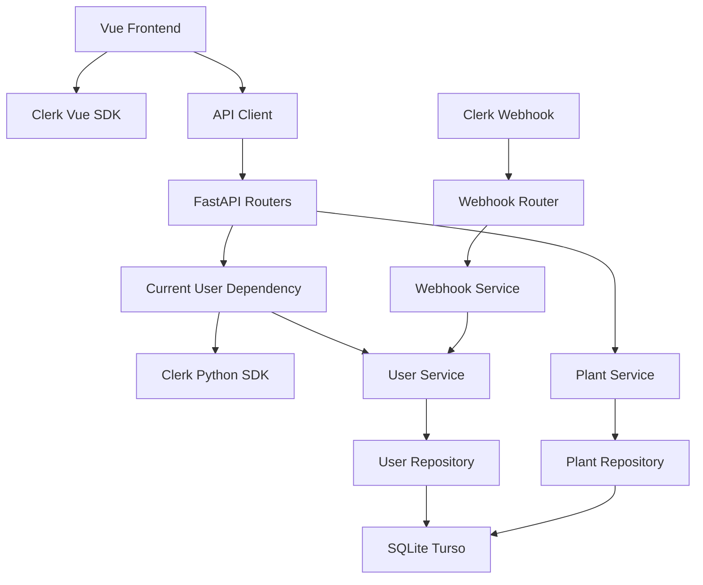
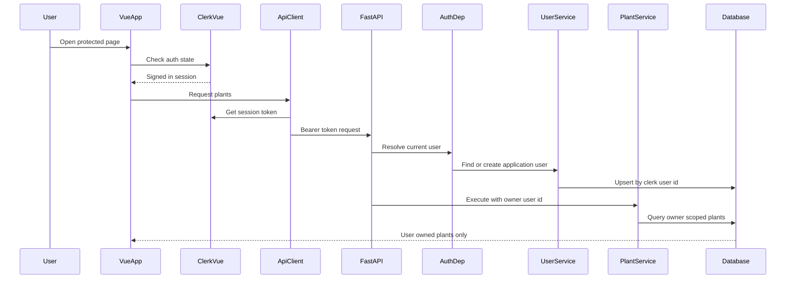
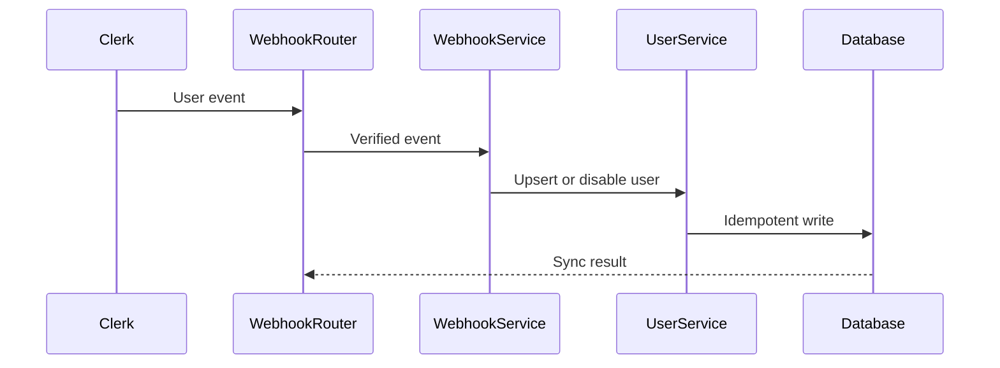
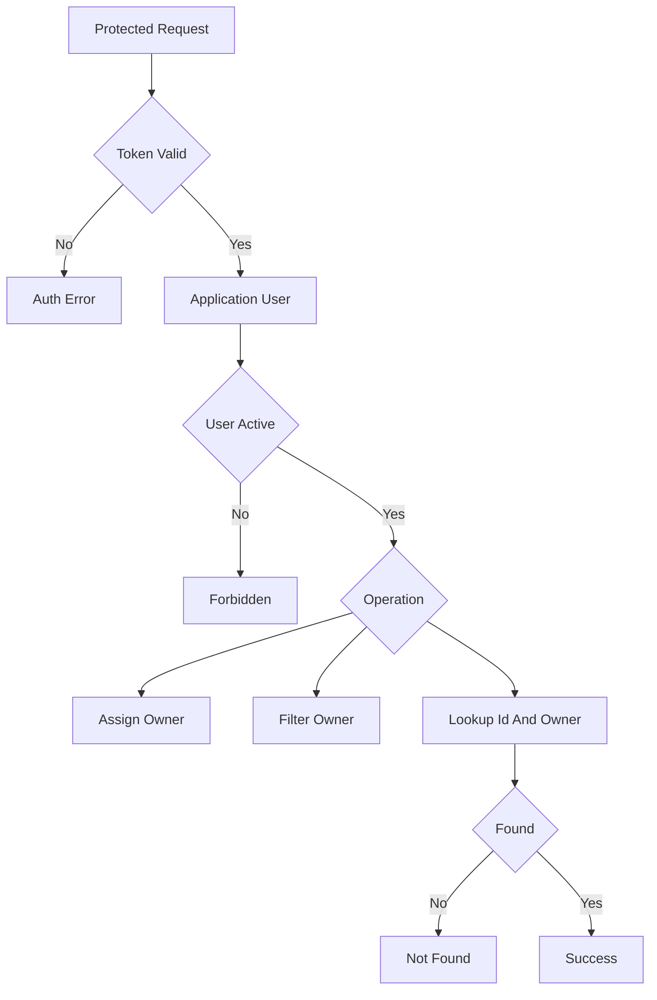
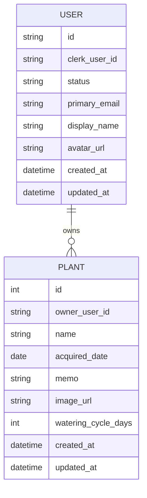
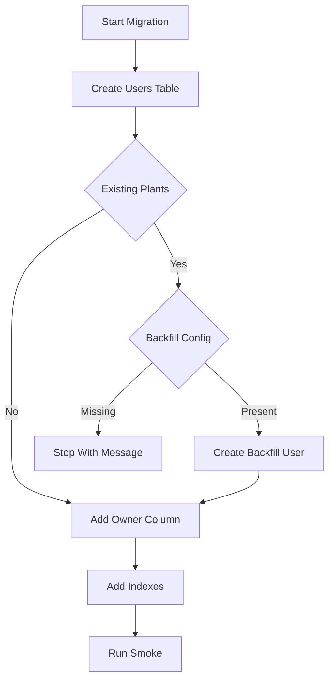

# Design Document

## Overview
Auth Authorization Foundation は、Clerk を認証基盤として利用しながら、Green Mate 内部では application user と owner scope でユーザー所有データを分離する共通基盤を提供する。既存の Plant Registration を最初の適用先にし、未認証アクセス拒否、初回 application user 作成、同一 user の重複防止、他ユーザー所有データの遮断を確認する。

この設計は Backend の Router / Service / Repository / Database レイヤーと、Frontend の route / page / composable / component / API client 分離を維持する。認証 provider 連携は新しい auth/user 境界に閉じ込め、Plant domain は current user から渡される internal user id だけを使う。

### Goals
- Clerk 認証済み session を Green Mate の `CurrentUser` へ変換し、保護 API で必須化する。
- `users.id` をアプリケーション内部の所有者識別子として使い、domain table が Clerk User ID を直接参照しないようにする。
- Plant create/list/detail を owner-scoped に変更し、他ユーザーの植物を表示・変更しない。
- Clerk webhook は user profile/status 同期の補助経路として扱い、API request path の lazy upsert と矛盾しないようにする。

### Non-Goals
- Clerk 以外の provider 抽象化、独自 password 認証、MFA、password reset の実装。
- RBAC、admin、組織、共有、家族アカウント。
- Plant 登録項目や user-facing Plant copy の変更。
- 水やり履歴、今日のお世話、成長写真ログ、画像 upload。
- 退会後のデータ保持・削除ポリシーの詳細化。

## Boundary Commitments

### This Spec Owns
- Frontend の Clerk provider 設定、認証状態 gate、ログイン・ログアウト導線、API token injection。
- Backend の Clerk session 検証、`CurrentUser` dependency、application user lazy upsert、disabled/deleted user の拒否。
- `users` table と、Clerk User ID から internal `users.id` への対応付け。
- `plants.owner_user_id` の導入と Plant API の owner-scoped create/list/detail。
- `POST /webhooks/clerk` による `user.created`, `user.updated`, `user.deleted` の署名検証済み・冪等同期。
- 認証・認可 error の API contract と frontend typed error handling。

### Out of Boundary
- domain feature 固有の business rule。Plant の入力項目や表示体験は Plant Registration が所有する。
- 共有・権限グループ・role 判定。owner-only 以外の authorization は後続 spec。
- Clerk dashboard の詳細な運用手順や secret 実値。
- 本番退会処理の物理削除・保持期間・export。
- 新しい global state store の導入。必要性が明確になるまで composable state に留める。

### Allowed Dependencies
- Clerk Vue SDK: frontend 認証 UI、session state、session token 取得。
- Clerk Python SDK: backend request authentication。FastAPI `Request` から SDK が検証できる request 形への変換は `ClerkSessionVerifier` が所有する。
- Svix Python library: Clerk webhook signature verification。
- FastAPI dependency injection, SQLModel, SQLAlchemy Session, Alembic。
- Existing Plant Registration components and API contracts, except auth/owner gate の追加。

### Revalidation Triggers
- `PlantRead` / `PlantCreate` の field shape、Plant ID 型、HTTP status semantics が変わる。
- `users.id` 型、owner column 名、owner visibility が変わる。
- `get_current_user` の dependency contract や error mapping が変わる。
- frontend API client の request signature や `ApiErrorType` が変わる。
- Clerk SDK の major update により token verification または Vue provider setup が変わる。
- migration が既存 Plant data の backfill 方針を変更する。

## Architecture

### Existing Architecture Analysis
- Backend は `routers -> services -> repositories -> models/db` の依存方向で成立している。認証 HTTP error は dependency/router 側に置き、Service は HTTP を知らない方針を維持する。
- Frontend は component から直接 `fetch` しない。API token injection も `src/api/client.ts` と composable に集約し、presentation component へ Clerk を漏らさない。
- 現在の Plant API は single-user MVP として全件 list / ID 取得を行うため、owner-aware repository への変更が必要である。
- Alembic と Turso/libSQL smoke が既にあるため、schema 変更は SQLite と Turso の両方で検証する。

### Architecture Pattern & Boundary Map
**Architecture Integration**
- Selected pattern: Hybrid cross-cutting auth boundary。auth/user は新設し、Plant は既存 layer を owner-aware に拡張する。
- Domain boundaries: Clerk は認証元、Green Mate `users` は application identity、Plant は `owner_user_id` だけを知る。
- Existing patterns preserved: FastAPI dependency、Router HTTP mapping、Service domain orchestration、Repository persistence、Vue composable state。
- New components rationale: current user と webhook は後続 domain が再利用するため、Plant から分離する。
- Steering compliance: secret は env、UUID は text、camelCase JSON、Turso/SQLite 互換 migration を維持する。



### Technology Stack

| Layer | Choice / Version | Role in Feature | Notes |
|-------|------------------|-----------------|-------|
| Frontend | Vue 3.5.x, Vue Router 4.6.x, TypeScript 6.x, `@clerk/vue` current compatible | Clerk provider、auth gate、typed API token injection | 新規 dependency は implementation 時に lockfile へ固定する |
| Backend | FastAPI 0.136.x, Pydantic 2.13.x, SQLModel 0.0.38, SQLAlchemy 2.0.50 | protected API、dependency injection、typed schemas | 既存 stack を維持 |
| Auth Provider | Clerk | sign-up/sign-in/session/user webhook | Clerk は認証基盤としてのみ使用 |
| Backend Auth SDK | `clerk-backend-api` current compatible | session token verification | FastAPI adapter は `ClerkSessionVerifier` に閉じる |
| Webhook Verification | `svix` current compatible | Clerk webhook signature verification | raw body と headers を検証 |
| Data | Turso/libSQL, SQLite local/test | `users`, `plants.owner_user_id`, migration smoke | UUID text と UTC datetime 方針を維持 |

## File Structure Plan

### Directory Structure
```text
backend/
├── alembic/versions/
│   └── 0002_create_users_and_plant_owners.py # AuthMigration
├── app/
│   ├── auth/
│   │   ├── __init__.py
│   │   ├── clerk.py                    # ClerkSessionVerifier
│   │   ├── dependencies.py             # CurrentUserDependency
│   │   ├── types.py                    # CurrentUser and auth error types
│   │   └── webhooks.py                 # WebhookVerifier
│   ├── core/
│   │   └── config.py
│   ├── models/
│   │   ├── user.py
│   │   └── plant.py
│   ├── repositories/
│   │   ├── user_repository.py          # UserRepository
│   │   └── plant_repository.py         # PlantRepository owner scope
│   ├── routers/
│   │   ├── plants.py                   # PlantRouter protected endpoints
│   │   └── webhooks.py                 # WebhookRouter
│   ├── schemas/
│   │   ├── user.py
│   │   └── plant.py
│   ├── services/
│   │   ├── user_service.py             # UserService
│   │   ├── clerk_webhook_service.py    # ClerkWebhookService
│   │   └── plant_service.py            # PlantService owner input
│   ├── scripts/
│   │   └── verify_turso_crud.py
│   └── main.py
├── requirements.txt
└── tests/
    ├── test_auth_dependencies.py
    ├── test_users.py
    ├── test_clerk_webhooks.py
    └── test_plants_api.py

frontend/
├── package.json
├── src/
│   ├── api/
│   │   ├── client.ts                   # AuthenticatedApiClient
│   │   └── plants.ts                   # PlantsApiClient
│   ├── components/
│   │   ├── auth/
│   │   │   ├── AuthGate.vue            # AuthGate
│   │   │   └── AuthHeaderControls.vue  # AuthHeaderControls
│   │   └── plants/
│   ├── composables/
│   │   ├── useAuthenticatedApi.ts      # API client composition
│   │   ├── usePlants.ts
│   │   └── usePlantDetail.ts
│   ├── types/
│   │   ├── api.ts
│   │   ├── auth.ts
│   │   └── plant.ts
│   ├── App.vue                         # Protected shell composition
│   ├── main.ts                         # ClerkAppProvider
│   └── router/index.ts                 # FrontendRouter
└── .env.example
```

### Modified Files
- `backend/app/core/config.py` — Clerk secret、authorized parties、webhook secret、legacy owner backfill 設定を追加する。
- `backend/alembic/env.py` — new `User` model metadata を import し、migration settings を継続利用する。
- `backend/app/models/plant.py` — `owner_user_id` を追加し、`users.id` を参照する。
- `backend/app/schemas/plant.py` — request/response へ owner を露出しないことを維持する。
- `backend/app/repositories/plant_repository.py` — `owner_user_id` 必須の create/list/get に変更する。
- `backend/app/services/plant_service.py` — Plant validation は維持し、owner id を use case input として受け取る。
- `backend/app/routers/plants.py` — `CurrentUser` dependency を追加し、401/403/404 mapping を明示する。
- `backend/app/main.py` — webhook router を登録し、CORS allow headers に Authorization を通すことを確認する。
- `backend/app/scripts/verify_turso_crud.py` — smoke user を作成し、owner-scoped Plant CRUD を検証する。
- `backend/tests/test_plants_api.py` — current user override と A/B user separation coverage を追加する。
- `backend/requirements.txt` — Clerk Python SDK と Svix dependency を追加する。
- `backend/.env.example` — Clerk 関連 env 名を追加する。secret 実値は記載しない。
- `frontend/src/main.ts` — `clerkPlugin` と publishable key check を追加する。
- `frontend/src/App.vue` — header に auth controls、protected content に `AuthGate` を組み込む。
- `frontend/src/router/index.ts` — route metadata で protected route を示す。実際の auth display は `AuthGate` が担う。
- `frontend/src/api/plants.ts` — common API client を利用する shape へ変更する。
- `frontend/src/composables/usePlants.ts` / `usePlantDetail.ts` — `useAuthenticatedApi` から token-aware client を受け取る。
- `frontend/src/types/plant.ts` — `ApiError` は `types/api.ts` へ移すか re-export し、owner field は追加しない。
- `frontend/package.json` / `package-lock.json` — `@clerk/vue` を追加する。

## System Flows

### Authenticated API Request


### Webhook Sync


### Owner Authorization Decision


## Requirements Traceability

| Requirement | Summary | Components | Interfaces | Flows |
|-------------|---------|------------|------------|-------|
| 1.1 | 登録手段 | ClerkAppProvider, AuthGate, AuthHeaderControls | Clerk Vue components | Authenticated API Request |
| 1.2 | ログイン手段 | ClerkAppProvider, AuthGate, AuthHeaderControls | Clerk Vue components | Authenticated API Request |
| 1.3 | 認証完了後の保護画面 | AuthGate, FrontendRouter | Auth state | Authenticated API Request |
| 1.4 | ログアウト後の非表示 | AuthHeaderControls, AuthGate | Auth state | Authenticated API Request |
| 1.5 | 認証確認中の data 非表示 | AuthGate | Auth state | Authenticated API Request |
| 1.6 | 未完了 auth の拒否 | AuthGate, AuthenticatedApiClient | ApiError auth | Owner Authorization Decision |
| 2.1 | 未認証 API 拒否 | CurrentUserDependency | HTTP 401 | Owner Authorization Decision |
| 2.2 | 無効認証 API 拒否 | ClerkSessionVerifier, CurrentUserDependency | HTTP 401 | Owner Authorization Decision |
| 2.3 | 有効認証を user 操作として処理 | CurrentUserDependency, UserService | CurrentUser | Authenticated API Request |
| 2.4 | user data API を保護 | PlantRouter, WebhookRouter | Protected route dependency | Owner Authorization Decision |
| 2.5 | 公開 API が user data を返さない | PlantRouter, WebhookRouter | Route policy | Owner Authorization Decision |
| 3.1 | 初回 application user 作成 | UserService, UserRepository | upsert user | Authenticated API Request |
| 3.2 | 既存 user 再利用 | UserService, UserRepository | upsert user | Authenticated API Request |
| 3.3 | 重複作成防止 | UserRepository, UserService | unique clerk_user_id | Authenticated API Request |
| 3.4 | Clerk ID を owner にしない | UserService, PlantOwnerScope | users.id FK | Owner Authorization Decision |
| 3.5 | internal user id を owner にする | CurrentUser, PlantService | owner_user_id | Owner Authorization Decision |
| 3.6 | disabled user 拒否 | CurrentUserDependency, UserService | HTTP 403 | Owner Authorization Decision |
| 4.1 | create owner 決定 | PlantRouter, PlantService | owner_user_id input | Owner Authorization Decision |
| 4.2 | request user id を owner に使わない | PlantOwnerScope, PlantService | no owner request field | Owner Authorization Decision |
| 4.3 | 全 user data owner | PlantOwnerScope, AuthMigration | owner_user_id not null | Owner Authorization Decision |
| 4.4 | current user 決定 | CurrentUserDependency | CurrentUser | Authenticated API Request |
| 4.5 | current user 不明時は data 操作しない | CurrentUserDependency, PlantRouter | HTTP 401 | Owner Authorization Decision |
| 5.1 | owner list | PlantRepository, PlantsApiClient | GET plants | Authenticated API Request |
| 5.2 | own detail | PlantRepository, PlantService | GET plant | Owner Authorization Decision |
| 5.3 | other detail 非表示 | PlantRepository, PlantRouter | HTTP 404 | Owner Authorization Decision |
| 5.4 | own update delete pattern | PlantOwnerScope | Service contract | Owner Authorization Decision |
| 5.5 | other update delete 不許可 | PlantOwnerScope | Service contract | Owner Authorization Decision |
| 5.6 | 複数 user 分離 | PlantRepository, User table | owner scoped query | Owner Authorization Decision |
| 6.1 | Plant create owner | PlantRouter, PlantService | POST plants | Authenticated API Request |
| 6.2 | Plant list owner | PlantRepository, PlantList | GET plants | Authenticated API Request |
| 6.3 | own detail 表示 | PlantRepository, PlantDetail | GET plant | Owner Authorization Decision |
| 6.4 | other detail 非表示 | PlantRepository, PlantDetail | HTTP 404 | Owner Authorization Decision |
| 6.5 | own empty state | PlantList, usePlants | empty list | Authenticated API Request |
| 6.6 | Plant contract 維持 | Plant schema, Plant components | PlantRead | Authenticated API Request |
| 6.7 | out of scope 維持 | Router policy | no extra endpoints | Owner Authorization Decision |
| 7.1 | user create update event | WebhookRouter, ClerkWebhookService | Clerk event | Webhook Sync |
| 7.2 | webhook duplicate 防止 | ClerkWebhookService, UserRepository | idempotent upsert | Webhook Sync |
| 7.3 | unverifiable event 拒否 | WebhookVerifier, WebhookRouter | HTTP 400 | Webhook Sync |
| 7.4 | user deleted disabled | ClerkWebhookService, UserService | status update | Webhook Sync |
| 7.5 | webhook 未到達でも API upsert | CurrentUserDependency, UserService | lazy upsert | Authenticated API Request |
| 8.1 | session invalid during operation | AuthenticatedApiClient, CurrentUserDependency | ApiError auth | Owner Authorization Decision |
| 8.2 | auth error を成功扱いしない | AuthenticatedApiClient, usePlants, usePlantDetail | typed error | Authenticated API Request |
| 8.3 | temporary auth failure の安全停止 | CurrentUserDependency, AuthenticatedApiClient | fail closed | Owner Authorization Decision |
| 8.4 | unverifiable access 拒否 | ClerkSessionVerifier, WebhookVerifier | 401 or 400 | Owner Authorization Decision |
| 8.5 | secret-safe error | AuthenticatedApiClient, CurrentUserDependency, WebhookRouter | sanitized messages | Owner Authorization Decision |

## Components and Interfaces

| Component | Domain/Layer | Intent | Req Coverage | Key Dependencies | Contracts |
|-----------|--------------|--------|--------------|------------------|-----------|
| ClerkAppProvider | Frontend Auth | Clerk session context を Vue app に提供 | 1.1-1.5 | Clerk Vue P0 | State |
| FrontendRouter | Frontend Routing | protected route metadata と Plant route を保持 | 1.3, 2.5 | AuthGate P0 | State |
| AuthGate | Frontend Auth | Protected content の loading/signed-out/signed-in 分岐 | 1.3-1.6, 8.1 | ClerkAppProvider P0 | State |
| AuthHeaderControls | Frontend Auth | login/logout/user button を header に表示 | 1.1, 1.2, 1.4 | Clerk Vue P0 | State |
| AuthenticatedApiClient | Frontend API | token-aware fetch と typed error mapping | 2.1-2.3, 8.1-8.5 | Clerk Vue P0, Fetch P0 | Service |
| PlantsApiClient | Frontend API | Plant API contract を保持 | 5.1-5.3, 6.1-6.6 | AuthenticatedApiClient P0 | API |
| CurrentUserDependency | Backend Auth | protected API request を `CurrentUser` に変換 | 2.1-2.4, 3.1-4.5, 8.1-8.4 | ClerkSessionVerifier P0, UserService P0 | Service |
| ClerkSessionVerifier | Backend Auth | Clerk session token を検証し claims を返す | 2.1-2.3, 4.4, 8.4 | Clerk Python SDK P0 | Service |
| UserService | Backend Identity | application user の upsert/status 判定 | 3.1-3.6, 7.1-7.5 | UserRepository P0 | Service |
| UserRepository | Backend Data | `users` persistence と unique lookup | 3.1-3.6, 7.1-7.5 | SQLModel Session P0 | Service |
| WebhookVerifier | Backend Auth | Clerk webhook signature を検証 | 7.3, 8.4 | Svix P0 | Service |
| WebhookRouter | Backend API | Clerk webhook endpoint と HTTP mapping | 7.1-7.4, 8.4 | WebhookVerifier P0 | API |
| ClerkWebhookService | Backend Identity | user events を idempotent に反映 | 7.1-7.5 | UserService P0 | Event |
| PlantOwnerScope | Backend Domain | Plant create/list/detail の owner enforcement | 4.1-6.7 | CurrentUser P0, PlantRepository P0 | Service, API |
| AuthMigration | Data Migration | users table と plant owner schema を導入 | 3.3-4.3, 6.1 | Alembic P0 | Batch |

### Frontend Auth and API

#### ClerkAppProvider

| Field | Detail |
|-------|--------|
| Intent | Clerk session context を Vue app 全体へ提供する |
| Requirements | 1.1, 1.2, 1.3, 1.4, 1.5 |

**Responsibilities & Constraints**
- `VITE_CLERK_PUBLISHABLE_KEY` がない場合は app startup を失敗させる。
- Clerk の session state を `AuthGate`, `AuthHeaderControls`, `useAuthenticatedApi` へ提供する。
- secret key は frontend に置かない。

**Dependencies**
- External: `@clerk/vue` — Vue plugin and auth components (P0)
- Inbound: `frontend/src/main.ts` — app bootstrap (P0)

**Contracts**: Service [ ] / API [ ] / Event [ ] / Batch [ ] / State [x]

##### State Management
- State model: Clerk SDK の `isLoaded`, `isSignedIn`, `sessionId`, `getToken`。
- Persistence & consistency: Clerk SDK の session management に委譲する。
- Concurrency strategy: auth state 未ロード時は protected data を表示しない。

**Implementation Notes**
- Integration: `createApp(App).use(clerkPlugin, { publishableKey })` の後に router を use する。
- Validation: publishable key 未設定時の build/runtime failure を明確にする。
- Risks: key 未設定の local dev で全画面が起動しないため `.env.example` と README 更新が必要。

#### AuthGate

| Field | Detail |
|-------|--------|
| Intent | protected page の loading, signed-out, signed-in 表示を一箇所に閉じる |
| Requirements | 1.3, 1.5, 1.6, 8.1 |

**Responsibilities & Constraints**
- `isLoaded=false` の間は Plant data を描画しない。
- signed-out のときは Green Mate の文言に合う案内と Clerk sign-in/sign-up 導線を表示する。
- signed-in のときだけ `RouterView` の protected content を表示する。

**Dependencies**
- Inbound: `App.vue` — route content wrapper (P0)
- External: Clerk Vue `useAuth`, sign-in components (P0)

**Contracts**: Service [ ] / API [ ] / Event [ ] / Batch [ ] / State [x]

##### State Management
- State model: `loading | signedOut | signedIn` の表示状態。
- Persistence & consistency: domain state は持たない。
- Concurrency strategy: session 変化時に signed-out 表示へ戻し、child components の API request は token-aware client で失敗させる。

#### AuthenticatedApiClient

| Field | Detail |
|-------|--------|
| Intent | API request に session token を付与し、auth error を型付きで返す |
| Requirements | 2.1, 2.2, 2.3, 8.1, 8.2, 8.3, 8.5 |

**Responsibilities & Constraints**
- request ごとに `getToken()` で token を取得し、存在する場合だけ `Authorization: Bearer` を付与する。
- 401 を `auth`、403 を `forbidden`、404 を `not_found`、422 を `validation` に分類する。
- response body の内部詳細や secret を user-facing message に出さない。

**Dependencies**
- Inbound: `useAuthenticatedApi`, feature API clients (P0)
- External: Browser `fetch` (P0)
- External: Clerk `getToken` (P0)

**Contracts**: Service [x] / API [ ] / Event [ ] / Batch [ ] / State [ ]

##### Service Interface
```typescript
export type ApiErrorType =
  | 'validation'
  | 'not_found'
  | 'network'
  | 'server'
  | 'auth'
  | 'forbidden'

export interface ApiError extends Error {
  type: ApiErrorType
  fieldErrors?: Record<string, string>
}

export interface AuthenticatedApiClient {
  request<TResponse>(path: string, init?: RequestInit): Promise<TResponse>
}

export type SessionTokenProvider = () => Promise<string | null>
```
- Preconditions: `SessionTokenProvider` は Clerk auth state から生成される。
- Postconditions: success response は typed JSON として返る。auth failure は `ApiError` として throw される。
- Invariants: component は直接 `fetch` しない。

### Backend Auth and Identity

#### ClerkSessionVerifier

| Field | Detail |
|-------|--------|
| Intent | Clerk session token を検証し、Clerk user subject を抽出する |
| Requirements | 2.1, 2.2, 2.3, 4.4, 8.4 |

**Responsibilities & Constraints**
- Authorization header から Bearer token を受け取り、Clerk SDK で署名、期限、authorized party を検証する。
- FastAPI/Starlette `Request` と Clerk Python SDK の request authentication の差分はこの adapter が吸収する。
- token payload から `sub` が取れない場合は認証失敗として扱う。

**Dependencies**
- Inbound: CurrentUserDependency — request verification (P0)
- External: Clerk Python SDK — session verification (P0)
- Outbound: Settings — secret key and authorized parties (P0)

**Contracts**: Service [x] / API [ ] / Event [ ] / Batch [ ] / State [ ]

##### Service Interface
```python
class ClerkSessionClaims(BaseModel):
    clerk_user_id: str
    email: str | None = None
    display_name: str | None = None
    avatar_url: str | None = None

class ClerkSessionVerifier(Protocol):
    def verify_request(self, request: Request) -> ClerkSessionClaims:
        ...
```
- Preconditions: `CLERK_SECRET_KEY` と authorized parties が設定されている。
- Postconditions: valid token は `clerk_user_id` を返す。
- Invariants: invalid/missing token は fail closed で扱う。

#### CurrentUserDependency

| Field | Detail |
|-------|--------|
| Intent | protected router に `CurrentUser` を注入する |
| Requirements | 2.1, 2.2, 2.3, 2.4, 3.1, 3.2, 3.6, 4.4, 4.5, 8.1, 8.3 |

**Responsibilities & Constraints**
- Clerk claims を `UserService.get_or_create_from_clerk` へ渡して application user を取得する。
- `status != active` は 403 として拒否する。
- 認証失敗は 401 として拒否する。
- Service/Repository layer に `HTTPException` を漏らさない。

**Dependencies**
- Inbound: PlantRouter and future protected routers (P0)
- Outbound: ClerkSessionVerifier (P0)
- Outbound: UserService (P0)
- Outbound: SQLModel Session dependency (P0)

**Contracts**: Service [x] / API [ ] / Event [ ] / Batch [ ] / State [ ]

##### Service Interface
```python
class CurrentUser(BaseModel):
    id: str
    clerk_user_id: str
    status: Literal["active", "disabled", "deleted"]

def get_current_user(request: Request, session: Session) -> CurrentUser:
    ...
```
- Preconditions: request has valid Clerk session token.
- Postconditions: active application user is returned or request is rejected.
- Invariants: returned `id` is the only owner id accepted by domain services.

#### UserService and UserRepository

| Field | Detail |
|-------|--------|
| Intent | application user lifecycle を管理する |
| Requirements | 3.1, 3.2, 3.3, 3.4, 3.5, 3.6, 7.1, 7.2, 7.4, 7.5 |

**Responsibilities & Constraints**
- `clerk_user_id` unique key で idempotent upsert する。
- new user id は UUID text として application 側で生成する。
- profile fields は認可判定に使わない。
- deleted/disabled user は protected operation を実行できない状態にする。

**Dependencies**
- Inbound: CurrentUserDependency, ClerkWebhookService (P0)
- Outbound: UserRepository (P0)
- Outbound: SQLModel Session (P0)

**Contracts**: Service [x] / API [ ] / Event [ ] / Batch [ ] / State [x]

##### Service Interface
```python
UserStatus = Literal["active", "disabled", "deleted"]

class UserProfileInput(BaseModel):
    clerk_user_id: str
    primary_email: str | None = None
    display_name: str | None = None
    avatar_url: str | None = None

class UserService:
    def get_or_create_from_clerk(self, profile: UserProfileInput) -> User:
        ...

    def sync_from_clerk_event(self, profile: UserProfileInput) -> User:
        ...

    def mark_deleted(self, clerk_user_id: str) -> User | None:
        ...
```
- Preconditions: `clerk_user_id` is verified by auth dependency or webhook verifier.
- Postconditions: at most one `users` row exists per `clerk_user_id`.
- Invariants: domain tables reference `users.id`, never `clerk_user_id`.

### Backend Webhooks

#### WebhookVerifier

| Field | Detail |
|-------|--------|
| Intent | Clerk webhook の署名を検証し、未検証 event を service に渡さない |
| Requirements | 7.3, 8.4, 8.5 |

**Responsibilities & Constraints**
- FastAPI `Request` から raw body と Svix headers を取得し、`CLERK_WEBHOOK_SECRET` で検証する。
- 検証済み event だけを typed webhook event として `ClerkWebhookService` へ渡せる形にする。
- signature failure、timestamp failure、malformed payload は 400 へ mapping できる verifier error として返す。

**Dependencies**
- Inbound: WebhookRouter — verifies incoming webhook (P0)
- External: Svix Python library — signature verification (P0)
- Outbound: Settings — webhook signing secret (P0)

**Contracts**: Service [x] / API [ ] / Event [x] / Batch [ ] / State [ ]

##### Service Interface
```python
class ClerkWebhookEvent(BaseModel):
    event_id: str
    event_type: Literal["user.created", "user.updated", "user.deleted"]
    clerk_user_id: str
    primary_email: str | None = None
    display_name: str | None = None
    avatar_url: str | None = None

class WebhookVerifier(Protocol):
    async def verify(self, request: Request) -> ClerkWebhookEvent:
        ...
```
- Preconditions: request body is unmodified raw payload from Clerk.
- Postconditions: only verified events reach `ClerkWebhookService`.
- Invariants: raw payload and secrets are not logged.

#### WebhookRouter and ClerkWebhookService

| Field | Detail |
|-------|--------|
| Intent | Clerk user events を署名検証し、application user state へ反映する |
| Requirements | 7.1, 7.2, 7.3, 7.4, 7.5, 8.4, 8.5 |

**Responsibilities & Constraints**
- `POST /webhooks/clerk` は raw body と headers を使って署名検証する。
- `user.created` / `user.updated` は user profile を upsert する。
- `user.deleted` は user を `deleted` にする。物理削除は行わない。
- duplicate event は unique key と idempotent service で安全に処理する。
- unverifiable event は 400 とし、user state を変更しない。

**Dependencies**
- Inbound: Clerk webhook delivery (P0)
- External: Svix Python library (P0)
- Outbound: UserService (P0)

**Contracts**: Service [ ] / API [x] / Event [x] / Batch [ ] / State [ ]

##### API Contract
| Method | Endpoint | Request | Response | Errors |
|--------|----------|---------|----------|--------|
| POST | `/webhooks/clerk` | raw JSON body plus Svix headers | `{"received": true}` | 400 invalid signature, 500 unexpected failure |

##### Event Contract
- Subscribed events: `user.created`, `user.updated`, `user.deleted`
- Payload source: Clerk user event payload after signature verification
- Ordering / delivery guarantees: webhook may retry or arrive after API lazy upsert; service must be idempotent.

### Plant Owner Scope

#### PlantOwnerScope

| Field | Detail |
|-------|--------|
| Intent | Plant API を current user ownership に閉じる |
| Requirements | 4.1, 4.2, 4.3, 5.1, 5.2, 5.3, 5.6, 6.1, 6.2, 6.3, 6.4, 6.5, 6.6, 6.7 |

**Responsibilities & Constraints**
- `PlantCreate` request には owner field を持たせない。
- Router が `CurrentUser.id` を service へ渡し、service/repository が owner id を必須引数にする。
- detail lookup は `plant_id + owner_user_id` で行い、見つからなければ既存と同じ not found outcome にする。
- `PlantRead` は owner を返さない。
- update/delete はこの spec で endpoint を新設しないが、owner lookup pattern を設計 contract として固定する。

**Dependencies**
- Inbound: PlantRouter, future Plant update/delete flows (P0)
- Outbound: CurrentUserDependency (P0)
- Outbound: PlantRepository (P0)

**Contracts**: Service [x] / API [x] / Event [ ] / Batch [ ] / State [ ]

##### Service Interface
```python
class PlantService:
    def create_plant(self, owner_user_id: str, payload: PlantCreate) -> PlantRead:
        ...

    def list_plants(self, owner_user_id: str) -> list[PlantRead]:
        ...

    def get_plant(self, owner_user_id: str, plant_id: int) -> PlantRead:
        ...
```
- Preconditions: `owner_user_id` came from `CurrentUser.id`.
- Postconditions: created/read/listed plants belong to `owner_user_id`.
- Invariants: repository methods never return plants without owner filter.

##### API Contract
| Method | Endpoint | Request | Response | Errors |
|--------|----------|---------|----------|--------|
| GET | `/plants` | Authorization header | `PlantRead[]` | 401, 403, 500 |
| POST | `/plants` | Authorization header + `PlantCreate` | `PlantRead` | 401, 403, 422, 500 |
| GET | `/plants/{plant_id}` | Authorization header | `PlantRead` | 401, 403, 404, 500 |

## Data Models

### Domain Model


- Aggregate boundaries: User identity は auth/user 境界が所有する。Plant は Plant domain が所有し、owner id は authorization invariant として参照する。
- Business rules: every user-owned row has exactly one `owner_user_id`; owner is set by auth context only.
- Domain events: Clerk user events are external events consumed by webhook service; Green Mate domain events are not introduced.

### Logical Data Model

**Structure Definition**
- `users.id`: UUID text primary key.
- `users.clerk_user_id`: unique, not null; Clerk subject の対応付け。
- `users.status`: `active | disabled | deleted`。
- `plants.owner_user_id`: not null FK to `users.id`。
- `plants` existing fields remain unchanged for API consumers.

**Consistency & Integrity**
- User lazy upsert and Plant create run in the same request transaction scope where practical.
- `users.clerk_user_id` unique constraint is the concurrency guard for duplicate first access and webhook retries.
- Plant owner lookup always filters by `owner_user_id` and resource id.
- Deleted/disabled users are not cascaded to physical Plant deletion in this spec.

### Physical Data Model

| Table | Column | Type | Constraint | Notes |
|-------|--------|------|------------|-------|
| users | id | TEXT | primary key | UUID text |
| users | clerk_user_id | TEXT | not null unique | Clerk user subject |
| users | primary_email | TEXT | nullable | display/contact only |
| users | display_name | TEXT | nullable | display only |
| users | avatar_url | TEXT | nullable | display only |
| users | status | TEXT | not null default active | check active disabled deleted |
| users | created_at | DATETIME | not null | UTC |
| users | updated_at | DATETIME | not null | UTC |
| plants | owner_user_id | TEXT | not null FK users.id | owner scope |

Indexes:
- `ux_users_clerk_user_id` on `users.clerk_user_id`
- `ix_plants_owner_user_id_id` on `plants.owner_user_id, plants.id`
- keep `ix_plants_name` unless design review of Plant Registration changes it.

### Data Contracts & Integration

**API Data Transfer**
- `PlantCreate` remains unchanged and does not include owner fields.
- `PlantRead` remains unchanged and does not include owner fields.
- `ApiError` adds auth classifications but does not expose internal verifier messages.

**Event Schemas**
- Clerk event payloads are accepted only after signature verification.
- Green Mate stores only fields needed by this feature: Clerk user id, primary email, display name, avatar URL, status.

## Error Handling

### Error Strategy
- Authentication failures fail closed before domain service execution.
- Authorization failures for disabled/deleted active session users return 403.
- Other-user resource access returns 404 to avoid existence disclosure.
- Webhook signature failures return 400 and never call UserService.
- Frontend treats auth/forbidden errors as protected operation failures, not as successful empty data.

### Error Categories and Responses
| Category | Backend response | Frontend behavior |
|----------|------------------|-------------------|
| Missing or invalid token | 401 | show sign-in or session-expired guidance |
| Disabled or deleted application user | 403 | show access unavailable message |
| Other user resource | 404 | existing not-found detail behavior |
| Plant validation | 422 | existing validation message path |
| Webhook verification failure | 400 | no user-facing UI |
| Unexpected auth provider failure | 401 or 500 based on verifier outcome | do not update local data as success |

### Monitoring
- Log auth failures at warning level without token, secret, or raw webhook body.
- Log webhook event type and Clerk user id after verification.
- Smoke scripts report auth/owner verification failure as blocking.

## Testing Strategy

### Unit Tests
- `UserService.get_or_create_from_clerk` creates once and reuses existing user for 3.1, 3.2, 3.3.
- `UserService.mark_deleted` blocks future protected operations through status for 3.6 and 7.4.
- `ClerkSessionVerifier` adapter maps missing/invalid token to auth error for 2.1, 2.2, 8.4 using mocked SDK.
- `PlantService` rejects ownerless calls at type/interface boundary by requiring `owner_user_id` for 4.1, 4.5.
- `AuthenticatedApiClient` maps 401/403/404/422 to discriminated `ApiErrorType` for 8.1, 8.2, 8.5.

### Integration Tests
- `GET /plants` without auth returns 401 and does not call PlantService for 2.1.
- Valid mocked current user creates an application user and Plant with owner for 2.3, 3.1, 4.1, 6.1.
- User A and User B list/detail tests prove owner separation for 5.1, 5.3, 5.6, 6.2, 6.4.
- Disabled user dependency returns 403 for 3.6 and 8.3.
- `POST /webhooks/clerk` rejects invalid signature and accepts duplicate valid user events idempotently for 7.2, 7.3.

### E2E/UI Checks
- Signed-out `/plants` view shows auth prompt and no Plant list for 1.5, 1.6.
- Signed-in user can load own empty state, create Plant, and navigate to detail for 1.3, 6.1, 6.3, 6.5.
- Logout hides protected Plant data and returns to signed-out state for 1.4.
- Session-expired API response does not leave stale create/list success state for 8.1, 8.2.

### Performance and Smoke
- Local SQLite migration + owner-scoped CRUD smoke.
- Turso/libSQL migration + user upsert + owner-scoped Plant CRUD smoke.
- Webhook duplicate delivery test proves unique constraint and idempotent service behavior.
- Frontend `npm run build` verifies Clerk types and no TypeScript `any`.

## Security Considerations

- Client-supplied `userId` or `ownerId` is ignored because no request schema accepts owner data.
- Bearer token is verified server-side; frontend auth state alone is never trusted.
- Authorized parties are configured to limit accepted frontend origins.
- Clerk secret key and webhook signing secret live only in backend env.
- Publishable key is frontend env only and not treated as secret.
- `users.clerk_user_id` is unique; domain FK points to `users.id`.
- Webhook raw payload is verified before parsing into trusted user profile input.
- Logs must not include tokens, secret values, raw signature secrets, or full webhook bodies.

## Performance & Scalability

- `users.clerk_user_id` unique index keeps lazy upsert lookup bounded.
- `plants.owner_user_id, plants.id` index supports detail lookup and prevents owner-scoped scans by id.
- Current scope does not introduce cache. Token verification may use SDK/JWKS caching behavior; custom caching is deferred unless profiling shows a bottleneck.
- Webhook processing is synchronous for current scale; queueing is deferred because requirements only need idempotent state sync.

## Migration Strategy



- Migration creates `users` before `plants.owner_user_id`.
- If existing `plants` rows exist, migration requires explicit backfill config that maps legacy rows to a real application user. Without it, migration stops rather than creating ownerless data.
- New Plant writes after migration always require current user.
- Rollback drops owner index/column and `users` only in development contexts where data loss is acceptable; production rollback requires separate review.
- Smoke validation must run for local SQLite and Turso/libSQL before implementation completion.

## Supporting References
- Clerk Vue quickstart: `clerkPlugin` requires `VITE_CLERK_PUBLISHABLE_KEY`; `SignedIn`, `SignedOut`, `SignInButton`, `UserButton`, `useAuth` provide UI/session integration.
- Clerk Python SDK request authentication: `clerk_backend_api` provides request authentication with secret key and authorized parties.
- Clerk webhook syncing docs: `user.created`, `user.updated`, `user.deleted` are the relevant user sync events; webhook requests must be verified before processing.
- FastAPI dependency and raw body docs: auth dependency injection and raw body access support protected routes and webhook verification.
- Svix webhook library docs: Python package supports webhook signature verification; implementation must use raw body and headers.
