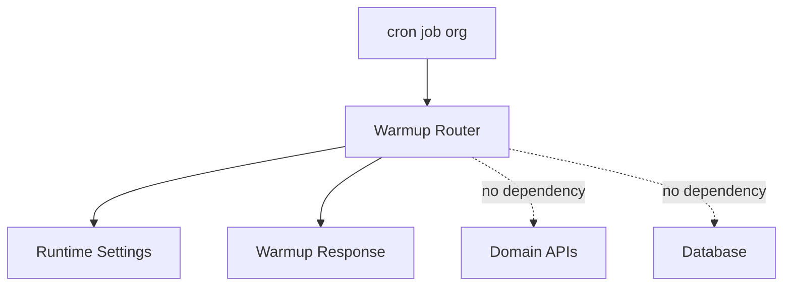
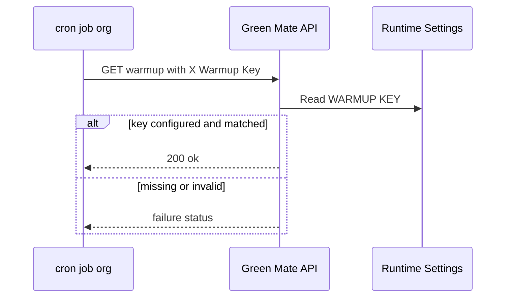

# Design Document

## Overview

この feature は、Render 上の Green Mate API が利用想定時間帯にスリープしにくい状態を保つため、cron-job.org から呼び出せる warmup 専用 endpoint を提供する。対象ユーザーは運用者と開発者であり、サービス主要機能ではなく、補助的な運用機能として扱う。

変更は backend の公開 HTTP endpoint、runtime secret 設定、運用ドキュメント、最小限の API/config テストに限定する。warmup はアプリケーションプロセスの応答可能性だけを示し、業務データ、DB、Clerk 認証、通常 service/repository には接続しない。

### Goals
- cron-job.org から `X-Warmup-Key` 付きで呼び出せる軽量 endpoint を追加する。
- 固定キーの欠落・不一致時は fail closed で成功扱いにしない。
- cron-job.org の `Asia/Tokyo` スケジュールとトラブルシュート方針を運用ドキュメントに残す。

### Non-Goals
- Cloudflare Workers Cron Trigger の構築。
- cron-job.org REST API を使ったジョブ自動作成。
- DB、Turso/libSQL、Clerk、植物・写真・水やり domain の死活確認。
- 複雑なリトライ、フォールバック、専用監視基盤。

## Boundary Commitments

### This Spec Owns
- `GET /warmup` の API contract。
- `X-Warmup-Key` ヘッダーと `WARMUP_KEY` runtime secret の一致検証。
- warmup 成功・失敗時の応答 shape と status code。
- cron-job.org での warmup ジョブ設定手順。
- warmup endpoint と runtime config の最小テスト。

### Out of Boundary
- ユーザー所有データの認証・認可、owner scope、domain data の読み書き。
- database session、repository、service layer を使った health check。
- cron-job.org account API key の管理、自動ジョブ作成 script、外部通知設定の実装。
- Render plan、Render health check、deployment platform の変更。

### Allowed Dependencies
- `app.core.config.Settings` と `get_settings`。
- FastAPI router、Header dependency、HTTP status response。
- Python standard library の constant-time string comparison。
- cron-job.org の HTTP request scheduling、request headers、execution history、notification settings。
- 既存 pytest / FastAPI `TestClient` テスト基盤。

### Revalidation Triggers
- endpoint path、method、header 名、response status、response body を変更する場合。
- `WARMUP_KEY` の設定名、secret の扱い、未設定時の挙動を変更する場合。
- warmup endpoint が DB、Clerk、domain service、外部 API に依存するようになる場合。
- cron-job.org 以外の scheduler を追加する場合。
- 運用時間帯や timezone を変更する場合。

## Architecture

### Existing Architecture Analysis
- backend は `app/routers/*.py` の router を `app/main.py` で include する。
- runtime settings は `app/core/config.py` の `Settings` に集約し、secret 類は `SecretStr` として扱う。
- ユーザー所有データの API は `get_current_user` と DB session を使うが、この feature はユーザー所有データを扱わないため、その境界に入らない。

### Architecture Pattern & Boundary Map



**Architecture Integration**:
- Selected pattern: Router-only operational endpoint。
- Domain/feature boundaries: warmup は HTTP 境界と runtime secret 検証だけを持ち、domain use case を持たない。
- Existing patterns preserved: router は `app/routers/`、runtime config は `app/core/config.py`、テストは `backend/tests/`。
- New components rationale: warmup 専用 router と運用ドキュメントだけで要件を満たせる。
- Steering compliance: secret は環境変数で扱い、ユーザー所有データ API の認証・認可境界には触れない。

### Technology Stack

| Layer | Choice / Version | Role in Feature | Notes |
|-------|------------------|-----------------|-------|
| Backend | FastAPI, Pydantic Settings | warmup endpoint と runtime secret 設定 | 既存 stack を継続 |
| Infrastructure / Runtime | Render, cron-job.org | backend hosting と外部 HTTP schedule | cron-job.org は手動設定、API 自動化なし |
| Testing | pytest, FastAPI TestClient | endpoint と config の検証 | 既存テスト基盤を利用 |

## File Structure Plan

### Directory Structure

```text
backend/
├── app/
│   ├── core/
│   │   └── config.py              # WARMUP_KEY secret 設定と値取得 property
│   ├── routers/
│   │   └── warmup.py              # GET /warmup と X-Warmup-Key 検証
│   └── main.py                    # warmup router の include
├── tests/
│   ├── test_runtime_config.py     # WARMUP_KEY と .env.example の設定検証を追加
│   └── test_warmup_api.py         # warmup 成功・失敗・副作用なし応答の API テスト
└── .env.example                   # WARMUP_KEY の設定例

docs/
└── operations/
    └── backend-warmup.md          # cron-job.org の設定とトラブルシュート
```

### Modified Files
- `backend/app/core/config.py` — `warmup_key: SecretStr | None` と `warmup_key_value` property を追加する。
- `backend/app/main.py` — `warmup_router` を include する。
- `backend/.env.example` — `WARMUP_KEY=` を追加する。
- `backend/tests/test_runtime_config.py` — secret 読み取り、repr masking、`.env.example` 記載を検証する。

### New Files
- `backend/app/routers/warmup.py` — warmup endpoint の HTTP contract と固定キー検証を担当する。
- `backend/tests/test_warmup_api.py` — `GET /warmup` の成功、ヘッダー欠落、不一致、secret 未設定を検証する。
- `docs/operations/backend-warmup.md` — cron-job.org の URL、method、header、timezone、schedule、確認手順を記載する。

## System Flows



Key decisions:
- 成功 path は DB、Clerk、domain service を呼ばない。
- 失敗 path も secret 実値や検証詳細を返さない。

## Requirements Traceability

| Requirement | Summary | Components | Interfaces | Flows |
|-------------|---------|------------|------------|-------|
| 1.1 | 正しいヘッダー付き warmup を受け付ける | Warmup Router, Runtime Settings | `GET /warmup`, `X-Warmup-Key` | Warmup sequence |
| 1.2 | 成功判定できる応答を返す | Warmup Router | `200` JSON response | Warmup sequence |
| 1.3 | ユーザー所有データや認証情報を返さない | Warmup Router | response schema | Warmup sequence |
| 2.1 | ヘッダー欠落を拒否する | Warmup Router | error response | Warmup sequence |
| 2.2 | 誤ったヘッダーを拒否する | Warmup Router | error response | Warmup sequence |
| 2.3 | 認証失敗時に業務処理をしない | Warmup Router | dependency boundary | Warmup sequence |
| 2.4 | secret や内部情報を返さない | Warmup Router | error response | Warmup sequence |
| 3.1 | 業務データを作成・更新・削除しない | Warmup Router | dependency boundary | Warmup sequence |
| 3.2 | DB 死活確認をしない | Warmup Router | dependency boundary | Warmup sequence |
| 3.3 | owner-scoped data を読み出さない | Warmup Router | dependency boundary | Warmup sequence |
| 3.4 | 主要機能の成功条件にしない | Operations Documentation | operations contract | none |
| 4.1 | cron-job.org を実行元にする | Operations Documentation | operations contract | none |
| 4.2 | timezone を Asia/Tokyo にする | Operations Documentation | schedule contract | none |
| 4.3 | 2:00 から 5:00 は実行しない | Operations Documentation | schedule contract | none |
| 4.4 | それ以外は 10 分ごとに実行する | Operations Documentation | schedule contract | none |
| 4.5 | `X-Warmup-Key` header を設定する | Operations Documentation | header contract | none |
| 5.1 | 一時失敗の影響を説明する | Operations Documentation | troubleshooting contract | none |
| 5.2 | 設定確認の順序を示す | Operations Documentation | troubleshooting contract | none |
| 5.3 | 複雑な運用機構を導入しない | Operations Documentation | non-goal contract | none |

## Components and Interfaces

| Component | Domain/Layer | Intent | Req Coverage | Key Dependencies | Contracts |
|-----------|--------------|--------|--------------|------------------|-----------|
| Warmup Router | Backend HTTP | 固定キー付き warmup request を検証し軽量応答する | 1.1, 1.2, 1.3, 2.1, 2.2, 2.3, 2.4, 3.1, 3.2, 3.3 | Runtime Settings P0, FastAPI P0 | API |
| Runtime Settings | Backend Config | `WARMUP_KEY` を secret として読み出す | 1.1, 2.1, 2.2, 2.4 | Pydantic Settings P0 | State |
| Operations Documentation | Docs | cron-job.org 設定と失敗時確認手順を固定する | 3.4, 4.1, 4.2, 4.3, 4.4, 4.5, 5.1, 5.2, 5.3 | cron-job.org P0, Render env vars P0 | Batch |

### Backend HTTP

#### Warmup Router

| Field | Detail |
|-------|--------|
| Intent | 公開 warmup endpoint の受け付け可否と応答を担当する |
| Requirements | 1.1, 1.2, 1.3, 2.1, 2.2, 2.3, 2.4, 3.1, 3.2, 3.3 |

**Responsibilities & Constraints**
- `X-Warmup-Key` と runtime secret を比較する。
- secret 未設定、空、ヘッダー欠落、不一致の場合は成功応答を返さない。
- 成功応答は `{"status": "ok"}` のような固定 JSON に留める。
- DB session、Clerk current user、domain service、repository、storage client を依存に持たない。
- ログや response に secret 値、入力ヘッダー値、内部検証詳細を含めない。

**Dependencies**
- Inbound: cron-job.org — scheduled HTTP request (P0)
- Outbound: Runtime Settings — expected warmup key lookup (P0)
- External: FastAPI — request header extraction and HTTP response (P0)

**Contracts**: Service [ ] / API [x] / Event [ ] / Batch [ ] / State [ ]

##### API Contract
| Method | Endpoint | Request | Response | Errors |
|--------|----------|---------|----------|--------|
| GET | `/warmup` | Header `X-Warmup-Key: <secret>` | `200 {"status":"ok"}` | `401 {"detail":"Unauthorized"}`, `503 {"detail":"Warmup is not configured"}` |

- Preconditions: `WARMUP_KEY` が Render runtime 環境に設定されている。
- Postconditions: 業務データと永続化データは変更されない。
- Invariants: 成功・失敗のどちらでも secret 値は response に含まれない。

**Implementation Notes**
- 固定キー比較は timing leak を避けるため standard library の constant-time comparison を使う。
- `401` はヘッダー欠落・不一致、`503` は server-side の `WARMUP_KEY` 未設定に使う。
- CORS や frontend API client の変更は不要。

### Backend Config

#### Runtime Settings

| Field | Detail |
|-------|--------|
| Intent | warmup 固定キーを runtime secret として提供する |
| Requirements | 1.1, 2.1, 2.2, 2.4 |

**Responsibilities & Constraints**
- `WARMUP_KEY` を `SecretStr | None` として読み取る。
- router には `warmup_key_value: str | None` で secret 値を渡す。
- `repr(Settings(...))` に secret 実値を出さない既存性質を維持する。

**Dependencies**
- Inbound: Warmup Router — expected key lookup (P0)
- External: Pydantic Settings — env var binding (P0)

**Contracts**: Service [ ] / API [ ] / Event [ ] / Batch [ ] / State [x]

##### State Management
- State model: process runtime の immutable settings object。
- Persistence & consistency: `.env` または Render env vars から起動時に読み込まれる。
- Concurrency strategy: request 間で mutable state を持たない。

**Implementation Notes**
- `.env.example` に `WARMUP_KEY=` を追加するが、実値は記載しない。
- 既存 secret masking test に `warmup_key` を含める。

### Operations

#### Operations Documentation

| Field | Detail |
|-------|--------|
| Intent | cron-job.org と Render の設定を運用者が再現できる形で固定する |
| Requirements | 3.4, 4.1, 4.2, 4.3, 4.4, 4.5, 5.1, 5.2, 5.3 |

**Responsibilities & Constraints**
- Render 側に `WARMUP_KEY` を設定することを示す。
- cron-job.org 側で URL、method、header、timezone、schedule を設定することを示す。
- schedule は `Asia/Tokyo`、minutes `0,10,20,30,40,50`、hours `0,1,5-23` 相当として示す。
- 一時失敗時の影響は「初回アクセス時のコールドスタート発生可能性」に限定して説明する。
- 複雑な retry、二重実行、fallback、専用監視を導入しないことを明記する。

**Dependencies**
- Inbound: 運用者 — manual configuration (P0)
- External: cron-job.org — scheduled HTTP request and execution history (P0)
- External: Render — runtime environment variables and backend URL (P0)

**Contracts**: Service [ ] / API [ ] / Event [ ] / Batch [x] / State [ ]

##### Batch / Job Contract
- Trigger: cron-job.org scheduled HTTP request。
- Input / validation: `GET https://<backend-host>/warmup` with `X-Warmup-Key`。
- Output / destination: cron-job.org execution history records HTTP success or failure。
- Idempotency & recovery: warmup is idempotent; failure recovery is manual setting verification.

**Implementation Notes**
- cron-job.org account API key は扱わない。
- `X-Warmup-Key` は URL query ではなく request header に置く。
- 失敗通知を使う場合も cron-job.org console 側の設定に留める。

## Data Models

この feature は domain data model と database schema を変更しない。新規 table、migration、repository、SQLModel model は追加しない。

### Data Contracts & Integration

**API Data Transfer**
- Success response: `{"status": "ok"}`
- Unauthorized response: `{"detail": "Unauthorized"}`
- Misconfigured response: `{"detail": "Warmup is not configured"}`

これらの response は secret、ユーザー ID、owner ID、Clerk ID、植物・写真・水やりデータを含まない。

## Error Handling

### Error Strategy
- Header missing or mismatch: `401 Unauthorized`。
- `WARMUP_KEY` missing or empty: `503 Service Unavailable`。
- Any error response uses generic detail only and does not expose expected token, received token, config path, or stack detail.

### Monitoring
- Green Mate 側に専用監視基盤は追加しない。
- cron-job.org の execution history と optional failure notification を運用確認先にする。
- warmup が失敗してもサービス主要機能の失敗とは扱わない。

## Security Considerations

- `WARMUP_KEY` は Render env var と cron-job.org request header にのみ設定する。
- `WARMUP_KEY` は repository、docs、spec、steering に実値を記載しない。
- endpoint は公開 URL だが、固定キー不一致時は fail closed にする。
- warmup endpoint はユーザー認証済み API と異なり Clerk token を要求しない。ただし、ユーザー所有データを返さないため auth boundary と競合しない。

## Testing Strategy

### Backend API Tests
- `test_warmup_accepts_valid_key`: `WARMUP_KEY` と `X-Warmup-Key` が一致すると `200` と固定 JSON を返すことを確認する。Coverage: 1.1, 1.2, 1.3
- `test_warmup_rejects_missing_header`: header 欠落時に `401` を返し、secret 情報を含めないことを確認する。Coverage: 2.1, 2.3, 2.4
- `test_warmup_rejects_invalid_key`: header 不一致時に `401` を返すことを確認する。Coverage: 2.2, 2.3, 2.4
- `test_warmup_fails_closed_when_key_unconfigured`: `WARMUP_KEY` 未設定時に `503` を返すことを確認する。Coverage: 2.3, 2.4
- `test_warmup_does_not_require_authenticated_user_or_database`: auth dependency override や DB fixture なしで呼び出せることを確認する。Coverage: 3.1, 3.2, 3.3

### Config Tests
- `Settings` が `WARMUP_KEY` を `SecretStr` として読み取ることを確認する。Coverage: 1.1, 2.4
- `repr(Settings(...))` に warmup secret 実値が出ないことを確認する。Coverage: 2.4
- `.env.example` に `WARMUP_KEY=` が含まれることを確認する。Coverage: 4.5

### Documentation Review
- `docs/operations/backend-warmup.md` に cron-job.org、`Asia/Tokyo`、2:00-5:00 除外、10 分間隔、`X-Warmup-Key`、設定確認手順、非導入項目が含まれることを review で確認する。Coverage: 3.4, 4.1, 4.2, 4.3, 4.4, 4.5, 5.1, 5.2, 5.3

## Implementation Order

1. `Settings` と `.env.example` に `WARMUP_KEY` を追加する。
2. `warmup.py` router を追加し、`main.py` に include する。
3. API/config tests を追加する。
4. `docs/operations/backend-warmup.md` を追加する。
5. backend tests を実行し、warmup が DB/auth に依存しないことを確認する。
