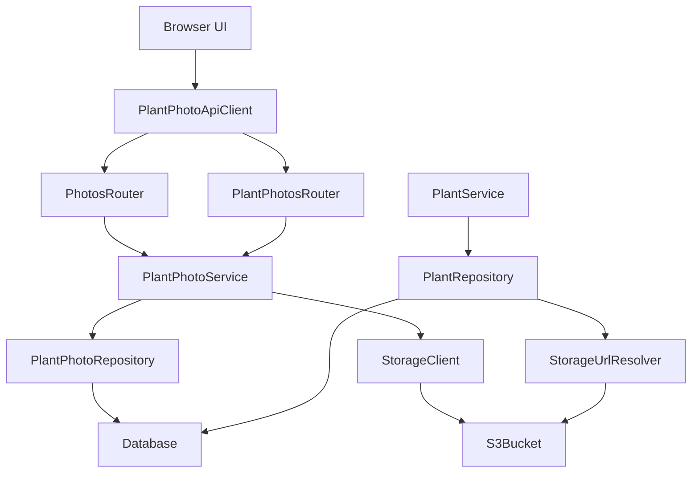
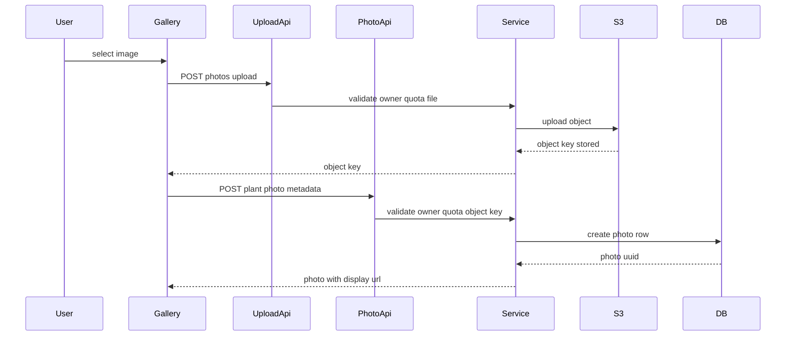
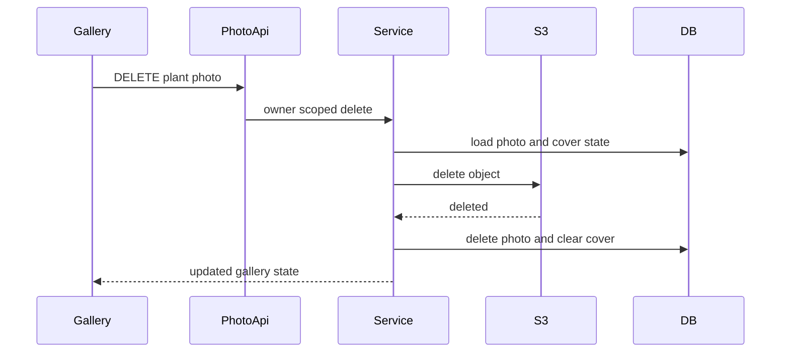
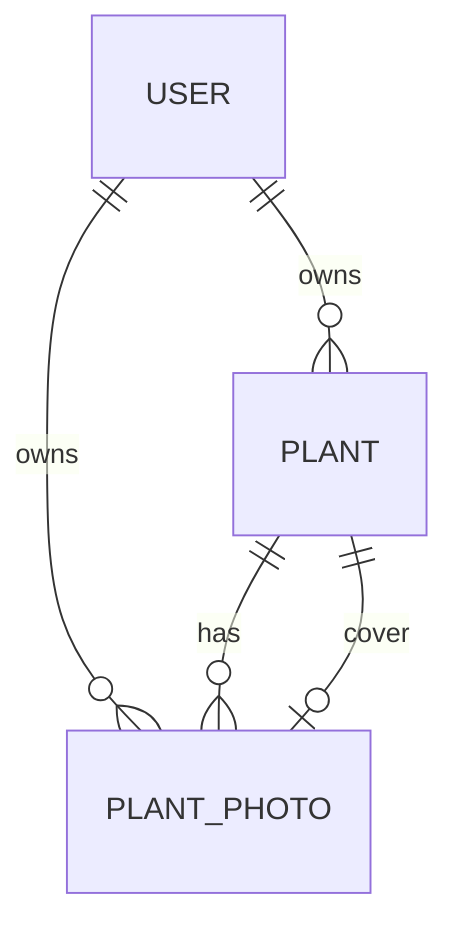
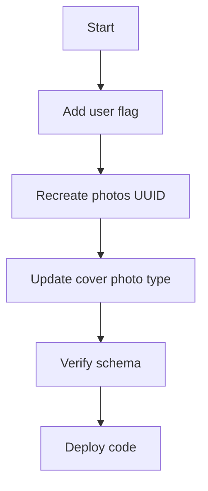

# Design Document

## Overview

Plant Image Management は、植物詳細画面から画像を追加し、植物ごとの時系列ギャラリー、代表画像、削除、枚数上限を提供する。画像本体は Amazon S3 に保存し、DB は公開 URL ではなく object key を保持する。Frontend は API から受け取る表示用 URL を描画に使い、URL 生成方式を保存データから分離する。

この設計は既存の Plant Photo Schema Foundation を更新し、`plant_photos.id` と `plants.cover_photo_id` を UUID text に変更する。既存 `plant_photos` にデータはない前提のため、既存行の ID 互換や移行は扱わない。写真操作は専用 service/repository/storage 境界に分け、既存 Plant list/detail の `imageUrl` 互換は維持する。

### Goals
- 植物詳細画面から現在表示している植物へ画像を追加できる。
- S3 object key を canonical data とし、表示用 URL を動的生成する。
- 植物ごとの時系列ギャラリー、代表画像設定、削除確認、代表画像削除時の未設定化を提供する。
- 一般ユーザーは1植物5枚まで、上限なしユーザーは制限なしで扱う。
- owner scope と internal field 非公開を保ち、他ユーザーの植物画像を閲覧・操作させない。

### Non-Goals
- 画像管理専用画面、他植物への画像移動。
- プラン定義、課金、ユーザー向け上限変更 UI。
- 画像編集、トリミング、圧縮、サムネイル生成、タイムラプス表示。
- ブラウザから S3 への直接アップロード。
- 署名付き URL、CloudFront、Cloudflare R2 への実移行。

## Boundary Commitments

### This Spec Owns
- `plant_photos` の UUID 化、object key 保存、代表画像参照の UUID 化。
- S3 への FastAPI 経由 upload と object delete。
- `POST /photos/upload`、`POST/GET /plants/{plant_id}/photos`、代表画像設定、画像削除 API。
- 写真枚数上限と上限なしユーザー判定。
- object key から表示用 URL を生成する storage abstraction。
- 植物詳細画面内の画像ギャラリー、追加、削除確認、代表画像設定 UI。
- 植物一覧・詳細・水やり summary での `imageUrl` 互換。

### Out of Boundary
- S3 bucket 作成、IAM user 作成、bucket policy 適用の自動化。
- S3 public read から署名付き URL への移行作業。
- orphan object の background cleanup job。
- CDN、R2、画像変換、サムネイル。
- 画像メタ情報の編集 UI。撮影日・コメントは登録時のみ扱う。
- user-facing plan management。

### Allowed Dependencies
- `auth-authorization-foundation`: `CurrentUser.id`、owner scope、401/403/404 方針。
- `plant-photo-schema-foundation`: 写真記録と代表画像の基盤。ただし本 spec で UUID/object key 方針へ更新する。
- Existing backend layers: FastAPI, SQLModel, SQLAlchemy Session, Alembic, Pydantic Settings。
- Existing frontend layers: Vue 3, Vue Router, authenticated API client, composable/component separation。
- New backend dependencies: `boto3` for S3, `python-multipart` for FastAPI form upload。
- AWS S3 bucket with public read and Bucket owner enforced Object Ownership。

### Revalidation Triggers
- `PlantRead.imageUrl` を削除、object 化、または `storageKey` 露出へ変更する。
- `plant_photos.id` または `plants.cover_photo_id` の型を UUID text 以外へ変える。
- upload API が S3 direct upload または署名付き URL 発行方式へ変わる。
- S3 public URL から署名付き URL または CDN URL へ切り替える。
- `photos/upload` と `plants/{plant_id}/photos` の分離を統合する。
- 上限なしユーザー判定を plan model や課金状態へ移す。

## Architecture

### Existing Architecture Analysis
- Backend は Router / Service / Repository / Model / Schema の層を持ち、Service は HTTP 例外を知らない。
- `PlantPhoto` と `Plant.cover_photo_id` は存在するが、現在は integer ID と `image_url` join 前提である。
- `PlantRepository.list_with_cover_image()` は `PlantPhoto.image_url` を返すため、object key から URL を作る storage URL resolver が必要になる。
- Frontend は `Plant.imageUrl` を一覧・詳細で表示できるが、写真 API client、gallery state、gallery UI は未実装である。
- `createAuthenticatedApiClient()` は JSON を前提に `Content-Type` を設定するため、multipart upload 用の request path を追加する。

### Architecture Pattern & Boundary Map
Selected pattern は hybrid owner-scoped photo lifecycle。写真操作と storage integration は専用境界に分離し、Plant read model は既存 `imageUrl` 互換を維持する。



**Architecture Integration**
- Backend dependency direction: `config/types/models/schemas -> repositories/storage -> services -> routers`。
- Frontend dependency direction: `types -> api -> composables -> components -> pages`。
- `PlantPhotoService` owns photo lifecycle rules. `PlantService` continues to own plant create/list/detail/update and only consumes display URL projection.
- `StorageClient` owns S3 upload/delete. `StorageUrlResolver` owns public URL generation and is the future seam for signed URLs/CDN/R2.

### Technology Stack

| Layer | Choice / Version | Role in Feature | Notes |
|-------|------------------|-----------------|-------|
| Frontend | Vue 3 / Vite / TypeScript / Tailwind CSS | Gallery UI, upload form, typed state | 新規 frontend dependency なし |
| Backend | FastAPI 0.136.x / Pydantic 2.13.x / SQLModel 0.0.38 | Protected APIs, multipart upload, typed schemas | `python-multipart` を追加 |
| AWS SDK | boto3 current compatible | S3 upload/delete | `upload_fileobj` を使う |
| Data | SQLite / Turso libSQL / Alembic | UUID text photo IDs, object key persistence, quota flag | 既存 photo data migration 不要 |
| Storage | Amazon S3 ap-northeast-1 | Image object storage | Public read, Bucket owner enforced |

## File Structure Plan

### Directory Structure
```text
backend/
├── alembic/versions/
│   └── 0005_plant_image_management.py
├── app/
│   ├── core/
│   │   └── config.py
│   ├── domain/
│   │   └── plant_photo_constraints.py
│   ├── models/
│   │   ├── plant.py
│   │   ├── plant_photo.py
│   │   └── user.py
│   ├── repositories/
│   │   ├── plant_photo_repository.py
│   │   ├── plant_repository.py
│   │   └── user_repository.py
│   ├── routers/
│   │   ├── photos.py
│   │   └── plant_photos.py
│   ├── schemas/
│   │   ├── plant.py
│   │   └── plant_photo.py
│   ├── services/
│   │   ├── plant_photo_service.py
│   │   └── plant_service.py
│   └── storage/
│       ├── __init__.py
│       └── object_storage.py
└── tests/
    ├── test_plant_image_migration.py
    ├── test_plant_photos_api.py
    ├── test_plant_photo_repository.py
    ├── test_plant_photo_service.py
    └── test_storage.py

frontend/
└── src/
    ├── api/
    │   ├── client.ts
    │   └── plantPhotos.ts
    ├── components/plants/
    │   └── PlantImageGallery.vue
    ├── composables/
    │   └── usePlantPhotos.ts
    ├── pages/
    │   └── PlantDetailPage.vue
    └── types/
        └── plantPhoto.ts
```

### Modified Files
- `backend/requirements.txt` — `boto3`, `python-multipart` を追加する。
- `backend/.env.example` — `AWS_ACCESS_KEY_ID`, `AWS_SECRET_ACCESS_KEY`, `AWS_REGION`, `S3_BUCKET_NAME` を追加する。
- `backend/app/core/config.py` — S3 settings と secret accessors を追加する。
- `backend/app/main.py` — `photos_router`, `plant_photos_router` を登録する。
- `backend/app/models/plant.py` — `cover_photo_id: str | None` へ変更する。
- `backend/app/models/plant_photo.py` — `id: str` UUID text、`storage_key` non-null、`image_url` 廃止方針へ変更する。
- `backend/app/models/user.py` — `photo_upload_unlimited` boolean 相当列を追加する。
- `backend/app/repositories/plant_repository.py` — cover photo の `storage_key` を取得し URL resolver で `imageUrl` を返す。
- `backend/app/schemas/plant.py` — `PlantRead.image_url` は表示 URL として維持する。
- `backend/app/scripts/verify_turso_crud.py` — UUID photo、storage key、representative URL、owner separation を smoke に反映する。
- `backend/tests/test_backend_integration_contract.py` / `backend/tests/test_plants_api.py` — 前段の photo route 禁止契約を本 spec の route surface に更新する。
- `frontend/src/api/client.ts` — JSON request に加え、multipart upload で `Content-Type` を自動設定しない request helper を追加する。
- `frontend/src/types/plant.ts` — `Plant.imageUrl` は維持し、必要に応じて代表画像同期補助型だけ追加する。

## System Flows

### Upload And Register


Upload API は `plantId` を multipart form field で受け取り、owner と quota を検証してから S3 key を発行する。Metadata registration API は同じ owner/quota を再検証し、upload 後の競合を防ぐ。

### Delete Photo


S3 delete に失敗した場合は DB record を維持し、UI は削除失敗を表示する。DB delete 失敗後に S3 object が消えた場合は operator remediation が必要な既知リスクとして扱う。

## Requirements Traceability

| Requirement | Summary | Components | Interfaces | Flows |
|-------------|---------|------------|------------|-------|
| 1.1 | 詳細画面の追加対象を現在植物に限定 | `PlantImageGallery`, `usePlantPhotos`, `PlantPhotoService` | `POST /photos/upload`, `POST /plants/{plant_id}/photos` | Upload And Register |
| 1.2 | 有効画像を対象植物画像として記録 | `PlantPhotoService`, `ObjectStorageClient`, `PlantPhotoRepository` | Upload API, Register API | Upload And Register |
| 1.3 | 追加後ギャラリー表示 | `usePlantPhotos`, `PlantImageGallery` | `PlantPhotoRead` | Upload And Register |
| 1.4 | 他植物への紐づけ変更なし | `PlantPhotoService`, API route shape | Plant scoped registration | Upload And Register |
| 1.5 | 追加失敗時に既存状態保持 | `usePlantPhotos`, `PlantPhotoService` | Error contract | Upload And Register |
| 2.1 | 対象植物画像だけ表示 | `PlantPhotoRepository`, `PlantImageGallery` | `GET /plants/{plant_id}/photos` | |
| 2.2 | 時系列表示 | `PlantPhotoRepository`, `PlantImageGallery` | `PlantPhotoRead.takenDate`, `createdAt` | |
| 2.3 | 画像なし状態 | `PlantImageGallery` | Gallery state | |
| 2.4 | 画像読み込み失敗 | `PlantImageGallery` | UI state | |
| 2.5 | 他ユーザー/他植物画像を表示しない | `PlantPhotoRepository`, `PlantPhotoService` | owner-scoped queries | |
| 3.1 | 一般ユーザー5枚上限 | `PlantPhotoService`, `UserRepository` | quota check | Upload And Register |
| 3.2 | 現在枚数と上限表示 | `PlantPhotoService`, `PlantImageGallery` | `PhotoQuotaRead` | |
| 3.3 | 上限到達時に追加拒否 | `PlantPhotoService`, `usePlantPhotos` | 422 error | Upload And Register |
| 3.4 | 上限なしユーザー | `User.photo_upload_unlimited`, `PlantPhotoService` | quota check | |
| 3.5 | 上限なしは上限表示しない | `PlantImageGallery` | `limit: null` | |
| 3.6 | 追加削除で枚数更新 | `usePlantPhotos` | Gallery state | Upload And Register, Delete Photo |
| 4.1 | ギャラリー画像を代表設定 | `PlantPhotoService`, `PlantPhotoRepository` | `PUT /plants/{plant_id}/cover-photo` | |
| 4.2 | 対象外画像を代表にしない | `PlantPhotoRepository` | owner/plant validation | |
| 4.3 | 一覧サムネイル表示 | `PlantRepository`, `StorageUrlResolver`, `PlantList` | `PlantRead.imageUrl` | |
| 4.4 | 代表未設定状態 | `PlantList`, `PlantDetail` | `imageUrl: null` | |
| 4.5 | 詳細と一覧の代表状態同期 | `usePlantPhotos`, `usePlantDetail` | `coverImageUrl` response | |
| 5.1 | 削除確認 | `PlantImageGallery` | UI dialog state | Delete Photo |
| 5.2 | キャンセル時維持 | `PlantImageGallery` | UI state | Delete Photo |
| 5.3 | 確認後削除 | `PlantPhotoService`, `ObjectStorageClient`, `PlantPhotoRepository` | DELETE API | Delete Photo |
| 5.4 | 代表削除 warning | `PlantImageGallery` | `isCover` flag | Delete Photo |
| 5.5 | 代表削除で未設定 | `PlantPhotoService`, `PlantPhotoRepository` | DELETE API | Delete Photo |
| 5.6 | 削除失敗時維持 | `PlantPhotoService`, `usePlantPhotos` | Error contract | Delete Photo |
| 6.1 | 所有植物のみ追加 | `PlantPhotoService` | owner-scoped plant lookup | Upload And Register |
| 6.2 | 所有画像のみ閲覧 | `PlantPhotoRepository` | owner-scoped list | |
| 6.3 | 他 owner 操作不可 | Routers, `PlantPhotoService` | 404 mapping | |
| 6.4 | 未ログイン保護 | auth dependency, `AuthGate` | 401 mapping | |
| 6.5 | 内部 owner 非公開 | Schemas, frontend types | response schema | |
| 7.1 | 画像移動なし | API route shape | no move endpoint | |
| 7.2 | 専用画面なし | `PlantDetailPage` | route structure | |
| 7.3 | plan UI なし | `PlantImageGallery` | no plan endpoint | |
| 7.4 | 画像編集なし | API/schema scope | no edit endpoint | |
| 7.5 | タイムラプスなし | UI/API scope | no timeline animation | |
| 7.6 | 将来時系列利用可能 | Data model, `PlantPhotoRepository` | UUID + storage key + dates | |
| 8.1 | 詳細から追加検証 | API/UI tests | upload/register | Upload And Register |
| 8.2 | 植物ごと gallery 検証 | Repository/API/UI tests | list photos | |
| 8.3 | quota 検証 | Service/API tests | quota check | |
| 8.4 | cover 設定/削除検証 | Service/API/UI tests | cover/delete APIs | Delete Photo |
| 8.5 | owner separation 検証 | API/repository tests | owner-scoped queries | |

## Components and Interfaces

| Component | Domain/Layer | Intent | Req Coverage | Key Dependencies | Contracts |
|-----------|--------------|--------|--------------|------------------|-----------|
| `PlantPhotoService` | Backend Service | 写真 lifecycle、quota、owner validation を統括 | 1,2,3,4,5,6,7 | Repository P0, Storage P0, User P1 | Service |
| `PlantPhotoRepository` | Backend Repository | owner-scoped photo persistence | 2,4,5,6 | DB P0 | Service |
| `ObjectStorageClient` | Backend Storage | S3互換 object storage の upload/delete | 1,5,7 | boto3 P0, settings P0 | Service |
| `StorageUrlResolver` | Backend Storage | object key から表示用 URL を生成する | 4,7 | settings P0 | Service |
| `photos.py` router | Backend Router | multipart upload endpoint | 1,3,6 | CurrentUser P0, Service P0 | API |
| `plant_photos.py` router | Backend Router | gallery/register/cover/delete endpoints | 1,2,3,4,5,6 | CurrentUser P0, Service P0 | API |
| `plantPhotos.ts` | Frontend API | typed photo API client | 1,2,3,4,5,6 | authenticated client P0 | API |
| `usePlantPhotos` | Frontend State | gallery state orchestration | 1,2,3,4,5 | API client P0 | State |
| `PlantImageGallery` | Frontend UI | gallery, upload, quota, delete confirm | 1,2,3,4,5 | composable state P0 | State |

### Backend

#### PlantPhotoService

| Field | Detail |
|-------|--------|
| Intent | owner-scoped な画像 lifecycle と business rule を実行する |
| Requirements | 1.1, 1.2, 1.5, 2.5, 3.1, 3.3, 3.4, 4.1, 4.2, 5.3, 5.5, 6.1, 6.3 |

**Responsibilities & Constraints**
- upload 前に plant owner、file type、file size、quota を検証する。
- registration 前にも plant owner、object key ownership shape、quota を再検証する。
- `plant_photos.id` は UUID string を service で生成する。
- object key は `plants/{plant_id}/{photo_id}.{ext}`。
- delete は S3 delete 成功後に DB photo delete と cover clear を同一 DB transaction で行う。

##### Service Interface
```python
class PlantPhotoService:
    def upload_photo(self, owner_user_id: str, plant_id: int, upload: UploadFile) -> PhotoUploadRead: ...
    def create_photo(self, owner_user_id: str, plant_id: int, payload: PlantPhotoCreate) -> PlantPhotoRead: ...
    def list_photos(self, owner_user_id: str, plant_id: int) -> PlantPhotoGalleryRead: ...
    def set_cover_photo(self, owner_user_id: str, plant_id: int, photo_id: str) -> PlantPhotoGalleryRead: ...
    def delete_photo(self, owner_user_id: str, plant_id: int, photo_id: str) -> PlantPhotoGalleryRead: ...
```

Errors: `PlantPhotoNotFoundError`, `PlantPhotoValidationError`, `PlantPhotoLimitExceededError`, `PlantPhotoStorageError`。

#### PlantPhotoRepository

| Field | Detail |
|-------|--------|
| Intent | `plant_photos` と `plants.cover_photo_id` を owner-scoped に読み書きする |
| Requirements | 2.1, 2.2, 2.5, 4.1, 4.2, 5.5, 6.2, 6.3 |

**Responsibilities & Constraints**
- `owner_user_id` と `plant_id` をすべての list/detail/update/delete 条件に含める。
- list は `taken_date DESC NULLS LAST`, `created_at DESC` 相当を標準にする。SQLite 互換のため design implementation では null ordering を明示的に扱う。
- `set_cover_photo` は同一 owner/plant の photo だけを許可する。
- `delete_photo_and_clear_cover` は削除対象が代表画像なら `plants.cover_photo_id = NULL` にする。

#### ObjectStorageClient

| Field | Detail |
|-------|--------|
| Intent | S3互換 object storage の upload/delete を storage details に閉じる |
| Requirements | 1.2, 5.3, 7.6 |

**Responsibilities & Constraints**
- `boto3` client を汎用 storage settings から構築する。
- `put_object` で object key、body、ContentType を渡し、ACL は指定しない。
- `STORAGE_ENDPOINT_URL` が指定された場合は S3互換 provider endpoint として利用する。
- object key を永続データとし、公開 URL 形式は `StorageUrlResolver` に閉じる。

#### StorageUrlResolver

| Field | Detail |
|-------|--------|
| Intent | DB の object key を API response 用の表示 URL に変換する |
| Requirements | 4.3, 4.5, 7.6 |

**Responsibilities & Constraints**
- `storage_key` を受け取り、現在の storage public URL を返す。
- `PlantRepository` と `PlantPhotoService` から利用されるが、DB へ URL を保存しない。
- 将来の署名付き URL、CloudFront、R2 移行時の差し替え点になる。
- `backend/app/storage/object_storage.py` に `ObjectStorageClient` と同居し、storage 設定の読み取りを一箇所に保つ。

### API Contracts

| Method | Endpoint | Request | Response | Errors |
|--------|----------|---------|----------|--------|
| POST | `/photos/upload` | multipart: `plantId`, `file` | `PhotoUploadRead` | 401, 404, 422, 500 |
| GET | `/plants/{plant_id}/photos` | none | `PlantPhotoGalleryRead` | 401, 404 |
| POST | `/plants/{plant_id}/photos` | `PlantPhotoCreate` | `PlantPhotoRead` | 401, 404, 422 |
| PUT | `/plants/{plant_id}/cover-photo` | `SetCoverPhotoRequest` | `PlantPhotoGalleryRead` | 401, 404, 422 |
| DELETE | `/plants/{plant_id}/photos/{photo_id}` | none | `PlantPhotoGalleryRead` | 401, 404, 500 |

```python
class PhotoUploadRead(SQLModel):
    object_key: str

class PlantPhotoCreate(SQLModel):
    object_key: str
    taken_date: date | None = None
    comment: str | None = None

class PlantPhotoRead(SQLModel):
    id: str
    image_url: str
    taken_date: date | None
    comment: str | None
    is_cover: bool
    created_at: datetime
    updated_at: datetime

class PhotoQuotaRead(SQLModel):
    count: int
    limit: int | None

class PlantPhotoGalleryRead(SQLModel):
    photos: list[PlantPhotoRead]
    quota: PhotoQuotaRead
    cover_photo_id: str | None
```

`object_key` は upload/register flow の一時 contract としてのみ返す。gallery/list/detail/plant read response には `storageKey`, owner id, internal auth field を含めない。

### Frontend

#### PlantPhotosApiClient

```typescript
export interface PlantPhotosApiClient {
  uploadPhoto(input: PhotoUploadInput): Promise<PhotoUploadResult>
  listPhotos(plantId: number): Promise<PlantPhotoGallery>
  createPhoto(plantId: number, input: PlantPhotoCreateInput): Promise<PlantPhoto>
  setCoverPhoto(plantId: number, photoId: string): Promise<PlantPhotoGallery>
  deletePhoto(plantId: number, photoId: string): Promise<PlantPhotoGallery>
}
```

`uploadPhoto` は `FormData` を使い、request helper は `Content-Type` を手動設定しない。`any` は使わず、`ApiError` は既存型を再利用する。

#### usePlantPhotos
- State: `gallery`, `isLoading`, `isUploading`, `isDeleting`, `isSettingCover`, `error`, `mutationError`, `successMessage`。
- `loadPhotos`, `uploadAndCreatePhoto`, `setCoverPhoto`, `deletePhoto` を提供する。
- auth/forbidden/not_found error では gallery を clear し、validation/storage/server error では既存 gallery を維持する。
- 代表画像変更後は `onCoverImageChanged(imageUrl | null)` callback で `usePlantDetail` の `plant.imageUrl` を同期する。

#### PlantImageGallery
- Props は `PlantPhotoGallery`, loading/error/mutation state、command callbacks。
- 画像なし状態、quota 表示、上限なし表示省略、delete confirm、代表画像削除 warning を描画する。
- 画像読み込み失敗は対象 tile の fallback に留め、植物詳細全体を失敗扱いにしない。

## Data Models

### Domain Model


- `PlantPhoto` は plant の child entity であり、owner と plant の両方で scope される。
- `Plant.cover_photo_id` は同一 plant の `PlantPhoto.id` だけを指す domain invariant とする。DB FK は循環・SQLite migration 複雑化を避けるため必須にしない。
- `PhotoQuota` は保存しない read model。`User.photo_upload_unlimited` と photo count から計算する。

### Physical Data Model
- `users.photo_upload_unlimited`: boolean 相当、not null、default false。
- `plant_photos.id`: text UUID primary key。
- `plant_photos.storage_key`: text not null。公開 URL は保存しない。
- `plant_photos.image_url`: 廃止する。既存 data はないため移行不要。
- `plants.cover_photo_id`: text nullable。
- Indexes:
  - `ix_plant_photos_owner_user_id_plant_id_created_at`
  - `ix_plant_photos_owner_user_id_plant_id_taken_date`
  - `ix_plant_photos_storage_key` unique
  - `ix_plants_cover_photo_id`

Migration は SQLite/Turso 互換を優先し、必要なら `plant_photos` と `plants` の batch recreate を使う。`plant_photos` 既存行はない前提を migration test で固定する。

## Error Handling

### Error Strategy
- Router は service error を HTTP status に変換する。
- 401/403 は既存 auth dependency に従う。
- owner mismatch と missing plant/photo は 404 に統一する。
- quota exceeded、invalid file type、file too large、invalid object key は 422。
- S3 upload/delete failure は 500。user-facing message は storage details、bucket name、key、credential を含めない。

### Error Categories and Responses
- Upload validation: 422、既存 gallery 維持。
- Registration validation: 422、S3 object は残り得る。UI は再試行または削除不能ではなく「追加できなかった」状態を表示する。
- Delete S3 failure: 500、DB record 維持。
- Delete DB failure after S3 success: 500、operator remediation。ログには object key を含めるが credential は含めない。

### Monitoring
- S3 upload/delete failures、quota exceeded、orphan-risk registration failures を structured log に残す。
- smoke verification は S3 実 bucket を要求しない。storage client は test double で owner/quota/DB path を検証し、S3 integration は unit adapter test で分離する。

## Testing Strategy

### Unit Tests
- `PlantPhotoService` が一般ユーザー5枚上限、上限なしユーザー、upload/register 二重 quota check を行う。
- `PlantPhotoService` が invalid MIME/extension/size を 422 相当 error にする。
- `ObjectStorageClient` が ACL を指定せず `put_object` と delete を呼び、`StorageUrlResolver` が public URL を object key から生成する。
- `StorageUrlResolver` が `storage_key` から `imageUrl` を生成し、DB に URL を保存しない。

### Backend Integration Tests
- `POST /photos/upload` は認証必須で、other-owner plant は 404、valid upload は object key を返す。
- `POST /plants/{plant_id}/photos` は object key を登録し、response に owner/storage fields を出さない。
- `GET /plants/{plant_id}/photos` は owner/plant scoped、時系列、quota を返す。
- `PUT /plants/{plant_id}/cover-photo` は同一 owner/plant photo のみ許可し、Plant list/detail の `imageUrl` に反映する。
- `DELETE /plants/{plant_id}/photos/{photo_id}` は確認済み command として処理され、代表画像削除時に `cover_photo_id` を null にする。

### Frontend Tests
- `plantPhotos.ts` は authenticated client を使い、upload では JSON Content-Type を設定しない。
- `usePlantPhotos` は load/upload/register/delete/setCover の loading/error/success state を分離する。
- `PlantImageGallery` は画像なし、quota、上限なし、削除確認、代表画像 warning、画像 tile fallback を表示する。
- `PlantDetailPage.vue` は plant detail、watering、image gallery の error surface を混ぜない。

### Migration And Smoke
- Alembic migration が `plant_photos.id` と `plants.cover_photo_id` を text UUID compatible にし、`users.photo_upload_unlimited` を追加する。
- migration downgrade が追加列/index/table 変更を戻す。
- `verify_turso_crud.py` は UUID photo、storage key、representative URL、other-owner 代表画像非表示を検証する。

## Security Considerations
- AWS credentials は environment variables と `SecretStr` で扱い、logs/errors/spec examples に実値を記載しない。
- S3 Object Ownership は Bucket owner enforced。upload 時に ACL は指定しない。
- public read 初期運用では object key の推測困難性が安全性の一部になる。UUID を key に含め、user id は含めない。
- API は storage key を gallery response へ露出しない。upload/register flow の `objectKey` は短期操作用 contract として扱う。
- owner scope は DB/API で担保する。public URL を知る者は読めるため、将来の署名付き URL 移行時は `StorageUrlResolver` を差し替える。

## Performance & Scalability
- MVP quota は1植物5枚であり、list は plant 単位の小さな collection を前提にする。
- upload は FastAPI process 経由で S3 に stream する。大容量対応、direct upload、background processing は out of boundary。
- Index は owner/plant/date query と storage key uniqueness を優先する。

## Migration Strategy


- 既存 `plant_photos` data はないため ID migration は行わない。
- migration test は空 table 前提と schema shape を固定する。
- Deploy order は migration first、backend code、frontend code。既存 plant list/detail は `imageUrl: null` でも継続する。

## Supporting References
- FastAPI official docs: `UploadFile` and `python-multipart` are required for file upload handling.
- Boto3 official docs: `upload_fileobj` accepts a binary file-like object and performs managed transfer.
- AWS S3 official docs: Bucket owner enforced disables ACLs and relies on policies for access.
