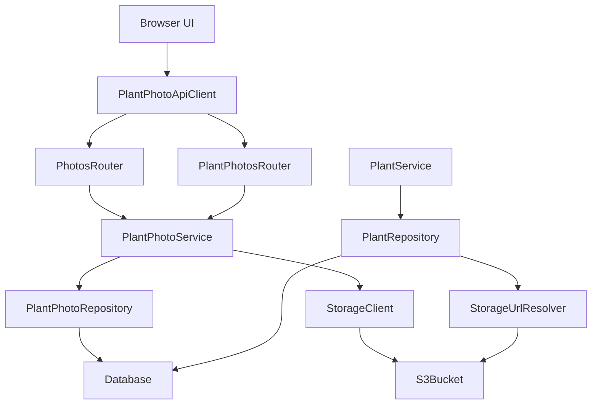
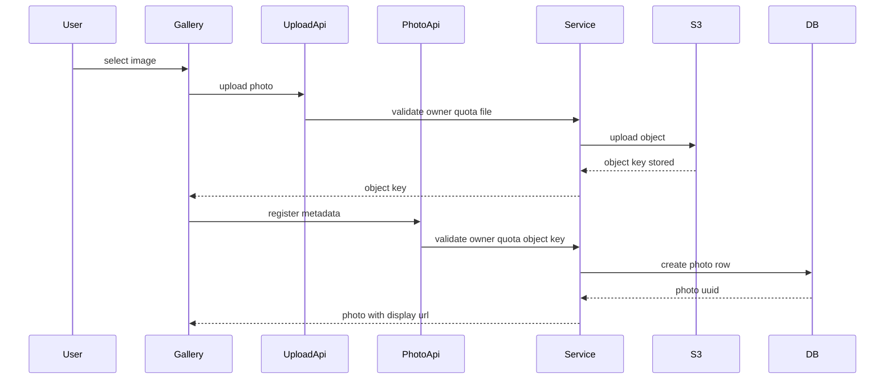
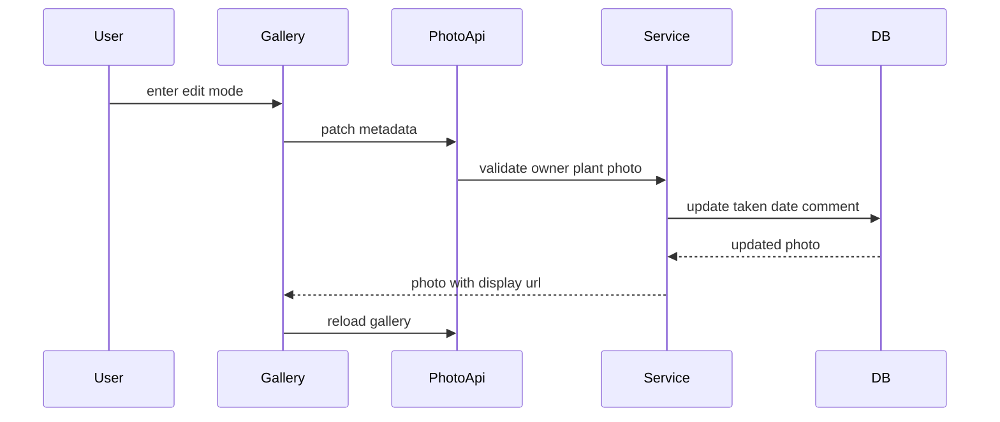
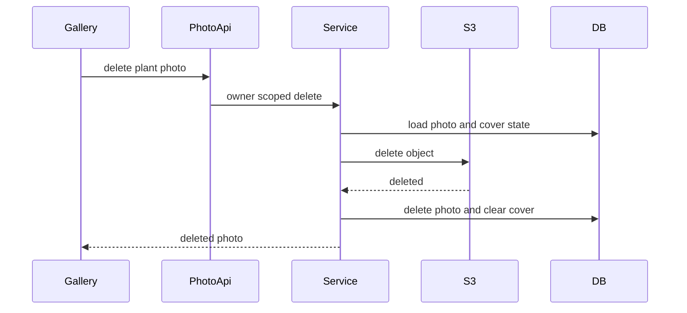
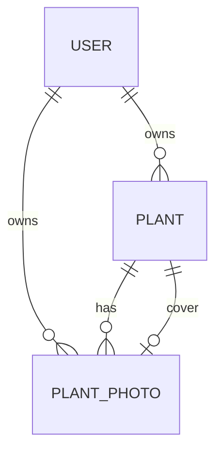

# Design Document

## Overview

Plant Image Management は、植物詳細画面から画像を追加し、植物ごとの時系列ギャラリー、代表画像、削除、枚数上限、画像メタ情報編集を提供する。画像本体は Amazon S3 に保存し、DB は公開 URL ではなく object key を保持する。Frontend は API から受け取る表示用 URL を描画に使い、URL 生成方式を保存データから分離する。

既存実装は画像アップロード、画像登録、ギャラリー表示、代表画像設定、削除までを持つ。今回の design 更新では、その既存境界を維持しながら、登録済み画像の撮影日・コメントを編集できる更新 API と、各画像カード上の編集モードを追加する。植物への紐づけ変更と画像ファイル差し替えは提供しない。

### Goals
- 植物詳細画面から現在表示している植物へ画像を追加できる。
- 植物ごとの時系列ギャラリー、代表画像設定、削除確認、代表画像削除時の未設定化を提供する。
- 一般ユーザーは1植物5枚まで、上限なしユーザーは制限なしで扱う。
- 登録済み画像の撮影日・コメントを画像ごとに編集できる。
- owner scope と internal field 非公開を保ち、他ユーザーの植物画像を閲覧・操作させない。

### Non-Goals
- 画像管理専用画面、他植物への画像移動。
- プラン定義、課金、ユーザー向け上限変更 UI。
- 画像ファイル差し替え、トリミング、圧縮、サムネイル生成、タイムラプス表示。
- ブラウザから S3 への直接アップロード。
- 署名付き URL、CloudFront、Cloudflare R2 への実移行。

## Boundary Commitments

### This Spec Owns
- `plant_photos` の object key、撮影日、コメント、代表画像状態を対象植物の成長画像記録として扱う。
- S3 への FastAPI 経由 upload と object delete。
- `POST /photos/upload`、`POST/GET/PATCH /plants/{plant_id}/photos`、代表画像設定、画像削除 API。
- 写真枚数上限と上限なしユーザー判定。
- object key から表示用 URL を生成する storage abstraction。
- 植物詳細画面内の画像ギャラリー、追加、削除確認、代表画像設定、画像メタ情報編集 UI。
- 植物一覧・詳細・水やり summary での `imageUrl` 互換。

### Out of Boundary
- S3 bucket 作成、IAM user 作成、bucket policy 適用の自動化。
- S3 public read から署名付き URL への移行作業。
- orphan object の background cleanup job。
- CDN、R2、画像変換、サムネイル。
- 画像ファイルの差し替え、画像の別植物への再紐づけ。
- user-facing plan management。

### Allowed Dependencies
- `auth-authorization-foundation`: `CurrentUser.id`、owner scope、401/403/404 方針。
- `plant-photo-schema-foundation`: 写真記録と代表画像の基盤。
- Existing backend layers: FastAPI, SQLModel, SQLAlchemy Session, Alembic, Pydantic Settings。
- Existing frontend layers: Vue 3, Vue Router, authenticated API client, composable/component separation。
- Existing backend dependencies: `boto3` for S3, `python-multipart` for FastAPI form upload。
- AWS S3 bucket with public read and Bucket owner enforced Object Ownership。

### Revalidation Triggers
- `PlantRead.imageUrl` を削除、object 化、または `storageKey` 露出へ変更する。
- `PlantPhotoRead` から `takenDate` または `comment` を削除する。
- `plant_photos.id` または `plants.cover_photo_id` の型を UUID text 以外へ変える。
- upload API が S3 direct upload または署名付き URL 発行方式へ変わる。
- S3 public URL から署名付き URL または CDN URL へ切り替える。
- 上限なしユーザー判定を plan model や課金状態へ移す。

## Architecture

### Existing Architecture Analysis
- Backend は Router / Service / Repository / Model / Schema の層を持ち、Service は HTTP 例外を知らない。
- `PlantPhoto` は `owner_user_id`, `plant_id`, `storage_key`, `taken_date`, `comment`, `created_at`, `updated_at` を持つ。
- `PlantPhotoRepository.list_for_plant()` は owner/plant scoped に画像を取得し、`taken_date`, `created_at`, `id` で時系列表示を安定化している。
- `PlantPhotoService` は upload/register/gallery/cover/delete を統括し、Router が service error を HTTP status へ変換する。
- Frontend は `plantPhotos.ts`、`usePlantPhotos`、`PlantImageGallery.vue` を持ち、植物詳細画面へ composition されている。
- 植物基本情報編集は `PlantDetail` の編集ボタンから `PlantEditForm` に切り替わるため、画像メタ情報編集も画像カード単位で閲覧状態と編集状態を分ける。

### Architecture Pattern & Boundary Map
Selected pattern は owner-scoped photo lifecycle extension。写真操作と storage integration は専用境界に分離し、Plant read model は既存 `imageUrl` 互換を維持する。メタ情報編集は同じ写真 lifecycle 境界に追加し、storage や plant profile editing へ責務を広げない。



**Architecture Integration**
- Backend dependency direction: `config/types/models/schemas -> repositories/storage -> services -> routers`。
- Frontend dependency direction: `types -> api -> composables -> components -> pages`。
- `PlantPhotoService` owns photo lifecycle rules. `PlantService` continues to own plant create/list/detail/update and only consumes display URL projection.
- `StorageClient` owns S3 upload/delete. `StorageUrlResolver` owns public URL generation and is the future seam for signed URLs/CDN/R2.
- Metadata update uses DB-only mutation and never calls storage upload/delete.

### Technology Stack

| Layer | Choice / Version | Role in Feature | Notes |
|-------|------------------|-----------------|-------|
| Frontend | Vue 3 / Vite / TypeScript / Tailwind CSS | Gallery UI, upload form, metadata edit form, typed state | 新規 frontend dependency なし |
| Backend | FastAPI 0.136.x / Pydantic 2.13.x / SQLModel 0.0.38 | Protected APIs, multipart upload, metadata update schemas | 新規 backend dependency なし |
| AWS SDK | boto3 current compatible | S3 upload/delete | メタ情報編集では未使用 |
| Data | SQLite / Turso libSQL / Alembic | UUID text photo IDs, object key persistence, metadata fields | メタ情報編集の DB migration 不要 |
| Storage | Amazon S3 ap-northeast-1 | Image object storage | Public read, Bucket owner enforced |

## File Structure Plan

### Directory Structure
```text
backend/
├── app/
│   ├── models/
│   │   └── plant_photo.py
│   ├── repositories/
│   │   ├── plant_repository.py
│   │   └── plant_photo_repository.py
│   ├── auth/
│   │   └── dependencies.py
│   ├── routers/
│   │   ├── photos.py
│   │   └── plant_photos.py
│   ├── schemas/
│   │   └── plant_photo.py
│   ├── services/
│   │   ├── plant_service.py
│   │   └── plant_photo_service.py
│   └── storage/
│       └── object_storage.py
└── tests/
    ├── test_plant_photos_api.py
    ├── test_plant_photo_repository.py
    └── test_plant_photo_service.py

frontend/
└── src/
    ├── api/
    │   └── plantPhotos.ts
    ├── components/plants/
    │   ├── PlantDetail.vue
    │   └── PlantImageGallery.vue
    ├── composables/
    │   ├── usePlantDetail.ts
    │   └── usePlantPhotos.ts
    ├── pages/
    │   └── PlantDetailPage.vue
    └── types/
        └── plantPhoto.ts
```

### Modified Files
- `backend/app/schemas/plant_photo.py` — `PlantPhotoUpdate` を追加し、撮影日・コメントのみを更新入力として受ける。
- `backend/app/repositories/plant_photo_repository.py` — owner/plant/photo scoped に `taken_date`, `comment`, `updated_at` を更新する method を追加する。
- `backend/app/services/plant_photo_service.py` — `update_photo_metadata()` を追加し、対象画像の owner scope、植物 scope、入力正規化、更新後 read model 生成を担当する。
- `backend/app/routers/plant_photos.py` — `PATCH /plants/{plant_id}/photos/{photo_id}` を追加し、service error を既存方針で 404/422 に変換する。
- `backend/tests/test_plant_photos_api.py` — metadata update API、他 owner 操作不可、response field 非公開、時系列再取得を検証する。
- `backend/tests/test_plant_photo_repository.py` — owner/plant/photo scoped update と other-owner no-op を検証する。
- `backend/tests/test_plant_photo_service.py` — update 成功、missing photo、metadata update で storage を触らないことを検証する。
- `frontend/src/types/plantPhoto.ts` — `PlantPhotoUpdateInput` を追加する。
- `frontend/src/api/plantPhotos.ts` — `updatePlantPhotoMetadata(plantId, photoId, input)` を追加する。
- `frontend/src/composables/usePlantPhotos.ts` — `isUpdatingMetadata`, `updatePhotoMetadata()` を追加し、成功後に gallery を再取得する。
- `frontend/src/components/plants/PlantImageGallery.vue` — 各画像カードに編集ボタン、編集フォーム、保存/キャンセル、更新中/失敗状態を追加する。
- `frontend/src/pages/PlantDetailPage.vue` — `usePlantPhotos` から metadata update command/state を受け取り、`PlantImageGallery` に渡す。

### Referenced Existing Files
- `backend/app/repositories/plant_repository.py` — 代表画像 URL の `imageUrl` 互換を維持する。metadata update では変更しない。
- `backend/app/services/plant_service.py` — 植物基本情報の読み書きを継続して担当する。metadata update では変更しない。
- `backend/app/auth/dependencies.py` — protected photo API の current user 解決を既存通り利用する。
- `frontend/src/components/plants/PlantDetail.vue` — 植物基本情報の編集導線を維持する。画像カード単位の編集とは混在させない。
- `frontend/src/composables/usePlantDetail.ts` — 代表画像同期 callback の既存利用を維持する。metadata update では呼び出さない。

## System Flows

### Upload And Register


Upload API は `plantId` を multipart form field で受け取り、owner と quota を検証してから S3 key を発行する。Metadata registration API は同じ owner/quota を再検証し、upload 後の競合を防ぐ。

### Edit Photo Metadata


Metadata edit は DB-only flow とする。保存対象は撮影日とコメントに限定し、plant id、object key、image file、cover state は request から受け取らない。撮影日変更で時系列位置が変わるため、成功後は gallery を再取得する。

### Delete Photo


S3 delete に失敗した場合は DB record を維持し、UI は削除失敗を表示する。DB delete 失敗後に S3 object が消えた場合は operator remediation が必要な既知リスクとして扱う。

## Requirements Traceability

| Requirement | Summary | Components | Interfaces | Flows |
|-------------|---------|------------|------------|-------|
| 1.1 | 詳細画面の追加対象を現在植物に限定 | `PlantImageGallery`, `usePlantPhotos`, `PlantPhotoService` | `POST /photos/upload`, `POST /plants/{plant_id}/photos` | Upload And Register |
| 1.2 | 有効画像を対象植物画像として記録 | `PlantPhotoService`, `ObjectStorageClient`, `PlantPhotoRepository` | Upload API, Register API | Upload And Register |
| 1.3 | 追加後ギャラリー表示 | `usePlantPhotos`, `PlantImageGallery` | `PlantPhotoRead` | Upload And Register |
| 1.4 | 他植物への紐づけ変更なし | `PlantPhotoService`, API route shape | Plant scoped registration | Upload And Register |
| 1.5 | 追加失敗時に既存状態保持 | `usePlantPhotos`, `PlantPhotoService` | Error contract | Upload And Register |
| 2.1 | 対象植物画像だけ表示 | `PlantPhotoRepository`, `PlantImageGallery` | `GET /plants/{plant_id}/photos` | |
| 2.2 | 時系列表示 | `PlantPhotoRepository`, `PlantImageGallery` | `PlantPhotoRead.takenDate`, `createdAt` | Edit Photo Metadata |
| 2.3 | 画像なし状態 | `PlantImageGallery` | Gallery state | |
| 2.4 | 画像読み込み失敗 | `PlantImageGallery` | UI state | |
| 2.5 | 他ユーザー/他植物画像を表示しない | `PlantPhotoRepository`, `PlantPhotoService` | owner-scoped queries | |
| 3.1 | 一般ユーザー5枚上限 | `PlantPhotoService`, `UserRepository` | quota check | Upload And Register |
| 3.2 | 現在枚数と上限表示 | `PlantPhotoService`, `PlantImageGallery` | `PlantPhotoQuotaRead` | |
| 3.3 | 上限到達時に追加拒否 | `PlantPhotoService`, `usePlantPhotos` | 409 error | Upload And Register |
| 3.4 | 上限なしユーザー | `User.photo_upload_unlimited`, `PlantPhotoService` | quota check | |
| 3.5 | 上限なしは上限表示しない | `PlantImageGallery` | `maxCount: null` | |
| 3.6 | 追加削除で枚数更新 | `usePlantPhotos` | Gallery state | Upload And Register, Delete Photo |
| 4.1 | ギャラリー画像を代表設定 | `PlantPhotoService`, `PlantPhotoRepository` | `PATCH /plants/{plant_id}/cover-photo` | |
| 4.2 | 対象外画像を代表にしない | `PlantPhotoRepository` | owner/plant validation | |
| 4.3 | 一覧サムネイル表示 | `PlantRepository`, `StorageUrlResolver`, `PlantList` | `PlantRead.imageUrl` | |
| 4.4 | 代表未設定状態 | `PlantList`, `PlantDetail` | `imageUrl: null` | |
| 4.5 | 詳細と一覧の代表状態同期 | `usePlantPhotos`, `usePlantDetail` | cover callback | |
| 5.1 | 削除確認 | `PlantImageGallery` | UI dialog state | Delete Photo |
| 5.2 | キャンセル時維持 | `PlantImageGallery` | UI state | Delete Photo |
| 5.3 | 確認後削除 | `PlantPhotoService`, `ObjectStorageClient`, `PlantPhotoRepository` | DELETE API | Delete Photo |
| 5.4 | 代表削除 warning | `PlantImageGallery` | `isCover` flag | Delete Photo |
| 5.5 | 代表削除で未設定 | `PlantPhotoService`, `PlantPhotoRepository` | DELETE API | Delete Photo |
| 5.6 | 削除失敗時維持 | `PlantPhotoService`, `usePlantPhotos` | Error contract | Delete Photo |
| 6.1 | 画像ごとの編集モード | `PlantImageGallery`, `usePlantPhotos` | edit state | Edit Photo Metadata |
| 6.2 | 紐づく植物変更なし | `PlantImageGallery`, `PlantPhotoService` | PATCH route shape | Edit Photo Metadata |
| 6.3 | 画像ファイル差し替えなし | `PlantImageGallery`, `PlantPhotoService` | `PlantPhotoUpdate` | Edit Photo Metadata |
| 6.4 | 有効メタ情報保存 | `PlantPhotoService`, `PlantPhotoRepository`, `usePlantPhotos` | `PATCH /plants/{plant_id}/photos/{photo_id}` | Edit Photo Metadata |
| 6.5 | キャンセル時維持 | `PlantImageGallery` | local draft state | Edit Photo Metadata |
| 6.6 | 更新失敗時維持 | `PlantPhotoService`, `usePlantPhotos` | Error contract | Edit Photo Metadata |
| 6.7 | 対象外画像を更新しない | `PlantPhotoRepository` | owner/plant/photo validation | Edit Photo Metadata |
| 6.8 | 更新後時系列反映 | `PlantPhotoRepository`, `usePlantPhotos` | gallery reload | Edit Photo Metadata |
| 7.1 | 所有植物のみ追加 | `PlantPhotoService` | owner-scoped plant lookup | Upload And Register |
| 7.2 | 所有画像のみ閲覧 | `PlantPhotoRepository` | owner-scoped list | |
| 7.3 | 他 owner 操作不可 | Routers, `PlantPhotoService` | 404 mapping | |
| 7.4 | 未ログイン保護 | auth dependency, `AuthGate` | 401 mapping | |
| 7.5 | 内部 owner 非公開 | Schemas, frontend types | response schema | |
| 8.1 | 画像移動なし | API route shape | no move endpoint | |
| 8.2 | 専用画面なし | `PlantDetailPage` | route structure | |
| 8.3 | plan UI なし | `PlantImageGallery` | no plan endpoint | |
| 8.4 | 画像ファイル加工なし | API/schema/UI scope | no file replacement endpoint | |
| 8.5 | タイムラプスなし | UI/API scope | no timeline animation | |
| 8.6 | 将来時系列利用可能 | Data model, `PlantPhotoRepository` | UUID + storage key + dates | |
| 9.1 | 詳細から追加検証 | API/UI tests | upload/register | Upload And Register |
| 9.2 | 植物ごと gallery 検証 | Repository/API/UI tests | list photos | |
| 9.3 | quota 検証 | Service/API tests | quota check | |
| 9.4 | cover 設定/削除検証 | Service/API/UI tests | cover/delete APIs | Delete Photo |
| 9.5 | owner separation 検証 | API/repository tests | owner-scoped queries | |
| 9.6 | metadata edit 検証 | Service/API/UI tests | metadata patch | Edit Photo Metadata |

## Components and Interfaces

| Component | Domain/Layer | Intent | Req Coverage | Key Dependencies | Contracts |
|-----------|--------------|--------|--------------|------------------|-----------|
| `PlantPhotoService` | Backend Service | 写真 lifecycle、quota、owner validation、metadata update を統括 | 1,2,3,4,5,6,7,8 | Repository P0, Storage P0, User P1 | Service |
| `PlantPhotoRepository` | Backend Repository | owner-scoped photo persistence and update | 2,4,5,6,7 | DB P0 | Service |
| `ObjectStorageClient` | Backend Storage | S3互換 object storage の upload/delete | 1,5,8 | boto3 P0, settings P0 | Service |
| `StorageUrlResolver` | Backend Storage | object key から表示用 URL を生成する | 4,8 | settings P0 | Service |
| `photos.py` router | Backend Router | multipart upload endpoint | 1,3,7 | CurrentUser P0, Service P0 | API |
| `plant_photos.py` router | Backend Router | gallery/register/metadata/cover/delete endpoints | 1,2,3,4,5,6,7 | CurrentUser P0, Service P0 | API |
| `plantPhotos.ts` | Frontend API | typed photo API client | 1,2,3,4,5,6,7 | authenticated client P0 | API |
| `usePlantPhotos` | Frontend State | gallery state orchestration | 1,2,3,4,5,6 | API client P0 | State |
| `PlantImageGallery` | Frontend UI | gallery, upload, quota, metadata edit, delete confirm | 1,2,3,4,5,6,8 | composable state P0 | State |

### Backend

#### PlantPhotoService

| Field | Detail |
|-------|--------|
| Intent | owner-scoped な画像 lifecycle と business rule を実行する |
| Requirements | 1.1, 1.2, 1.5, 2.5, 3.1, 3.3, 3.4, 4.1, 4.2, 5.3, 5.5, 6.4, 6.6, 6.7, 7.1, 7.3 |

**Responsibilities & Constraints**
- upload 前に plant owner、file type、file size、quota を検証する。
- registration 前にも plant owner、object key ownership shape、quota を再検証する。
- metadata update は owner/plant/photo scope を必須にし、`taken_date`, `comment`, `updated_at` だけを変更する。
- metadata update は storage upload/delete、cover state、plant id、object key を変更しない。
- delete は S3 delete 成功後に DB photo delete と cover clear を同一 DB transaction で行う。

##### Service Interface
```python
class PlantPhotoService:
    def upload_photo(self, *, owner_user_id: str, plant_id: int, filename: str, content_type: str, body: bytes) -> str: ...
    def register_photo(self, *, owner_user_id: str, plant_id: int, payload: PlantPhotoCreate) -> PlantPhotoRead: ...
    def get_gallery(self, owner_user_id: str, plant_id: int) -> PlantPhotoGalleryRead: ...
    def update_photo_metadata(self, owner_user_id: str, plant_id: int, photo_id: str, payload: PlantPhotoUpdate) -> PlantPhotoRead: ...
    def set_cover_photo(self, owner_user_id: str, plant_id: int, photo_id: str) -> PlantPhotoGalleryRead: ...
    def delete_photo(self, owner_user_id: str, plant_id: int, photo_id: str) -> PlantPhotoRead: ...
```

Errors: `PlantPhotoNotFoundError`, `PlantPhotoValidationError`, `PlantPhotoQuotaExceededError`, storage configuration/operation errors。

#### PlantPhotoRepository

| Field | Detail |
|-------|--------|
| Intent | `plant_photos` と `plants.cover_photo_id` を owner-scoped に読み書きする |
| Requirements | 2.1, 2.2, 2.5, 4.1, 4.2, 5.5, 6.4, 6.7, 6.8, 7.2, 7.3 |

**Responsibilities & Constraints**
- `owner_user_id` と `plant_id` をすべての list/detail/update/delete 条件に含める。
- list は `taken_date ASC NULLS LAST`, `created_at ASC`, `id ASC` 相当を標準にする。
- `update_metadata` は同一 owner/plant/photo の photo だけを更新し、存在しない場合は `None` を返す。
- `set_cover_photo` は同一 owner/plant の photo だけを許可する。
- `delete_photo` は削除対象が代表画像なら `plants.cover_photo_id = NULL` にする。

#### API Contracts

| Method | Endpoint | Request | Response | Errors |
|--------|----------|---------|----------|--------|
| POST | `/photos/upload` | multipart: `plantId`, `file` | `PlantPhotoUploadRead` | 401, 404, 422, 409, 500 |
| GET | `/plants/{plant_id}/photos` | none | `PlantPhotoGalleryRead` | 401, 404 |
| POST | `/plants/{plant_id}/photos` | `PlantPhotoCreate` | `PlantPhotoRead` | 401, 404, 422, 409 |
| PATCH | `/plants/{plant_id}/photos/{photo_id}` | `PlantPhotoUpdate` | `PlantPhotoRead` | 401, 404, 422 |
| PATCH | `/plants/{plant_id}/cover-photo` | `PlantCoverPhotoUpdate` | `PlantPhotoGalleryRead` | 401, 404, 422 |
| DELETE | `/plants/{plant_id}/photos/{photo_id}` | none | `PlantPhotoRead` | 401, 404, 503 |

```python
class PlantPhotoUpdate(SQLModel):
    taken_date: date | None = None
    comment: str | None = None
```

`PlantPhotoUpdate` は `plant_id`, `object_key`, `image_url`, `is_cover`, owner field を受け取らない。API response も `storageKey`, owner id, internal auth field を含めない。

### Frontend

#### PlantPhotosApiClient

```typescript
export interface PlantPhotosApiClient {
  uploadPhoto(input: PlantPhotoUploadInput): Promise<PlantPhotoUploadResult>
  listPlantPhotos(plantId: number): Promise<PlantPhotoGallery>
  registerPlantPhoto(plantId: number, input: PlantPhotoCreateInput): Promise<PlantPhoto>
  updatePlantPhotoMetadata(
    plantId: number,
    photoId: string,
    input: PlantPhotoUpdateInput,
  ): Promise<PlantPhoto>
  setCoverPhoto(plantId: number, photoId: string): Promise<PlantPhotoGallery>
  deletePlantPhoto(plantId: number, photoId: string): Promise<PlantPhoto>
}
```

`uploadPhoto` は `FormData` を使い、request helper は `Content-Type` を手動設定しない。metadata update は JSON request を使う。`any` は使わず、`ApiError` は既存型を再利用する。

#### usePlantPhotos
- State: `gallery`, `isLoading`, `isUploading`, `isDeleting`, `isSettingCover`, `isUpdatingMetadata`, `error`, `actionError`。
- `loadPhotos`, `addPhoto`, `updatePhotoMetadata`, `setCoverPhoto`, `deletePhoto` を提供する。
- auth/forbidden/not_found error では gallery を clear し、validation/storage/server error では既存 gallery を維持する。
- metadata update 成功後は `loadPhotos()` で gallery を再取得し、時系列順と表示値を同期する。
- metadata update は cover callback を呼ばない。代表画像状態と一覧サムネイルは変わらないため。

#### PlantImageGallery
- Props は `PlantPhotoGallery`, loading/error/mutation state、command callbacks。
- 画像なし状態、quota 表示、上限なし表示省略、delete confirm、代表画像削除 warning を描画する。
- 各画像カードに編集ボタンを置き、編集モードでは撮影日・コメントのフォーム、保存、キャンセルを表示する。
- 編集モードでは植物選択、object key、file input、代表画像状態変更を metadata form に含めない。
- 画像読み込み失敗は対象 tile の fallback に留め、植物詳細全体を失敗扱いにしない。

## Data Models

### Domain Model


- `PlantPhoto` は plant の child entity であり、owner と plant の両方で scope される。
- `Plant.cover_photo_id` は同一 plant の `PlantPhoto.id` だけを指す domain invariant とする。
- `PhotoQuota` は保存しない read model。`User.photo_upload_unlimited` と photo count から計算する。
- メタ情報編集は `PlantPhoto` entity の `taken_date`, `comment`, `updated_at` のみを更新する。

### Physical Data Model
- `users.photo_upload_unlimited`: boolean 相当、not null、default false。
- `plant_photos.id`: text UUID primary key。
- `plant_photos.storage_key`: text not null。公開 URL は保存しない。
- `plant_photos.taken_date`: date nullable。時系列表示と編集対象。
- `plant_photos.comment`: text nullable。画像説明と編集対象。
- `plant_photos.updated_at`: datetime not null。metadata update 時に更新する。
- `plants.cover_photo_id`: text nullable。
- Indexes:
  - `ix_plant_photos_owner_user_id_plant_id_created_at`
  - `ix_plant_photos_owner_user_id_plant_id_taken_date`
  - `ix_plants_cover_photo_id`

メタ情報編集では既存列を利用するため、新規 migration は不要である。

## Error Handling

### Error Strategy
- Router は service error を HTTP status に変換する。
- 401/403 は既存 auth dependency に従う。
- owner mismatch と missing plant/photo は 404 に統一する。
- quota exceeded は 409、invalid file type、file too large、invalid object key、invalid metadata は 422。
- S3 upload/delete failure は storage unavailable として扱う。user-facing message は storage details、bucket name、key、credential を含めない。

### Error Categories and Responses
- Upload validation: 422、既存 gallery 維持。
- Quota exceeded: 409、既存 gallery 維持。
- Metadata update validation: 422、対象画像の既存 metadata と gallery を維持。
- Metadata update not found: 404、存在を漏らさず対象画像を利用できない状態として扱う。
- Delete S3 failure: 503、DB record 維持。
- Delete DB failure after S3 success: operator remediation。ログには object key を含めるが credential は含めない。

## Testing Strategy

### Unit Tests
- `PlantPhotoService` が一般ユーザー5枚上限、上限なしユーザー、upload/register 二重 quota check を行う。
- `PlantPhotoService` が invalid MIME/extension/size を validation error にする。
- `PlantPhotoService.update_photo_metadata()` が owner/plant/photo scoped に撮影日・コメントだけを更新し、storage client を呼ばない。
- `PlantPhotoRepository.update_metadata()` が other-owner photo を更新しない。
- `StorageUrlResolver` が `storage_key` から `imageUrl` を生成し、DB に URL を保存しない。

### Backend Integration Tests
- `POST /photos/upload` は認証必須で、other-owner plant は 404、valid upload は object key を返す。
- `POST /plants/{plant_id}/photos` は object key を登録し、response に owner/storage fields を出さない。
- `GET /plants/{plant_id}/photos` は owner/plant scoped、時系列、quota を返す。
- `PATCH /plants/{plant_id}/photos/{photo_id}` は撮影日・コメントを更新し、plant id、object key、image file、cover state を変更しない。
- `PATCH /plants/{plant_id}/photos/{photo_id}` は other-owner plant/photo を 404 として扱う。
- `PATCH /plants/{plant_id}/cover-photo` は同一 owner/plant photo のみ許可し、Plant list/detail の `imageUrl` に反映する。
- `DELETE /plants/{plant_id}/photos/{photo_id}` は確認済み command として処理され、代表画像削除時に `cover_photo_id` を null にする。

### Frontend Tests
- `plantPhotos.ts` は authenticated client を使い、upload では JSON Content-Type を設定しない。
- `plantPhotos.ts` は metadata update を `PATCH /plants/{plantId}/photos/{photoId}` へ typed JSON request として送る。
- `usePlantPhotos` は load/add/update/delete/setCover の loading/error state を分離し、metadata update 成功後に gallery を再取得する。
- `PlantImageGallery` は画像なし、quota、上限なし、削除確認、代表画像 warning、画像 tile fallback を表示する。
- `PlantImageGallery` は画像ごとに編集モードを切り替え、保存時に撮影日・コメントだけを emit し、キャンセル時に既存表示へ戻る。
- `PlantDetailPage.vue` は plant detail、watering、image gallery の error surface を混ぜない。

### Migration And Smoke
- 既存 migration は `plant_photos.taken_date`, `comment`, `updated_at` を持つため、metadata edit 用の migration は追加しない。
- `verify_turso_crud.py` は UUID photo、storage key、representative URL、other-owner 代表画像非表示を維持検証する。
- 必要に応じて smoke に metadata update 後の owner separation と時系列表示を追加する。

## Security Considerations
- AWS credentials は environment variables と `SecretStr` で扱い、logs/errors/spec examples に実値を記載しない。
- S3 Object Ownership は Bucket owner enforced。upload 時に ACL は指定しない。
- public read 初期運用では object key の推測困難性が安全性の一部になる。UUID を key に含め、user id は含めない。
- API は storage key を gallery response へ露出しない。upload/register flow の `objectKey` は短期操作用 contract として扱う。
- metadata update API は owner scope を DB/API で担保し、request body の plant id や owner id を信頼しない。

## Performance & Scalability
- MVP quota は1植物5枚であり、list は plant 単位の小さな collection を前提にする。
- metadata update 後の gallery reload は小さな collection 前提で許容する。
- upload は FastAPI process 経由で S3 に stream する。大容量対応、direct upload、background processing は out of boundary。
- Index は owner/plant/date query と storage key uniqueness を優先する。

## Migration Strategy
- メタ情報編集では既存 `plant_photos.taken_date`, `comment`, `updated_at` を利用するため DB migration は追加しない。
- Deploy order は backend metadata update API、frontend API/composable/UI、tests の順で進められる。
- 既存 plant list/detail は `imageUrl` 互換を維持するため、metadata edit 追加で一覧表示の contract は変えない。

## Supporting References
- FastAPI official docs: `UploadFile` and `python-multipart` are required for file upload handling.
- Boto3 official docs: `upload_fileobj` accepts a binary file-like object and performs managed transfer.
- AWS S3 official docs: Bucket owner enforced disables ACLs and relies on policies for access.
