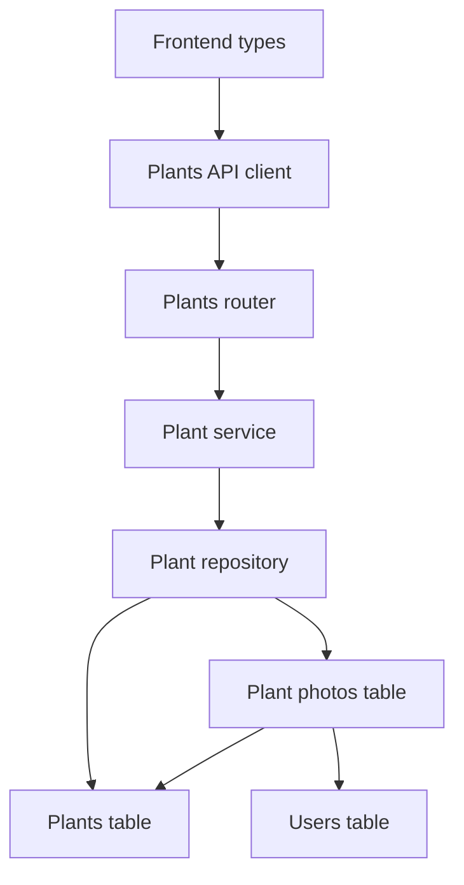
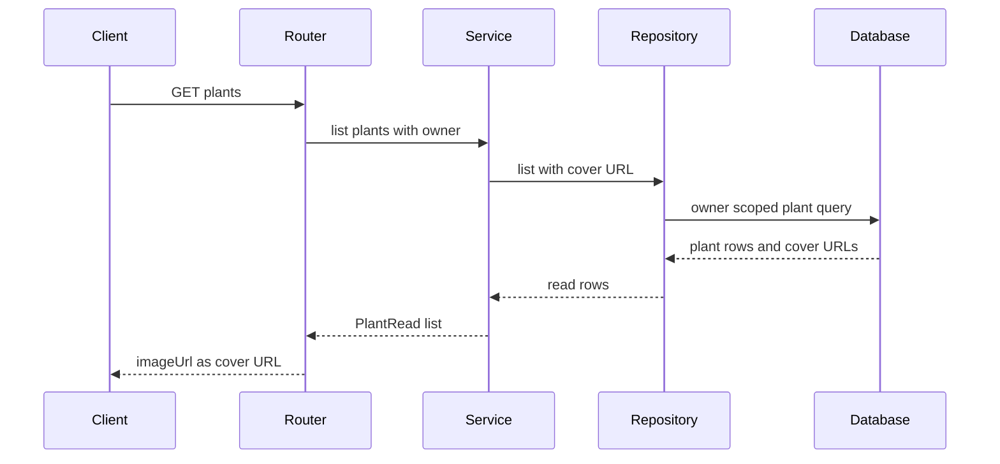
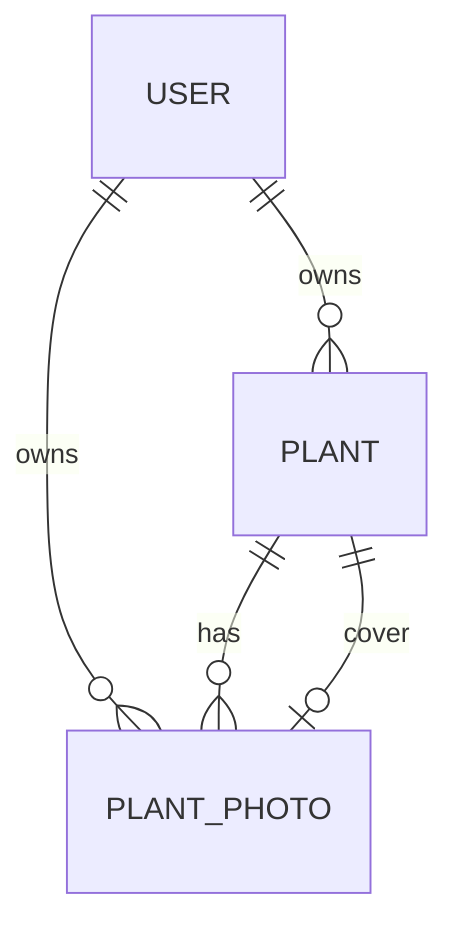

# Design Document

## Overview
Plant Photo Schema Foundation は、植物本体に単一画像URLを持たせる前提を解消し、植物個体に複数の写真記録を紐づけられる永続化基盤を追加する。ユーザー向けには、既存の植物一覧・詳細が代表画像を表示できる互換を維持しながら、新規植物は写真未設定でも正常に扱える状態にする。

この設計は画像アップロード機能ではない。写真ファイルの保存・削除や外部ストレージ連携は追加せず、Backend のデータモデル、migration、read response、Frontend の型と既存表示の最小調整に限定する。

### Goals
- 植物個体に複数の写真記録を紐づけられる構造を追加する。
- `plants.image_url` 依存を廃止し、代表画像URLを写真記録から導出する。
- owner scoped な写真記録と、既存一覧・詳細APIの最小互換を両立する。
- SQLite と Turso/libSQL の migration / smoke verification path で検証可能にする。

### Non-Goals
- 画像アップロード、画像削除、外部画像ストレージ連携。
- 写真CRUD endpoint、代表写真選択UI、成長記録ギャラリーUI。
- 既存 `plants.image_url` データの本番移行。
- サムネイル生成、画像変換、写真並び替え。

## Boundary Commitments

### This Spec Owns
- `PlantPhoto` domain entity と `plant_photos` 永続化構造。
- `Plant.cover_photo_id` による nullable な代表写真参照。
- 植物一覧・詳細・水やり関連 summary で返す `imageUrl` を代表写真URLとして導出する read contract。
- 植物作成 contract から植物本体画像入力を外し、写真未設定の植物作成を標準にする。
- owner scoped query による写真所有者分離と、他 owner の写真を代表写真として扱わない検証。

### Out of Boundary
- 写真ファイルの upload/download/delete lifecycle。
- storage key の署名URL生成、CDN、画像変換。
- 写真作成・更新・削除・並び替えの user-facing API。
- 代表写真をユーザーが選ぶ UI。
- `plant-registration` の植物基本項目や `plant-watering-care` の水やり計算そのもの。

### Allowed Dependencies
- `auth-authorization-foundation`: `CurrentUser.id` を internal owner id として使用する。
- `plant-registration`: 既存 `/plants` API、植物一覧・詳細画面、植物登録フォーム。
- `plant-watering-care`: 植物 summary に代表画像URLを渡す既存 contract。
- 既存 Backend layer: SQLModel model、Pydantic schema、Repository、Service、Router、Alembic。
- 既存 Frontend layer: typed API client、composable、presentation component、Vue Router。

### Revalidation Triggers
- `PlantRead.imageUrl` の削除、名前変更、object 化。
- `PlantCreateInput` に画像参照入力を再導入する変更。
- `cover_photo_id` にDB FKを追加する変更。
- 写真CRUD API、画像アップロード、画像削除、外部ストレージ連携の追加。
- owner id の由来または user-owned table policy の変更。

## Architecture

### Existing Architecture Analysis
- Backend は Router / Service / Repository / Database の layered architecture を使う。Service は FastAPI 例外を投げず、Router が HTTP mapping を行う。
- `watering_records` は `owner_user_id` と `plant_id` を持つ child table で、写真記録もこの pattern に合わせる。
- Frontend は `src/types`、`src/api`、`src/composables`、`src/components` の依存方向を持つ。今回のUI変更は登録フォームから画像URL入力を外し、一覧・詳細の代表画像表示を継続する範囲に留める。

### Architecture Pattern & Boundary Map
**Architecture Integration**:
- Selected pattern: owner scoped child entity + read model join。
- Domain/feature boundaries: 写真記録は `PlantPhoto` が所有し、植物 read response は代表写真URLだけを投影する。
- Existing patterns preserved: SQLModel table model、Repository owner scope、Service validation、camelCase API response、Alembic migration tests。
- New components rationale: `PlantPhoto` model/repository は写真記録の所有者・植物所属・代表URL導出を植物本体から分離するために必要。
- Steering compliance: owner column 必須、owner id 非公開、SQLite/libSQL migration 互換、TypeScript `any` 不使用。



### Technology Stack

| Layer | Choice / Version | Role in Feature | Notes |
|-------|------------------|-----------------|-------|
| Frontend | Vue 3 / TypeScript / Vite | Plant 型、登録フォーム、一覧・詳細表示の互換調整 | 新規依存なし |
| Backend | FastAPI / Pydantic / SQLModel / SQLAlchemy Session | API schema、domain validation、owner scoped persistence | 既存 layer に追加 |
| Data / Storage | Alembic / SQLite / Turso libSQL | `plant_photos` と `cover_photo_id` migration | 双方向DB FKは避ける |
| Infrastructure / Runtime | 既存 test/smoke scripts | local SQLite と Turso path の検証 | 新規 runtime prerequisite なし |

## File Structure Plan

### Directory Structure
```text
backend/
├── alembic/versions/
│   └── 0004_create_plant_photos.py
├── app/
│   ├── models/
│   │   ├── __init__.py
│   │   ├── plant.py
│   │   └── plant_photo.py
│   ├── repositories/
│   │   └── plant_repository.py
│   ├── schemas/
│   │   └── plant.py
│   ├── services/
│   │   └── plant_service.py
│   └── scripts/
│       └── verify_turso_crud.py
└── tests/
    ├── test_plant_photo_migration.py
    ├── test_plants_api.py
    ├── test_backend_integration_contract.py
    └── test_smoke_verification.py

frontend/
└── src/
    ├── components/plants/
    │   ├── PlantDetail.vue
    │   └── PlantForm.vue
    └── types/
        └── plant.ts
```

### Modified Files
- `backend/alembic/versions/0004_create_plant_photos.py` — `plant_photos` 作成、`plants.cover_photo_id` 追加、旧 `plants.image_url` 削除、indexes/constraints/downgrade を定義する。
- `backend/app/models/plant_photo.py` — `PlantPhoto` SQLModel table を追加する。
- `backend/app/models/plant.py` — `image_url` を削除し、`cover_photo_id` を追加する。
- `backend/app/models/__init__.py` — `PlantPhoto` を metadata discovery に含める。
- `backend/app/schemas/plant.py` — `PlantCreate` から canonical `image_url` 入力を外し、`PlantRead.image_url` を代表写真URLとして残す。
- `backend/app/repositories/plant_repository.py` — owner scoped list/detail で cover photo URL を導出し、写真所属検証 helper を持つ。
- `backend/app/services/plant_service.py` — 植物作成時に画像URLを保存せず、Repository read row から `PlantRead` を組み立てる。
- `backend/app/schemas/watering.py` と関連 service/repository — 植物 summary の `image_url` を代表写真URLとして返す。
- `backend/app/scripts/verify_turso_crud.py` — 写真未設定、複数写真、他 owner 写真混入なし、ownerless photo なしを smoke に追加する。
- `backend/tests/test_plant_photo_migration.py` — migration schema、旧 column 削除、downgrade を検証する。
- `backend/tests/test_plants_api.py` — create/list/detail の `imageUrl` 互換、owner separation、他 owner cover 無効を検証する。
- `backend/tests/test_backend_integration_contract.py` — route surface に写真CRUD endpoint が増えないことと owner情報非公開を検証する。
- `backend/tests/test_smoke_verification.py` — smoke script の写真基盤検証を固定する。
- `frontend/src/types/plant.ts` — `Plant.imageUrl` は nullable representative URL として維持し、`PlantCreateInput` / `PlantFormState` から `imageUrl` を削除する。
- `frontend/src/components/plants/PlantForm.vue` — 画像URL入力を削除し、植物作成 payload に画像URLを含めない。
- `frontend/src/components/plants/PlantDetail.vue` — 画像URL値の詳細行を削除し、代表画像表示と未設定表示を維持する。

## System Flows



代表写真がない、または代表写真に表示可能URLがない場合、Repository は `image_url=None` を返す。写真未登録は read failure ではない。

## Requirements Traceability

| Requirement | Summary | Components | Interfaces | Flows |
|-------------|---------|------------|------------|-------|
| 1.1 | 写真を植物に所属させる | PlantPhoto, PlantRepository | `PlantPhoto.plant_id` | Migration |
| 1.2 | 複数写真を独立保持する | PlantPhoto | `PlantPhoto.id` | Migration |
| 1.3 | 画像参照情報を保持する | PlantPhoto | `image_url`, `storage_key` | Migration |
| 1.4 | 撮影日を任意保持する | PlantPhoto | `taken_date` | Migration |
| 1.5 | コメントを任意保持する | PlantPhoto | `comment` | Migration |
| 1.6 | 作成・更新日時を保持する | PlantPhoto | `created_at`, `updated_at` | Migration |
| 2.1 | 代表写真を1つ参照する | Plant, PlantRepository | `cover_photo_id` | Read flow |
| 2.2 | 一覧・詳細で代表写真を扱う | PlantRepository, PlantRead, Frontend Plant | `imageUrl` | Read flow |
| 2.3 | 代表写真なしでも動く | PlantService, PlantRead, Plant UI | nullable `imageUrl` | Read flow |
| 2.4 | 他植物写真を代表にしない | PlantRepository | owner/plant scoped cover join | Read flow |
| 2.5 | 利用不可写真を未設定扱いする | PlantRepository | nullable cover URL | Read flow |
| 3.1 | 作成時に単一画像を要求しない | PlantCreate, PlantForm | create request | Create flow |
| 3.2 | 代表未設定で登録する | PlantService, Plant | `cover_photo_id=None` | Create flow |
| 3.3 | 植物本体を画像保存先にしない | Plant model, Migration | remove `image_url` column | Migration |
| 3.4 | 画像参照を写真記録に置く | PlantPhoto | image refs | Migration |
| 3.5 | 既存画像移行を完了条件にしない | Migration | no backfill | Migration |
| 4.1 | 写真所有者を認証ユーザーにする | PlantPhoto, Repository | `owner_user_id` | Repository |
| 4.2 | 写真と植物の所有者一致を要求する | PlantRepository | `_photo_belongs_to_owner_plant` | Repository |
| 4.3 | 所有写真だけ取得対象にする | PlantRepository | owner scoped joins | Read flow |
| 4.4 | 他 owner 存在を漏らさない | Router, Service, Repository | 404/None semantics | Read flow |
| 4.5 | owner id をレスポンス非公開にする | PlantRead, schemas | no owner field | API |
| 5.1 | 一覧に代表画像URLを返す | PlantRepository, PlantRead | list response `imageUrl` | Read flow |
| 5.2 | 詳細に代表画像URLを返す | PlantRepository, PlantRead | detail response `imageUrl` | Read flow |
| 5.3 | 代表なしなら未設定で返す | PlantRead | `imageUrl=null` | Read flow |
| 5.4 | 表示可能URLなしなら未設定で返す | PlantRepository | derived cover URL | Read flow |
| 5.5 | 既存基本情報を返す | PlantRead | existing fields | API |
| 5.6 | 写真未登録を失敗にしない | PlantRepository, Plant UI | nullable cover | Read flow |
| 6.1 | upload操作を提供しない | Router surface tests | no photo endpoints | API |
| 6.2 | storage連携を提供しない | Design boundary | no storage adapter | Boundary |
| 6.3 | file deleteを提供しない | Design boundary | no delete job | Boundary |
| 6.4 | gallery UIを提供しない | Frontend boundary | no gallery component | Boundary |
| 6.5 | 並び替え等を提供しない | Design boundary | no ordering API | Boundary |
| 6.6 | 後続uploadが写真記録を使える | PlantPhoto | image refs | Data model |
| 7.1 | 代表未設定を検証する | Tests, smoke | create/read tests | Verification |
| 7.2 | 複数写真を検証する | Tests, smoke | repository/migration tests | Verification |
| 7.3 | 他 owner 紐づけ不可を検証する | Tests, smoke | owner scoped tests | Verification |
| 7.4 | 写真未登録readを検証する | Tests, smoke | list/detail tests | Verification |
| 7.5 | 旧項目非依存を検証する | Tests, migration | no `plants.image_url` | Verification |

## Components and Interfaces

| Component | Domain/Layer | Intent | Req Coverage | Key Dependencies | Contracts |
|-----------|--------------|--------|--------------|------------------|-----------|
| PlantPhoto | Backend model | 写真記録の所有者・植物所属・画像参照を保持する | 1.1-1.6, 3.4, 4.1, 6.6 | User P0, Plant P0 | State |
| Plant | Backend model | 植物基本情報と nullable cover reference を保持する | 2.1, 2.3, 3.2, 3.3 | PlantPhoto P1 | State |
| PlantRepository | Backend persistence | owner scoped read と代表写真URL導出を担当する | 2.2-2.5, 4.2-4.4, 5.1-5.6 | Session P0 | Service |
| PlantService | Backend domain | 植物作成・read response 組み立てを担当する | 3.1-3.3, 5.5 | PlantRepository P0 | Service |
| Plant schemas | Backend API schema | create/read contract と camelCase response を定義する | 3.1, 4.5, 5.1-5.5 | Pydantic P0 | API |
| Plants UI types/forms | Frontend | create input から画像URLを外し、代表画像表示を維持する | 2.2, 2.3, 3.1, 5.1-5.6, 6.4 | API client P0 | State |
| Migration and verification | Data/Test | schema変更と回帰検証を固定する | 1.1-1.6, 3.3, 3.5, 7.1-7.5 | Alembic P0 | Batch |

### Backend Model Layer

#### PlantPhoto

| Field | Detail |
|-------|--------|
| Intent | 植物個体に紐づく写真メタデータを保持する |
| Requirements | 1.1, 1.2, 1.3, 1.4, 1.5, 1.6, 3.4, 4.1, 6.6 |

**Responsibilities & Constraints**
- `owner_user_id` は必須で、internal `users.id` を参照する。
- `plant_id` は必須で、`plants.id` を参照する。
- `image_url` と `storage_key` は nullable。今回の read response は `image_url` のみを表示可能URLとして使用する。
- `taken_date`, `comment`, `created_at`, `updated_at` を保持する。

**Dependencies**
- Outbound: `User` — owner FK (P0)
- Outbound: `Plant` — plant FK (P0)

**Contracts**: State [x]

##### State Management
- State model: immutable identifier + mutable metadata。
- Persistence & consistency: `owner_user_id`, `plant_id` による owner scoped child row。
- Concurrency strategy: 今回は写真更新APIを追加しないため optimistic locking は導入しない。

**Implementation Notes**
- Integration: `backend/app/models/__init__.py` に追加し、test metadata 作成に含める。
- Validation: ownerless photo が通常 path で作られないことを test/smoke で検証する。
- Risks: `storage_key` の意味は後続upload specで確定するため、今回の表示URL生成には使わない。

#### Plant

| Field | Detail |
|-------|--------|
| Intent | 植物基本情報と代表写真参照を保持する |
| Requirements | 2.1, 2.3, 3.2, 3.3 |

**Responsibilities & Constraints**
- `image_url` column は廃止する。
- `cover_photo_id` は nullable integer とする。
- `cover_photo_id` にDB FKは張らない。循環参照を避け、同一 owner/plant の整合は Repository query で担保する。

**Dependencies**
- Outbound: `PlantPhoto` — nullable logical reference (P1)

**Contracts**: State [x]

##### State Management
- State model: `cover_photo_id=None` が写真未設定の正規状態。
- Persistence & consistency: `cover_photo_id` が不正または参照不能なら read response では代表写真未設定として扱う。

**Implementation Notes**
- Integration: migration で旧 `image_url` を削除し、新 `cover_photo_id` を追加する。
- Validation: schema inspection test で `plants.image_url` が存在しないことを確認する。
- Risks: DB FKなしのため、後続の代表写真更新APIでは必ず owner/plant scoped validation を通す。

### Backend Persistence and Service Layer

#### PlantRepository

| Field | Detail |
|-------|--------|
| Intent | owner scoped plant read/write と代表写真URL導出を提供する |
| Requirements | 2.2, 2.3, 2.4, 2.5, 4.2, 4.3, 4.4, 5.1, 5.2, 5.3, 5.4, 5.6 |

**Responsibilities & Constraints**
- `list(owner_user_id)` と `get_by_id(owner_user_id, plant_id)` は owner scope を維持する。
- list/detail read は `Plant.cover_photo_id == PlantPhoto.id`、`PlantPhoto.owner_user_id == owner_user_id`、`PlantPhoto.plant_id == Plant.id` を満たす場合だけ `cover_image_url` を返す。
- cover photo がない、他 owner、他 plant、`image_url` が null の場合は `cover_image_url=None` にする。
- 写真CRUDは提供しない。ただし tests/smoke 用に必要な場合は repositoryではなく直接 model insert を使う。

**Dependencies**
- Inbound: `PlantService` — use case execution (P0)
- Outbound: SQLModel `Session` — persistence (P0)
- Outbound: `PlantPhoto` — cover URL join (P0)

**Contracts**: Service [x]

##### Service Interface
```python
@dataclass(frozen=True)
class PlantReadRow:
    plant: Plant
    cover_image_url: str | None

class PlantRepository:
    def create(self, plant: Plant) -> Plant: ...
    def list(self, owner_user_id: str) -> list[PlantReadRow]: ...
    def get_by_id(self, owner_user_id: str, plant_id: int) -> PlantReadRow | None: ...
```
- Preconditions: `owner_user_id` は認証済み internal user id。
- Postconditions: 返却 row は owner scoped。`cover_image_url` は対象 owner/plant の表示可能URLまたは `None`。
- Invariants: owner scope を外した list/detail query を通常API pathに置かない。

**Implementation Notes**
- Integration: 既存 `update_last_watered_at` は `Plant | None` のまま維持し、read row 型と混同しない。
- Validation: 他 owner の photo id を `cover_photo_id` に入れた場合でも `imageUrl=null` になる test を追加する。
- Risks: Watering summary の植物情報も代表画像URL導出が必要なため、既存 watering repository/service の read model に影響する。

#### PlantService

| Field | Detail |
|-------|--------|
| Intent | 植物作成と read response 変換を担当する |
| Requirements | 3.1, 3.2, 3.3, 5.5 |

**Responsibilities & Constraints**
- `create_plant` は画像URLを植物本体に保存しない。
- 新規植物は `cover_photo_id=None` で作成する。
- Repository の `PlantReadRow` から `PlantRead` を組み立て、`image_url` に `cover_image_url` を設定する。

**Dependencies**
- Inbound: `PlantsRouter` — protected API (P0)
- Outbound: `PlantRepository` — persistence (P0)

**Contracts**: Service [x]

##### Service Interface
```python
class PlantService:
    def create_plant(self, owner_user_id: str, payload: PlantCreate) -> PlantRead: ...
    def list_plants(self, owner_user_id: str) -> list[PlantRead]: ...
    def get_plant(self, owner_user_id: str, plant_id: int) -> PlantRead: ...
```
- Preconditions: `owner_user_id` は Router が `CurrentUser.id` から渡す。
- Postconditions: Response は owner id を含まず、`image_url` は代表写真URLまたは `None`。
- Invariants: `PlantCreate` の client supplied owner/image field は保存に使わない。

**Implementation Notes**
- Integration: blank name と watering cycle validation は既存通り維持する。
- Validation: spy service tests の `PlantRead` 作成箇所を新 contract に合わせる。
- Risks: 旧 tests が create response の `imageUrl` echo を期待しているため、代表写真未設定 `None` に更新する。

### Backend API Schema Layer

#### Plant schemas

| Field | Detail |
|-------|--------|
| Intent | Plant create/read JSON contract を定義する |
| Requirements | 3.1, 4.5, 5.1, 5.2, 5.3, 5.4, 5.5 |

**Responsibilities & Constraints**
- `PlantCreate` は `name`, `acquired_date`, `memo`, `watering_cycle_days` を受け取る。
- `PlantRead` は既存互換として `image_url: str | None` を返すが、意味は代表写真URLとする。
- `owner_user_id`, `cover_photo_id`, `storage_key` は user-facing response に出さない。

**Dependencies**
- Inbound: `PlantsRouter`, tests, OpenAPI generation (P0)
- External: Pydantic alias generator — camelCase contract (P0)

**Contracts**: API [x]

##### API Contract
| Method | Endpoint | Request | Response | Errors |
|--------|----------|---------|----------|--------|
| GET | `/plants` | なし | `imageUrl` を含む `PlantRead[]` | 401, 403 |
| POST | `/plants` | canonical な `imageUrl` を含まない `PlantCreate` | `imageUrl=null` の `PlantRead` | 401, 403, 422 |
| GET | `/plants/{plant_id}` | path id | `imageUrl` を含む `PlantRead` | 401, 403, 404 |

**Implementation Notes**
- Integration: Pydantic の既定の extra handling により legacy `imageUrl` request は無視できるが、植物写真や植物本体画像データを作ってはならない。
- Validation: OpenAPI/route contract tests で新しい写真 endpoint が追加されていないことを確認する。
- Risks: 将来 `coverPhoto` object が必要になる場合は revalidation trigger として扱う。

### Frontend Layer

#### Plants UI types/forms

| Field | Detail |
|-------|--------|
| Intent | Plant create input と代表画像表示 contract を typed に保つ |
| Requirements | 2.2, 2.3, 3.1, 5.1, 5.2, 5.3, 5.4, 5.5, 5.6, 6.4 |

**Responsibilities & Constraints**
- `Plant.imageUrl: string | null` は代表写真URLとして維持する。
- `PlantCreateInput` と `PlantFormState` から `imageUrl` を削除する。
- `PlantForm.vue` は画像URL入力欄を表示せず、payload にも含めない。
- `PlantList.vue` と `PlantDetail.vue` は `imageUrl` が null の場合の代替表示を維持する。
- `PlantDetail.vue` は画像URL文字列の詳細表示行を削除する。

**Dependencies**
- Inbound: Pages/composables — plant create/read workflow (P0)
- Outbound: `src/api/plants.ts` — typed request/response (P0)

**Contracts**: State [x]

##### State Management
- State model: `Plant.imageUrl` は nullable representative URL。
- Persistence & consistency: Frontend は画像URLを作成payloadとして保持しない。
- Concurrency strategy: 既存 page-local state のまま。

**Implementation Notes**
- Integration: `usePlants.addPlant` の signature は `PlantCreateInput` 変更だけで維持する。
- Validation: `npm run build` で型境界を確認する。
- Risks: Detail の「画像 URL」行削除は画面文言の小変更だが、画像アップロード前段として scope 内の最小UI調整に留める。

### Migration and Verification

#### Database migration and smoke verification

| Field | Detail |
|-------|--------|
| Intent | Schema 変更と回帰検証を Alembic/test/smoke に固定する |
| Requirements | 1.1, 1.2, 1.3, 1.4, 1.5, 1.6, 3.3, 3.5, 7.1, 7.2, 7.3, 7.4, 7.5 |

**Responsibilities & Constraints**
- `0004_create_plant_photos.py` は `plant_photos` を作成し、`plants.cover_photo_id` を追加し、`plants.image_url` を削除する。
- Downgrade は `plant_photos` と `cover_photo_id` を削除し、必要なら `plants.image_url` nullable を復元する。
- Migration は既存画像データの backfill をしない。
- Smoke は local SQLite と Turso path で owner scoped CRUD と写真基盤を検証する。

**Dependencies**
- External: Alembic — schema migration (P0)
- External: SQLAlchemy inspector — migration tests (P1)

**Contracts**: Batch [x]

##### Batch / Job Contract
- Trigger: Alembic upgrade to head。
- Input / validation: revision `0003` 時点の既存 schema。
- Output / destination: revision `0004` 時点の `plants` と `plant_photos` schema。
- Idempotency & recovery: Alembic revision ordering に従い、downgrade test で reversibility を確認する。

**Implementation Notes**
- Integration: `batch_alter_table("plants", recreate="always")` を使い、SQLite column drop と nullable column追加を安全に扱う。
- Validation: migration test は columns, FK, indexes, removed `image_url`, downgrade leftovers を検証する。
- Risks: `cover_photo_id` にDB FKを張らないため、schema testだけでなく owner mismatch read test が必須。

## Data Models

### Domain Model
- Aggregate root: `Plant`。
- Child entity: `PlantPhoto`。
- Business invariants:
  - `PlantPhoto.owner_user_id` は対象 `Plant.owner_user_id` と一致する。
  - `Plant.cover_photo_id` は nullable。
  - `Plant.cover_photo_id` が参照する写真が同一 owner / plant でない場合、代表写真として扱わない。
  - 写真未登録は正常状態。



### Logical Data Model

**Structure Definition**:
- `Plant`
  - `id`: integer identifier
  - `owner_user_id`: internal owner id
  - `cover_photo_id`: nullable photo identifier
  - existing plant fields: `name`, `acquired_date`, `memo`, `watering_cycle_days`, `last_watered_at`, `created_at`, `updated_at`
- `PlantPhoto`
  - `id`: integer identifier
  - `owner_user_id`: internal owner id
  - `plant_id`: owning plant id
  - `image_url`: nullable display URL
  - `storage_key`: nullable future storage reference
  - `taken_date`: nullable date
  - `comment`: nullable text
  - `created_at`: UTC datetime
  - `updated_at`: UTC datetime

**Consistency & Integrity**:
- `PlantPhoto.owner_user_id` は `User.id` を参照する。
- `PlantPhoto.plant_id` は `Plant.id` を参照する。
- `Plant.cover_photo_id` にはこの spec では DB FK を張らず、application read path で同一 owner / plant を検証する。
- 写真削除は scope 外のため、cascade behavior は導入しない。

### Physical Data Model

**Relational Tables**:
- `plants`
  - add `cover_photo_id INTEGER NULL`
  - remove `image_url TEXT NULL`
  - index `ix_plants_cover_photo_id` on `cover_photo_id`
- `plant_photos`
  - `id INTEGER PRIMARY KEY`
  - `owner_user_id TEXT NOT NULL`
  - `plant_id INTEGER NOT NULL`
  - `image_url TEXT NULL`
  - `storage_key TEXT NULL`
  - `taken_date DATE NULL`
  - `comment TEXT NULL`
  - `created_at DATETIME NOT NULL`
  - `updated_at DATETIME NOT NULL`
  - FK `owner_user_id -> users.id`
  - FK `plant_id -> plants.id`
  - index `ix_plant_photos_owner_user_id_plant_id_created_at`
  - index `ix_plant_photos_owner_user_id_plant_id_taken_date`

### Data Contracts & Integration

**API Data Transfer**:
- `PlantCreate`
  - `name: string`
  - `acquiredDate: string | null`
  - `memo: string | null`
  - `wateringCycleDays: number`
- `PlantRead`
  - `id: number`
  - `name: string`
  - `acquiredDate: string | null`
  - `memo: string | null`
  - `imageUrl: string | null`
  - `wateringCycleDays: number`
  - `createdAt: string`
  - `updatedAt: string`

`imageUrl` は互換 field として維持し、意味は代表写真URLとする。植物本体の画像保存 field としては扱わない。

## Error Handling

### Error Strategy
- 認証欠落または不正な認証は shared auth dependency が扱い、domain service 実行前に 401/403 とする。
- 他 owner の植物・写真参照は owner scoped query で扱い、not found または代表写真URL `None` として返す。
- 不正な植物作成入力は既存 router mapping により 422 を返す。
- 写真未登録は error ではない。

### Error Categories and Responses
- User Errors: 不正な植物作成 field は既存 validation message を返す。
- Authorization Errors: 他 owner detail は存在を漏らさず 404 を維持する。
- Data Integrity Gaps: 不正な `cover_photo_id` は read response で代表画像未設定として扱う。

### Monitoring
新しい monitoring system は導入しない。既存 tests と smoke verification をこの基盤の validation hook とする。

## Security and Privacy
- `owner_user_id` は `plant_photos` で必須とし、API response では返さない。
- Owner id は `CurrentUser.id` のみから決定し、client-supplied owner fields は引き続き無視する。
- Cover photo join は owner と plant の一致条件を必ず含める。
- public photo URL generation、signed URL handling、storage token、secret-bearing value は追加しない。

## Testing Strategy

### Backend Tests
- Migration schema test:
  - `plant_photos` table が期待する nullable / non-nullable columns を持つ。
  - `plants.cover_photo_id` が存在し、`plants.image_url` が存在しない。
  - `plant_photos` が `users` と `plants` への FK を持つ。
  - indexes が存在する。
  - downgrade で `plant_photos` と `cover_photo_id` が削除される。
- Plant API tests:
  - `imageUrl` なしで植物を作成すると `imageUrl: null` が返る。
  - legacy `imageUrl` を create request に含めても、植物本体に保存されず写真も作成されない。
  - cover photo が同一 owner / plant に属する場合、list/detail が cover photo の `imageUrl` を返す。
  - cover なし、不正 cover、他 owner cover、cover photo に `image_url` がない場合、list/detail は `imageUrl: null` を返す。
  - owner fields が露出しない。
- Integration contract tests:
  - 新しい写真CRUD routes が登録されていない。
  - 既存 `/plants` route surface が protected のまま維持される。
- Smoke verification:
  - local SQLite mode で植物を作成し、複数写真を direct insert し、1枚を cover にして representative URL を検証する。
  - 他 owner は representative URL に影響できない。
  - ownerless plant photos が存在しない。

### Frontend Tests and Build
- TypeScript build で `PlantCreateInput` が `imageUrl` を含まないことを確認する。
- Plant form が画像URLなしの payload を emit する。
- Plant list/detail は `imageUrl` が null の場合も代替表示を描画する。
- Plant detail は `imageUrl` がある場合に代表画像を描画し、raw URL を植物 field として表示しない。

## Rollout and Migration Notes
- 正式リリース前の schema change として扱い、production image backfill は不要とする。
- Alembic revision `0004` は `0003_create_watering_records` の後に適用する。
- `plants.image_url` を持つ既存 local data は、この変更で値を失う前提とする。
- `cover_photo_id` には DB FK がないため、将来の代表写真更新 behavior では read query validation と tests を必ず維持する。
