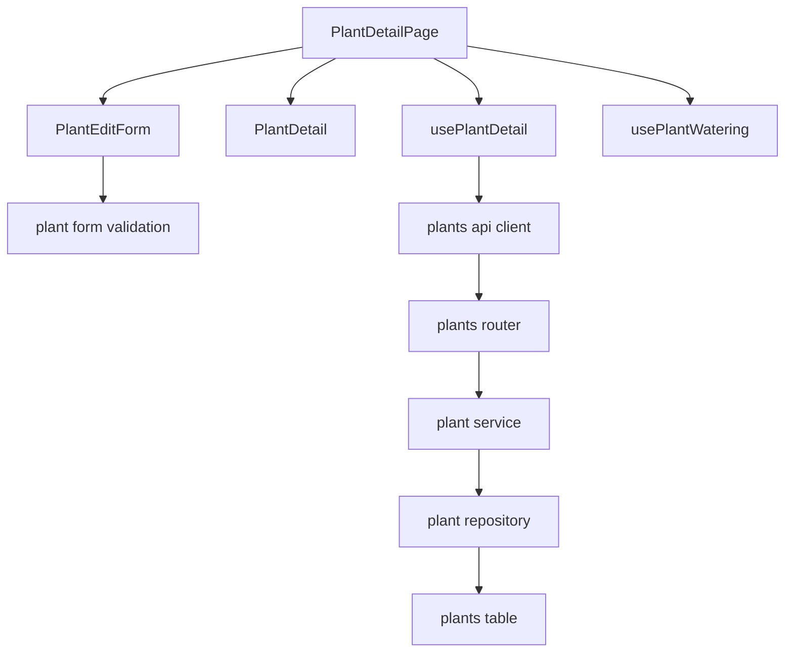
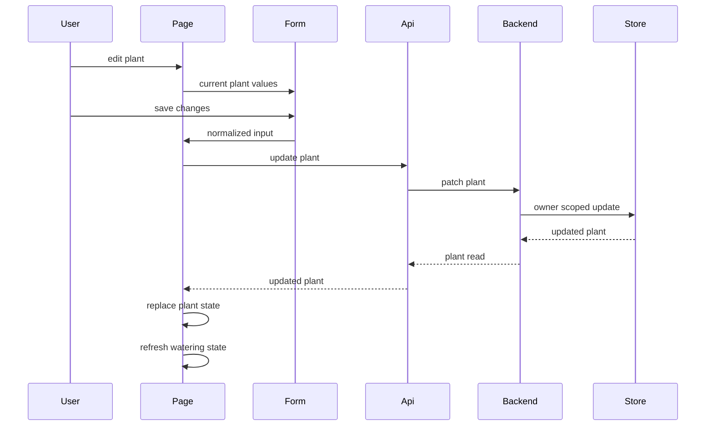

# Design Document

## Overview

Plant Profile Editing は、登録済み植物の既存基本情報を植物詳細画面から編集し、保存後に詳細表示と水やり関連表示へ即時反映する。既存の植物登録・詳細表示の縦切りを拡張し、植物名、家に来た日、メモ、水やり周期を owner-scoped に更新できるようにする。

この設計は既存の Frontend page / composable / API client / presentation component の分離と、Backend router / service / repository / schema の layered architecture を維持する。DB への項目追加は行わず、既存 `plants` table にある項目だけを対象にする。

### Goals
- 詳細画面内で既存の植物基本情報を編集、保存、取り消しできる。
- 保存成功後に詳細画面と水やり関連表示が更新後の植物情報を参照する。
- 植物更新 API は認証済み owner の植物だけを更新し、他 owner の存在を漏らさない。
- 登録時と同じ意味の入力検証を create/edit で共有する。

### Non-Goals
- DB への項目追加、既存テーブルにない植物属性の追加。
- 水やり記録の編集、削除、日付変更。
- 画像アップロード、複数写真、cover photo 選択 UI。
- 育成ガイド、推奨水やり周期。
- 共有ユーザー、共同編集、通知設定。
- 編集専用 route の追加。

## Boundary Commitments

### This Spec Owns
- 植物詳細画面における編集開始、編集フォーム表示、取り消し、保存状態、成功/失敗表示。
- 植物基本情報 update contract: `name`, `acquiredDate`, `memo`, `wateringCycleDays`。
- owner-scoped な植物更新 API と、更新後の `PlantRead` response。
- 登録/編集で共有する植物基本情報の入力検証。
- 更新成功後の plant state 差し替えと、水やり周期変更時の水やり状態再読込。

### Out of Boundary
- `plants` table への column 追加と migration。
- 現行 schema/model/table に存在しない新規植物属性。
- `PlantPhoto` の作成、更新、削除、画像 URL 入力、画像アップロード。
- `WateringRecord` の作成以外の編集、削除、日付補正。
- 植物属性マスタや候補の自動補完。
- global store の導入や route 構造の変更。

### Allowed Dependencies
- `plant-registration` の Plant 基本情報、一覧/詳細 read contract、既存 registration validation 文言。
- `plant-watering-care` の詳細画面内水やり状態表示と `wateringCycleDays` 参照。
- `auth-authorization-foundation` の `CurrentUser` dependency、internal owner id、認証/認可 error mapping。
- 既存 `plant-photo-schema-foundation` の cover photo read join。
- Vue 3、Vue Router、typed API client、FastAPI、SQLModel。

### Revalidation Triggers
- `PlantRead` / `PlantUpdate` の field 名、null semantics、serialization が変わる。
- 既存テーブルにない新規植物属性を追加したくなった。
- `wateringCycleDays` 更新後の水やり予定計算 contract が変わる。
- owner scope の lookup 方式、auth error mapping、response の owner field 非公開方針が変わる。
- cover photo の read contract が `imageUrl` 以外へ変わる。

## Architecture

### Existing Architecture Analysis
- Frontend は `PlantDetailPage` が詳細画面 composition、`usePlantDetail` が取得状態、`PlantDetail` が表示を担当している。
- `PlantForm` は登録専用 UI と client-side validation を持つ。編集では初期値、取り消し、保存中文言が必要なため、専用 `PlantEditForm` と共有 validation utility に分ける。
- Backend は `GET/POST /plants` と `GET /plants/{plant_id}` を持つ。`PATCH /plants/{plant_id}` を同じ router/service/repository 境界へ追加する。
- `imageUrl` は `PlantPhoto` から read response に合成されるため、更新 payload では扱わない。

### Architecture Pattern & Boundary Map



**Architecture Integration**:
- Selected pattern: existing layered extension。Frontend は Types → API client → Composable → Component/Page、Backend は Schema/Model → Repository → Service → Router の方向を維持する。
- Domain/feature boundaries: Plant update は Plant domain が所有し、Watering domain は更新後の Plant read state を参照するだけにする。
- Existing patterns preserved: authenticated API client、owner-scoped repository lookup、Router で HTTP error mapping、Service で domain validation。
- New components rationale: `PlantEditForm` は編集固有 state と取り消し UI を持つため、登録フォームから分離する。`plantFormValidation` は create/edit の検証重複を避ける。
- Steering compliance: owner は request から採用せず、response に owner/auth field を出さない。

### Technology Stack

| Layer | Choice / Version | Role in Feature | Notes |
|-------|------------------|-----------------|-------|
| Frontend | Vue 3 / Vite / TypeScript / Tailwind CSS | 詳細画面内編集、typed state、入力検証 | 新規 dependency なし |
| Backend | FastAPI / Pydantic / SQLModel | owner-scoped update API、validation、response serialization | 既存 layer へ追加 |
| Data / Storage | Existing SQLite / Turso libSQL schema | 既存 `plants` row の更新 | 新規 migration なし |
| Auth | Clerk backed CurrentUser boundary | protected update owner resolution | 既存 dependency を利用 |

## File Structure Plan

### Directory Structure

```text
backend/
├── app/
│   ├── schemas/plant.py                   # PlantUpdate contract for existing fields
│   ├── repositories/plant_repository.py   # owner-scoped profile update persistence
│   ├── services/plant_service.py          # update validation and PlantRead mapping
│   ├── routers/plants.py                  # PATCH /plants/{plant_id}
│   └── scripts/verify_turso_crud.py       # smoke coverage for update round trip
└── tests/
    ├── test_plants_api.py                 # update API validation and owner tests
    ├── test_e2e_owner_model_regression.py # route surface and other-owner update regression
    └── test_smoke_verification.py         # smoke script expectations if needed

frontend/
└── src/
    ├── types/plant.ts                     # PlantUpdateInput and edit form state
    ├── api/plants.ts                      # updatePlant method
    ├── utils/plantFormValidation.ts       # shared plant form validation and normalization
    ├── composables/usePlantDetail.ts      # update state and updatePlant action
    ├── components/plants/
    │   ├── PlantDetail.vue                # edit event and existing field display
    │   └── PlantEditForm.vue              # edit form presentation and client validation
    └── pages/PlantDetailPage.vue          # edit mode orchestration and watering refresh
```

### Modified Files
- `backend/app/schemas/plant.py` — define `PlantUpdate` for existing editable fields with camelCase serialization and unset/null semantics.
- `backend/app/repositories/plant_repository.py` — add owner-scoped update method that loads by owner id and plant id, mutates allowed fields, flushes/commits according to service contract, and preserves cover photo join.
- `backend/app/services/plant_service.py` — reuse validation for create/update, trim strings, normalize optional fields, set `updated_at`, return `PlantRead` with cover image.
- `backend/app/routers/plants.py` — add `PATCH /plants/{plant_id}` and map validation to 422, missing/other owner to 404.
- `backend/app/scripts/verify_turso_crud.py` — verify update round trip, owner separation, and watering name/current cycle interaction.
- `backend/tests/test_plants_api.py` — add update success, field clearing, validation, owner hiding, and response shape tests.
- `backend/tests/test_e2e_owner_model_regression.py` — update route surface expectations from PATCH 405 to PATCH 404 for other owner.
- `frontend/src/types/plant.ts` — add `PlantUpdateInput` and edit form state types without adding new Plant fields.
- `frontend/src/api/plants.ts` — add typed `updatePlant(id, input)` method using authenticated API client.
- `frontend/src/utils/plantFormValidation.ts` — centralize name, date, memo normalization, watering cycle parsing.
- `frontend/src/composables/usePlantDetail.ts` — expose `isUpdating`, `updateError`, `successMessage`, `updatePlant`, and keep `plant` synced with response.
- `frontend/src/components/plants/PlantDetail.vue` — emit edit only when plant is loaded and no detail error.
- `frontend/src/components/plants/PlantEditForm.vue` — render edit inputs with current values, submit/cancel events, field/server errors, disabled saving state.
- `frontend/src/pages/PlantDetailPage.vue` — hold `isEditing`, switch detail/edit UI, refresh watering state after successful update.

## System Flows



Key decisions:
- Form-level validation runs before API submission, but Backend remains authoritative for validation.
- Update response is the source of truth for the post-save detail display.
- Watering records are not mutated; only derived watering display is refreshed.

## Requirements Traceability

| Requirement | Summary | Components | Interfaces | Flows |
|-------------|---------|------------|------------|-------|
| 1.1 | 詳細画面に編集導線を表示 | `PlantDetail`, `PlantDetailPage` | `edit` event | Edit flow |
| 1.2 | 現在値を見ながら編集 | `PlantEditForm`, `usePlantDetail` | `PlantEditFormModel` | Edit flow |
| 1.3 | 編集対象識別 | `PlantEditForm` | Props `plant` | Edit flow |
| 1.4 | 取り消し | `PlantEditForm`, `PlantDetailPage` | `cancel` event | Edit flow |
| 1.5 | 取得失敗時は編集不可 | `PlantDetail`, `PlantDetailPage` | Display state | Error handling |
| 2.1 | 既存基本情報を編集対象にする | `PlantEditForm`, `PlantUpdate`, `PlantService` | `PlantUpdateInput` | Edit flow |
| 2.2 | 既存登録フォーム保持項目を更新対象にする | `PlantUpdate`, `PlantRead` | API schema | Edit flow |
| 2.3 | 任意項目のクリア | `PlantEditForm`, `PlantService` | null semantics | Edit flow |
| 2.4 | 鉢個体単位を維持 | `PlantService`, `PlantRepository` | Plant aggregate | Data model |
| 3.1 | 植物名必須 | validation utility, `PlantService` | Validation errors | Error handling |
| 3.2 | 水やり周期正数 | validation utility, `PlantService` | Validation errors | Error handling |
| 3.3 | 水やり周期数値 | validation utility, API schema | Validation errors | Error handling |
| 3.4 | 日付妥当性 | validation utility, API schema | Validation errors | Error handling |
| 3.5 | 入力見直し維持 | `PlantEditForm`, `usePlantDetail` | Error state | Error handling |
| 3.6 | 登録時検証と整合 | validation utility, `PlantService` | Shared rules | Error handling |
| 4.1 | 有効内容を保存 | `updatePlant`, `PlantService` | PATCH API | Edit flow |
| 4.2 | 保存中と重複防止 | `usePlantDetail`, `PlantEditForm` | `isUpdating` | Edit flow |
| 4.3 | 保存成功表示 | `usePlantDetail`, `PlantDetailPage` | `successMessage` | Edit flow |
| 4.4 | 保存失敗から再試行 | `usePlantDetail`, `PlantEditForm` | `updateError` | Error handling |
| 4.5 | 認証切れ | authenticated API client, `PlantEditForm` | `ApiError` | Error handling |
| 5.1 | 更新後詳細表示 | `usePlantDetail`, `PlantDetail` | `PlantRead` | Edit flow |
| 5.2 | 更新後植物名 | `PlantDetail`, watering heading | `Plant.name` | Edit flow |
| 5.3 | 更新後日付 | `PlantDetail` | `Plant.acquiredDate` | Edit flow |
| 5.4 | 更新後メモ | `PlantDetail` | `Plant.memo` | Edit flow |
| 5.5 | 更新後水やり周期 | `PlantDetailPage`, `usePlantWatering` | `loadWatering` | Edit flow |
| 5.6 | 未入力項目表示 | `PlantDetail` | null display | Edit flow |
| 6.1 | owner の植物だけ更新 | router/service/repository | PATCH API | Security |
| 6.2 | 未ログインは保護 | auth boundary, route gate | `ApiError` | Security |
| 6.3 | 他 owner は存在非公開 | repository lookup | 404 contract | Security |
| 6.4 | owner/auth 非表示 | schemas, API client | `PlantRead` | Security |
| 6.5 | request owner を信用しない | schema/service | accepted fields only | Security |
| 7.1 | 周期更新で実績非変更 | `PlantService`, `WateringService` | Plant update only | Edit flow |
| 7.2 | 現在名表示 | `PlantRead`, watering queries | current Plant name | Edit flow |
| 7.3 | 日付更新で実績非変更 | `PlantService` | Plant update only | Edit flow |
| 7.4 | 時系列ずれで保存拒否しない | validation rules | no hard constraint | Error handling |
| 7.5 | 案内は補助情報 | `PlantEditForm` | optional help text | Error handling |
| 8.1 | 暮らしの記録の文言 | UI components | text contract | UI |
| 8.2 | タスクよりお世話 | UI components | text contract | UI |
| 8.3 | 管理より記録 | UI components | text contract | UI |
| 8.4 | 小画面で主要操作可読 | `PlantEditForm`, layout | responsive classes | UI |
| 8.5 | 詳細画面を中心にする | `PlantDetailPage` | inline edit state | Edit flow |

## Components and Interfaces

| Component | Domain/Layer | Intent | Req Coverage | Key Dependencies | Contracts |
|-----------|--------------|--------|--------------|------------------|-----------|
| `PlantEditForm` | Frontend UI | 現在値を持つ編集フォーム | 1.2, 1.3, 1.4, 3.5, 4.2, 4.4, 8.4 | validation utility P0 | State |
| `PlantDetail` | Frontend UI | 詳細表示と編集導線 | 1.1, 1.5, 5.1, 5.6, 8.1 | Plant type P0 | State |
| `usePlantDetail` | Frontend composable | 詳細取得と更新 state orchestration | 4.1, 4.2, 4.3, 4.4, 5.1 | plants API P0 | Service, State |
| `plants api client` | Frontend API | typed authenticated plant API | 4.1, 6.2 | authenticated API client P0 | Service |
| `plantFormValidation` | Frontend utility | create/edit 入力の normalize と validation | 3.1, 3.2, 3.3, 3.4, 3.6 | none P0 | Service |
| `PlantsRouter` | Backend router | PATCH endpoint and HTTP error mapping | 4.1, 6.1, 6.3 | CurrentUser P0, PlantService P0 | API |
| `PlantService` | Backend service | domain validation and update use case | 2.1, 2.3, 3.1, 3.2, 7.4 | PlantRepository P0 | Service |
| `PlantRepository` | Backend repository | owner-scoped persistence | 6.1, 6.3, 7.1, 7.3 | SQLModel Session P0 | Service |
| `Plant schema` | Backend data contract | update/read shape for existing fields | 2.1, 6.4, 6.5 | Pydantic/SQLModel P0 | API |

### Frontend

#### `PlantEditForm`

| Field | Detail |
|-------|--------|
| Intent | 編集可能な既存植物基本情報を現在値付きで表示し、submit/cancel を発火する |
| Requirements | 1.2, 1.3, 1.4, 2.1, 2.3, 3.5, 4.2, 4.4, 7.5, 8.4 |

**Responsibilities & Constraints**
- `Plant` から form state を初期化し、`name`, `acquiredDate`, `memo`, `wateringCycleDays` を編集する。
- client-side validation は `plantFormValidation` を利用し、Backend validation と同じ意味の error を表示する。
- `isSubmitting` 中は保存 button を disabled にし、取り消しは二重送信を起こさない。
- Clerk token や API client を直接扱わない。

**Dependencies**
- Inbound: `PlantDetailPage` — current plant and submit/cancel callbacks (P0)
- Outbound: `plantFormValidation` — normalize and validate editable fields (P0)

**Contracts**: Service [ ] / API [ ] / Event [ ] / Batch [ ] / State [x]

##### State Management
- State model: local `PlantFormState` with string fields for inputs.
- Persistence & consistency: submit emits normalized `PlantUpdateInput`; parent owns persistence.
- Concurrency strategy: parent `isUpdating` prevents duplicate save.

**Implementation Notes**
- Integration: Use `type="date"` for acquired date and textarea for memo.
- Validation: Empty optional strings become `null`; name is trimmed and required.
- Risks: Editing a stale plant after reload failure is avoided by rendering form only when `plant` exists.

#### `usePlantDetail`

| Field | Detail |
|-------|--------|
| Intent | Plant detail read/update state and API orchestration |
| Requirements | 4.1, 4.2, 4.3, 4.4, 4.5, 5.1, 6.2 |

**Responsibilities & Constraints**
- Parse route plant id once for get/update operations.
- Expose `plant`, `isLoading`, `error`, `isUpdating`, `updateError`, `successMessage`, `loadPlant`, `updatePlant`.
- On update success, replace `plant.value` with returned `Plant`.
- Do not own watering state; caller decides whether to reload watering.

**Dependencies**
- Inbound: `PlantDetailPage` — calls load/update and reads state (P0)
- Outbound: `plants api client` — authenticated requests (P0)
- Outbound: `createApiError` — invalid route id error (P1)

**Contracts**: Service [x] / API [ ] / Event [ ] / Batch [ ] / State [x]

##### Service Interface
```typescript
interface UsePlantDetailResult {
  plant: Ref<Plant | null>
  isLoading: Ref<boolean>
  error: Ref<ApiError | null>
  isUpdating: Ref<boolean>
  updateError: Ref<ApiError | null>
  successMessage: Ref<string | null>
  loadPlant(): Promise<void>
  updatePlant(input: PlantUpdateInput): Promise<Plant | null>
}
```
- Preconditions: route plant id must parse to a positive integer.
- Postconditions: success replaces `plant` and clears `updateError`; failure leaves existing `plant` available for correction.
- Invariants: update is ignored or returns null while already updating.

### Backend

#### `PlantsRouter`

| Field | Detail |
|-------|--------|
| Intent | Plant update HTTP entrypoint and error mapping |
| Requirements | 4.1, 6.1, 6.2, 6.3 |

**Responsibilities & Constraints**
- Add `PATCH /plants/{plant_id}` with `CurrentUser` dependency.
- Pass only `current_user.id`, route `plant_id`, and parsed `PlantUpdate` to service.
- Map `PlantValidationError` to 422 and `PlantNotFoundError` to 404.

**Dependencies**
- Inbound: Frontend plants API client — update request (P0)
- Outbound: `PlantService` — update use case (P0)
- External: CurrentUser dependency — auth and active user gate (P0)

**Contracts**: Service [ ] / API [x] / Event [ ] / Batch [ ] / State [ ]

##### API Contract
| Method | Endpoint | Request | Response | Errors |
|--------|----------|---------|----------|--------|
| PATCH | `/plants/{plant_id}` | `PlantUpdate` JSON | `PlantRead` JSON | 401, 403, 404, 422, 500 |

#### `PlantService`

| Field | Detail |
|-------|--------|
| Intent | Plant profile update validation and read model mapping |
| Requirements | 2.1, 2.3, 3.1, 3.2, 3.4, 3.6, 7.1, 7.3, 7.4 |

**Responsibilities & Constraints**
- Share validation semantics between create and update for name and watering cycle.
- Normalize strings: trim required name, trim optional memo, convert empty optional values to `None`.
- Update only Plant basic fields; never mutate `last_watered_at`, watering records, owner id, or cover photo.
- Set `updated_at` on successful profile update.

**Dependencies**
- Inbound: `PlantsRouter` — update command (P0)
- Outbound: `PlantRepository` — owner-scoped persistence (P0)

**Contracts**: Service [x] / API [ ] / Event [ ] / Batch [ ] / State [ ]

##### Service Interface
```python
class PlantService:
    def update_plant(
        self,
        owner_user_id: str,
        plant_id: int,
        payload: PlantUpdate,
    ) -> PlantRead: ...
```
- Preconditions: `owner_user_id` is internal active user id from auth boundary.
- Postconditions: returned `PlantRead` contains updated existing basic fields and owner-safe cover image.
- Invariants: owner, cover photo, last watered timestamp, and watering records are not changed.

#### `PlantRepository`

| Field | Detail |
|-------|--------|
| Intent | Owner-scoped Plant persistence update |
| Requirements | 6.1, 6.3, 6.5, 7.1, 7.3 |

**Responsibilities & Constraints**
- Lookup uses both `owner_user_id` and `plant_id`.
- Return `None` for missing or other-owner plant.
- Persist only allowed existing fields supplied by service.
- Commit/refresh behavior should match existing `create` endpoint expectations for immediate response consistency.

**Dependencies**
- Inbound: `PlantService` — validated update values (P0)
- Outbound: SQLModel `Session` — persistence (P0)

**Contracts**: Service [x] / API [ ] / Event [ ] / Batch [ ] / State [ ]

##### Service Interface
```python
class PlantRepository:
    def update_profile(
        self,
        owner_user_id: str,
        plant_id: int,
        values: PlantProfileUpdateValues,
    ) -> Plant | None: ...
```
- Preconditions: `values` contains only editable existing Plant profile fields.
- Postconditions: owned plant is updated and returned; other-owner plant returns `None`.
- Invariants: no ownerless lookup is used in normal API path.

## Data Models

### Domain Model
- Aggregate: `Plant` is the root for user-owned plant basic information.
- Editable profile fields: `name`, `acquired_date`, `memo`, `watering_cycle_days`.
- Non-editable in this spec: `owner_user_id`, `cover_photo_id`, `last_watered_at`, `created_at`.
- Invariants:
  - `name` is non-empty after trimming.
  - `watering_cycle_days >= 1`.
  - `memo` and `acquired_date` may be null.
  - owner id is never accepted from request payload.

### Logical Data Model

**Structure Definition**:
- No new entity or attribute is introduced.
- `PlantUpdate` maps only to existing `plants` columns.
- `PlantRead` response shape remains compatible with current read contract.

**Consistency & Integrity**:
- Plant update transaction changes only Plant row.
- Watering records retain their original timestamps and ids.
- Existing cover photo read behavior remains unchanged.

### Physical Data Model

No physical schema change is required. Existing `plants` columns and indexes are sufficient, especially `ix_plants_owner_user_id_id` for owner-scoped update lookup.

### Data Contracts & Integration

**API Data Transfer**

`PlantUpdate`
- `name?: string`
- `acquiredDate?: string | null`
- `memo?: string | null`
- `wateringCycleDays?: number`

`PlantRead`
- Existing fields remain unchanged.
- Owner/auth fields are excluded.
- `imageUrl` remains read-only and derived from cover photo.

Validation rules:
- If `name` is supplied, trimmed value must be non-empty.
- If `wateringCycleDays` is supplied, it must be an integer greater than or equal to 1.
- If `acquiredDate` is supplied, it must parse as a valid date or null.
- Unknown owner fields must not affect ownership.

## Error Handling

### Error Strategy
- Client-side validation catches common input errors and keeps the form editable.
- Backend validation is authoritative and returns 422 for invalid domain input.
- Authenticated API client maps 401/403/404/422/network/server statuses to typed `ApiError`.
- Existing plant state remains visible when update fails so users can correct and retry.

### Error Categories and Responses
- Validation: blank name, invalid watering cycle, invalid date → field or form error, no state replacement.
- Auth: missing/expired session → user-facing re-login guidance, no saved success state.
- Forbidden: inactive user → operation unavailable message via existing auth boundary.
- Not found: missing or other-owner plant → target unavailable and no existence leak.
- Network/server: save failed message and retry affordance.

### Monitoring
- No new monitoring dependency.
- Backend errors should preserve existing FastAPI logging behavior and avoid logging secret/token material.
- Smoke verification covers owner-scoped update path for local SQLite and Turso modes.

## Testing Strategy

### Unit Tests
- `PlantService.update_plant` trims name/memo, converts empty optional fields to null, and updates `updated_at`.
- `PlantService.update_plant` rejects blank name and watering cycle less than 1 with existing validation messages.
- `PlantRepository.update_profile` updates only owner-scoped plant and returns `None` for other owner.
- `plantFormValidation` normalizes edit form input and returns typed validation errors for name, date, and watering cycle.

### Integration Tests
- `PATCH /plants/{id}` returns updated `PlantRead` with no owner fields and preserved `imageUrl` read behavior.
- `PATCH /plants/{id}` can clear optional `memo` and `acquiredDate` by sending null.
- Other owner `PATCH /plants/{id}` returns 404 and does not mutate the target row.
- Invalid update payload returns 422 and leaves persisted plant unchanged.
- Smoke verification updates a created plant, checks updated name appears in heatmap/current-name path, and confirms no ownerless plants.

### E2E/UI Tests
- Detail page edit flow: open detail, click edit, see current values, change fields, save, see updated detail.
- Cancel flow: edit current values, change fields, cancel, see original detail.
- Validation flow: blank name or invalid watering cycle shows error and keeps form open.
- Auth/network error flow: save failure shows retryable error and does not show success.
- Mobile viewport check: edit fields, save, cancel, and error text remain readable without overlap.

### Performance/Load
- No new high-volume path is introduced.
- Update path uses owner id + plant id lookup and should remain O(log n) or indexed lookup under existing index strategy.
- No frontend global store or broad list invalidation is required for the detail flow.

## Security Considerations

- Protected update API requires `CurrentUser`.
- Request owner fields are ignored or rejected by schema and never used for ownership.
- Other-owner updates return 404 through owner-scoped lookup.
- `PlantRead` excludes internal owner id, Clerk id, tokens, and auth diagnostics.
- Frontend presentation components never handle Clerk SDK, bearer token, or Authorization header.

## Migration Strategy

No database migration is required. Rollout is limited to backend update API, frontend editing UI, and corresponding tests/smoke verification.
