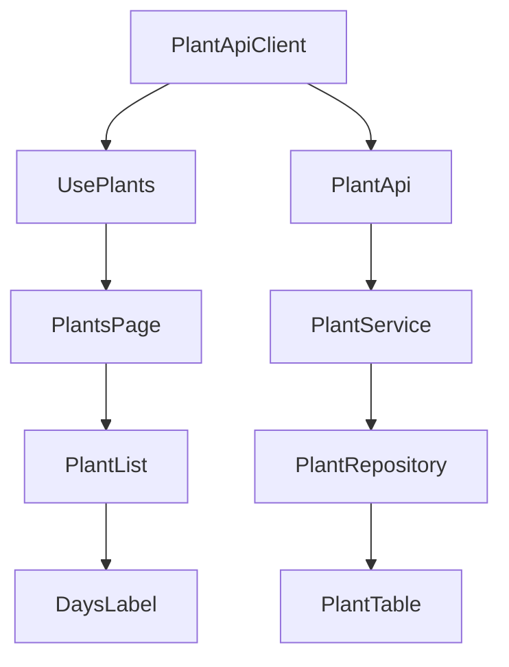

# Design Document

## Overview
Plant Registration は、ユーザー所有の鉢・個体として植物を登録し、一覧と詳細で見返せる基礎機能を提供する。既存実装では Plant API、owner scope、Vue Router、登録・一覧・詳細 UI が導入済みであり、今回の設計更新は植物一覧に「家に来てからXX日」を追加する表示改善を中心に扱う。

Plant 基本情報の authoritative source は Backend の Plant read model である。Frontend は既存の `acquiredDate` を使って一覧上の経過日表示を計算し、日付未設定時は未記録として表示する。水やり履歴、次回水やり予定、画像アップロード、植物種マスタは引き続きこの spec の境界外に置く。

### Goals
- 植物登録、一覧、詳細の既存 contract を維持する。
- 植物一覧で `acquiredDate` から「家に来てからXX日」を表示する。
- `acquiredDate` 未設定時に一覧を崩さず、家に来た日が未記録であることを表示する。
- 表示改善を Plant 基本情報の範囲に閉じ、水やり計算や新規 API を追加しない。

### Non-Goals
- Plant の更新、削除。
- 水やり完了、スキップ、履歴、次回水やり予定日の計算。
- 画像アップロード、画像ストレージ、複数写真ログ。
- 認証基盤そのものの設計変更。
- 植物種マスタ、植物図鑑、育成ガイド。

## Boundary Commitments

### This Spec Owns
- Plant 基本情報の作成、一覧取得、詳細取得。
- `name`, `acquiredDate`, `memo`, `imageUrl`, `wateringCycleDays` の入力、保存、表示 contract。
- 植物一覧での名前、画像、経過日、未記録状態、選択導線の表示。
- 植物詳細での基本情報表示。
- 登録前、取得失敗、登録失敗、詳細取得失敗のユーザー向け状態。

### Out of Boundary
- 水やり記録、最新水やり日時、次回水やり予定、今日のお世話。
- `acquiredDate` を使った水やり予定計算。
- Plant の所有者判定ロジックそのものの変更。既存 auth/owner scope に依存する。
- 画像 URL の検証強化、アップロード、変換、外部ストレージ連携。
- 植物種の正規化、推奨水やり周期、育成レコメンド。

### Allowed Dependencies
- Backend は既存の FastAPI、SQLModel、Pydantic schema、Router / Service / Repository 構成に従う。
- Backend Plant API は `CurrentUser` dependency により認証済み internal owner id を受け取り、Repository は owner scope を外さない。
- Frontend は `useAuthenticatedApi` と typed `PlantsApiClient` 経由で Plant API を呼び出す。
- Frontend は Vue 3 `<script setup lang="ts">`、Vue Router、page/composable/component/type 分離を維持する。
- 経過日表示は追加 dependency を導入せず、date-only 文字列を扱う小さな表示用関数で実現する。

### Revalidation Triggers
- `PlantRead.acquiredDate` の型、nullable 性、JSON field 名が変わる。
- Plant 一覧 API が `acquiredDate` を返さなくなる。
- 経過日表示を Backend 計算値に移す。
- Plant API の owner scope、認証 dependency、error mapping が変わる。
- `wateringCycleDays` が Plant 基本設定ではなく予定計算結果を表すようになる。
- `imageUrl` が URL 文字列以外の object contract に変わる。

## Architecture

### Existing Architecture Analysis
- `backend/app/routers/plants.py` が `GET /plants`, `POST /plants`, `GET /plants/{plant_id}` を提供している。
- `PlantService` は create/list/detail の use case と入力検証を担当し、FastAPI 例外を直接扱わない。
- `PlantRepository` は `owner_user_id` を条件に含め、他ユーザーの Plant を通常 API path で返さない。
- `frontend/src/types/plant.ts` は `Plant.acquiredDate: string | null` をすでに持つ。
- `frontend/src/components/plants/PlantList.vue` は名前、画像 fallback、水やり周期を表示しているが、経過日表示はまだ持たない。

### Architecture Pattern & Boundary Map
既存の layered vertical slice を維持する。経過日表示は Plant 基本情報の presentation concern であり、Backend schema や API endpoint は変更しない。



### Technology Stack

| Layer | Choice / Version | Role in Feature | Notes |
|-------|------------------|-----------------|-------|
| Frontend | Vue 3, TypeScript, Vue Router, Tailwind CSS | Plant 一覧・登録・詳細 UI | 追加 dependency なし |
| Backend | FastAPI, Pydantic, SQLModel | Plant API と owner-scoped read/write | API shape は維持 |
| Data | SQLite/Turso via SQLModel | Plant 基本情報の永続化 | `acquired_date` は既存列 |
| Auth | Clerk-backed current user dependency | owner scope の前提 | 本 spec は auth 基盤を変更しない |

## File Structure Plan

### Directory Structure
```text
backend/
└── app/
    ├── models/plant.py                # Plant table。acquired_date を保持する既存 source of truth
    ├── schemas/plant.py               # PlantCreate / PlantRead。acquiredDate を camelCase contract として公開
    ├── repositories/plant_repository.py # owner-scoped create/list/detail
    ├── services/plant_service.py      # Plant 入力検証と use case
    └── routers/plants.py              # Plant HTTP contract と error mapping

frontend/
└── src/
    ├── types/plant.ts                 # Plant / PlantCreateInput / PlantFormState
    ├── api/plants.ts                  # authenticated typed Plant API client
    ├── composables/usePlants.ts       # 一覧取得と登録 state
    ├── composables/usePlantDetail.ts  # 詳細取得 state
    ├── components/plants/PlantForm.vue   # 登録 form
    ├── components/plants/PlantList.vue   # 一覧、画像 fallback、経過日表示、空/失敗状態
    ├── components/plants/PlantDetail.vue # 詳細表示
    ├── pages/PlantsPage.vue           # 登録と一覧の composition
    └── pages/PlantDetailPage.vue      # 詳細 page composition
```

### Modified Files
- `frontend/src/components/plants/PlantList.vue` — `acquiredDate` から「家に来てからXX日」を表示し、未設定時は未記録文言を表示する。
- `frontend/tests/plant-ui-state.test.mjs` または一覧表示系テスト — 経過日表示、同日表示、未設定表示を検証する。
- `.kiro/specs/plant-registration/design.md` — requirements 更新に合わせた設計更新。
- `.kiro/specs/plant-registration/research.md` — 既存実装と表示改善方針の記録。

変更不要:
- Backend Plant API、schema、model は `acquiredDate` をすでに提供しているため変更しない。
- `frontend/src/types/plant.ts` は `acquiredDate: string | null` をすでに持つため変更しない。

## Requirements Traceability

| Requirement | Summary | Components | Interfaces | Flows |
|-------------|---------|------------|------------|-------|
| 1.1 | 登録手段を表示 | PlantsPage, PlantForm | PlantForm emits | Create flow |
| 1.2 | 有効な登録内容で作成 | PlantForm, usePlants, PlantsApiClient, PlantsRouter, PlantService, PlantRepository | POST `/plants` | Create flow |
| 1.3 | 一意の植物記録 | Plant model, PlantRepository, PlantRead | `id` | Create flow |
| 1.4 | 所有鉢・個体として扱う | Plant model, PlantService | Plant aggregate | Create/list/detail |
| 2.1 | name 保存 | PlantForm, PlantService, Plant model | PlantCreate `name` | Create flow |
| 2.2 | name 必須 error | PlantForm, PlantService, PlantsRouter | ApiError validation | Create flow |
| 2.3 | acquiredDate 保存 | PlantForm, Plant model, PlantRead | PlantCreate `acquiredDate` | Create/detail/list |
| 2.4 | memo 保存 | PlantForm, Plant model | PlantCreate `memo` | Create/detail |
| 2.5 | imageUrl 保存 | PlantForm, Plant model | PlantCreate `imageUrl` | Create/list/detail |
| 2.6 | wateringCycleDays 保存 | PlantForm, Plant model | PlantCreate `wateringCycleDays` | Create/list/detail |
| 2.7 | 1日未満 error | PlantForm, PlantService | ApiError validation | Create flow |
| 2.8 | 非数値周期 error | PlantForm | form validation state | Create flow |
| 3.1 | 一覧表示 | PlantsPage, usePlants, PlantList | GET `/plants` | List load |
| 3.2 | 植物名を一覧表示 | PlantList | Plant `name` | List render |
| 3.3 | 経過日を一覧表示 | PlantList | Plant `acquiredDate` | List render |
| 3.4 | 家に来た日未設定表示 | PlantList | Plant `acquiredDate: null` | List render |
| 3.5 | 画像あり一覧表示 | PlantList | Plant `imageUrl` | List render |
| 3.6 | 画像なし一覧維持 | PlantList | image fallback state | List render |
| 3.7 | 一覧から詳細へ遷移 | PlantList, PlantsPage, Vue Router | route `/plants/:plantId` | Detail route |
| 4.1 | 詳細項目表示 | PlantDetailPage, usePlantDetail, PlantDetail | GET `/plants/{plant_id}` | Detail load |
| 4.2 | 詳細画像表示 | PlantDetail | Plant `imageUrl` | Detail render |
| 4.3 | 任意項目未入力でも表示 | PlantDetail | nullable fields | Detail render |
| 4.4 | 存在しない詳細 error | PlantsRouter, usePlantDetail, PlantDetail | 404 mapped ApiError | Detail load |
| 5.1 | 空状態 | PlantList | empty plants state | List load |
| 5.2 | 一覧取得失敗 | usePlants, PlantList | ApiError | List load |
| 5.3 | 詳細取得失敗 | usePlantDetail, PlantDetail | ApiError | Detail load |
| 5.4 | 登録失敗と入力維持 | usePlants, PlantForm | ApiError and form state | Create flow |
| 6.1 | 後続参照用識別情報 | PlantRead, Plant model | `id` | All flows |
| 6.2 | 水やり周期を基本設定として保持 | PlantRead, Plant model | `wateringCycleDays` | All flows |
| 6.3 | 水やり完了等を持たない | Boundary, PlantsRouter | no watering action in Plant API | None |
| 6.4 | 次回水やり予定を計算しない | Boundary, PlantList | no next watering calculation | None |
| 6.5 | 画像 URL 保存のみ | PlantForm, PlantList, PlantDetail | `imageUrl` string | UI render |
| 6.6 | 種マスタ等を提供しない | Boundary, Plant model | no species relation | None |
| 7.1 | 暮らしの記録表現 | PlantForm, PlantList, PlantDetail | UI copy | All UI |
| 7.2 | 「お世話」優先 | PlantForm, PlantList, PlantDetail | UI copy | All UI |
| 7.3 | 「記録」優先 | PlantForm, PlantList, PlantDetail | UI copy | All UI |
| 7.4 | 小画面で読み取りやすい | PlantForm, PlantList, PlantDetail | responsive layout | All UI |

## Components and Interfaces

| Component | Domain/Layer | Intent | Req Coverage | Key Dependencies | Contracts |
|-----------|--------------|--------|--------------|------------------|-----------|
| Plant model | Backend data | Plant 基本情報の永続化 | 1.3, 1.4, 2.1-2.7, 6.1, 6.2, 6.5, 6.6 | SQLModel P0, User model P0 | State |
| Plant schemas | Backend API | camelCase JSON contract | 1.2, 2.1-2.7, 3.1, 4.1, 6.1, 6.2, 6.5 | Pydantic P0 | API |
| PlantRepository | Backend persistence | owner-scoped create/list/detail | 1.2, 1.3, 3.1, 4.1, 4.4 | Session P0 | Service |
| PlantService | Backend domain | validation and use case orchestration | 1.2, 1.4, 2.2, 2.7, 4.4, 6.3, 6.4 | PlantRepository P0 | Service |
| PlantsRouter | Backend HTTP | Plant REST contract and error mapping | 1.2, 3.1, 4.1, 4.4, 5.2-5.4 | CurrentUser P0, PlantService P0 | API |
| PlantsApiClient | Frontend integration | typed authenticated Plant API calls | 1.2, 3.1, 4.1, 5.2-5.4 | useAuthenticatedApi P0 | Service |
| usePlants | Frontend state | list and create state | 1.2, 3.1, 5.1, 5.2, 5.4 | PlantsApiClient P0 | State |
| usePlantDetail | Frontend state | detail fetch state | 4.1, 4.4, 5.3 | PlantsApiClient P0 | State |
| PlantForm | Frontend UI | create form and client validation | 1.1, 2.1-2.8, 5.4, 7.1-7.4 | usePlants P0 | State |
| PlantList | Frontend UI | list, image fallback, days-since label, empty/error states | 3.1-3.7, 5.1, 5.2, 7.1-7.4 | Plant type P0 | State |
| PlantDetail | Frontend UI | detail and not found/error state | 4.1-4.4, 5.3, 7.1-7.4 | Plant type P0 | State |

### Backend

#### Plant Model and Schemas

**Responsibilities & Constraints**
- `Plant` はユーザー所有の鉢・個体を表す。
- `owner_user_id` は既存 auth 基盤から得た internal user id を保存し、API response には露出しない。
- `acquired_date` は任意の日付として保存し、一覧経過日表示の入力になる。
- `last_watered_at` は水やり spec の summary field であり、この spec の UI 表示には使わない。
- `PlantRead` は `createdAt`, `updatedAt` を UTC ISO 文字列として返す。

**Contracts**: Service [ ] / API [x] / Event [ ] / Batch [ ] / State [x]

##### API Data Types
```python
class PlantCreate(SQLModel):
    name: str
    acquired_date: date | None = None
    memo: str | None = None
    image_url: str | None = None
    watering_cycle_days: int

class PlantRead(PlantCreate):
    id: int
    created_at: datetime
    updated_at: datetime
```

#### PlantRepository and PlantService

**Responsibilities & Constraints**
- Repository は `owner_user_id` を条件に含む `create`, `list`, `get_by_id` を提供する。
- Service は trim 後の空 name と `watering_cycle_days < 1` を拒否する。
- Service は Plant read model に水やり予定、履歴、所有者情報を追加しない。

**Contracts**: Service [x] / API [ ] / Event [ ] / Batch [ ] / State [ ]

##### Service Interface
```python
class PlantService:
    def create_plant(self, owner_user_id: str, payload: PlantCreate) -> PlantRead: ...
    def list_plants(self, owner_user_id: str) -> list[PlantRead]: ...
    def get_plant(self, owner_user_id: str, plant_id: int) -> PlantRead: ...
```

#### PlantsRouter

**Contracts**: Service [ ] / API [x] / Event [ ] / Batch [ ] / State [ ]

##### API Contract
| Method | Endpoint | Request | Response | Errors |
|--------|----------|---------|----------|--------|
| GET | `/plants` | none | `PlantRead[]` | 401, 403, 500 |
| POST | `/plants` | `PlantCreate` | `PlantRead` | 401, 403, 422, 500 |
| GET | `/plants/{plant_id}` | path `plant_id: int` | `PlantRead` | 401, 403, 404, 500 |

### Frontend

#### PlantsApiClient

**Responsibilities & Constraints**
- `useAuthenticatedApi` 経由で Plant API を呼び出す。
- Response は `Plant` 型として扱い、不明型への unsafe cast を避ける。
- API error は共通 `ApiError` に正規化された状態で composable/UI に渡る。

**Contracts**: Service [x] / API [x] / Event [ ] / Batch [ ] / State [ ]

##### Service Interface
```typescript
export interface PlantsApiClient {
  listPlants(): Promise<Plant[]>
  createPlant(input: PlantCreateInput): Promise<Plant>
  getPlant(id: number): Promise<Plant>
}
```

#### PlantList

**Responsibilities & Constraints**
- `plants`, `isLoading`, `error` を props として受け取り、`select` と `retry` を emits で返す。
- `acquiredDate` がある場合、今日との差分を calendar day 単位で計算して「家に来てからXX日」と表示する。
- `acquiredDate` がない場合、「家に来た日は未記録」と表示する。
- 同じ日の場合は `0日` として扱う。
- date-only 文字列は `YYYY-MM-DD` として分解し、時刻や timezone offset の影響で日数がずれないようにする。
- 計算関数は `today` を注入可能な純粋関数にして、UI テストで現在日付に依存しない検証を可能にする。

**Contracts**: Service [ ] / API [ ] / Event [ ] / Batch [ ] / State [x]

##### State Management
- State model: `brokenImageIds` for image fallback only.
- Derived labels: `daysSinceAcquiredLabel(plant.acquiredDate, today)`。
- Persistence: なし。表示専用の派生値として扱う。

## Data Models

### Domain Model
- Aggregate root: `Plant`
- Identity: `id`
- Owner scope: `owner_user_id`
- Value fields: `name`, `acquiredDate`, `memo`, `imageUrl`, `wateringCycleDays`
- Operational fields: `createdAt`, `updatedAt`
- Adjacent field: `lastWateredAt` は water care 用 summary であり Plant Registration UI の基本表示には含めない。

### Logical Data Model
| Attribute | Type | Required | Notes |
|-----------|------|----------|-------|
| id | integer | yes | primary identifier |
| ownerUserId | string | yes | response には露出しない |
| name | string | yes | main display label |
| acquiredDate | date | no | 家に来た日。経過日表示の入力 |
| memo | string | no | free text |
| imageUrl | string | no | external image URL |
| wateringCycleDays | integer | yes | basic watering cycle setting |
| createdAt | datetime | yes | UTC ISO response |
| updatedAt | datetime | yes | UTC ISO response |

### Data Contracts
API JSON uses camelCase:

```json
{
  "id": 1,
  "name": "リビングのモンステラ",
  "acquiredDate": "2026-05-28",
  "memo": "窓際に置いている",
  "imageUrl": "https://example.com/monstera.jpg",
  "wateringCycleDays": 7,
  "createdAt": "2026-05-31T08:00:00Z",
  "updatedAt": "2026-05-31T08:00:00Z"
}
```

## Error Handling

- Backend validation errors return 422 and are mapped to user-facing validation messages.
- Missing or other-owner Plant detail returns not found behavior without exposing owner information.
- Auth/session errors clear protected plant list state where appropriate and guide re-authentication through existing auth UI.
- Frontend list errors keep retry available.
- Registration failure keeps form input intact.
- Image load failure is isolated to that item and uses the existing fallback tile.

## Testing Strategy

### Unit and Component Tests
- `PlantService.create_plant` rejects empty trimmed name for 2.2.
- `PlantService.create_plant` rejects `wateringCycleDays < 1` for 2.7.
- `PlantRepository.list` and `get_by_id` enforce owner scope for 3.1, 4.4, and adjacent auth expectations.
- `PlantList` displays plant names for 3.2.
- `PlantList` displays `家に来てから12日` when `acquiredDate` is 12 calendar days before injected today for 3.3.
- `PlantList` displays `家に来てから0日` when `acquiredDate` equals injected today for 3.3.
- `PlantList` displays the unrecorded acquired-date message when `acquiredDate` is null for 3.4.
- `PlantList` keeps image fallback behavior for 3.5 and 3.6.

### Integration Tests
- `POST /plants` with valid payload returns `PlantRead` including `acquiredDate`, `id`, `createdAt`, and `updatedAt` for 1.2, 1.3, and 2.3.
- `GET /plants` returns owner-scoped plants including `acquiredDate` for 3.1 and 3.3.
- `GET /plants/{plant_id}` returns detail fields for 4.1.
- `GET /plants/{missing_or_other_owner_id}` returns not found behavior for 4.4.
- Invalid name or watering cycle returns validation error for 2.2 and 2.7.

### E2E and UI Tests
- User opens `/plants`, creates a plant with `acquiredDate`, and sees the plant in the list with a days-since label for 1.1, 1.2, 3.1, and 3.3.
- User opens `/plants` with a plant whose `acquiredDate` is null and sees the unrecorded message for 3.4.
- Empty list shows registration-oriented empty state for 5.1.
- Create failure leaves form values in place for 5.4.
- Mobile viewport shows form, list, detail, and days-since text without overlap for 7.4.

## Security Considerations

- Plant API remains protected by existing auth gate and current-user dependency.
- Owner id is never accepted from request body or exposed in Plant response.
- `imageUrl` is rendered as image source only and not executed as markup.
- Days-since display derives only from `acquiredDate`; it does not expose internal timestamps or owner identifiers.

## Performance & Scalability

- Days-since calculation is O(number of rendered plants) and runs in the existing list render path.
- No new Backend query or API field is required.
- List endpoint remains suitable for a personal plant collection; pagination can be added later without changing the days-since label contract.

## Early Verification Checklist

- Confirm `frontend/src/types/plant.ts` still exposes `acquiredDate: string | null`.
- Add or update `PlantList` tests with injected today date to avoid time-dependent failures.
- Run frontend tests covering plant list UI state.
- Run backend plant API tests to confirm no contract regression.
- Run `npm run build` in `frontend`.
