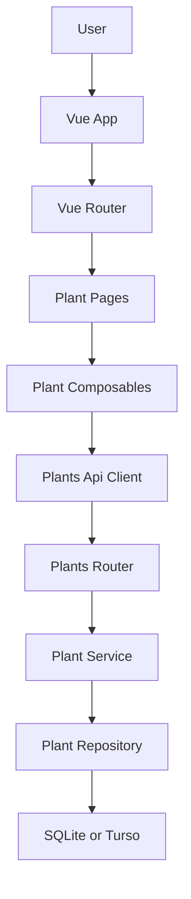
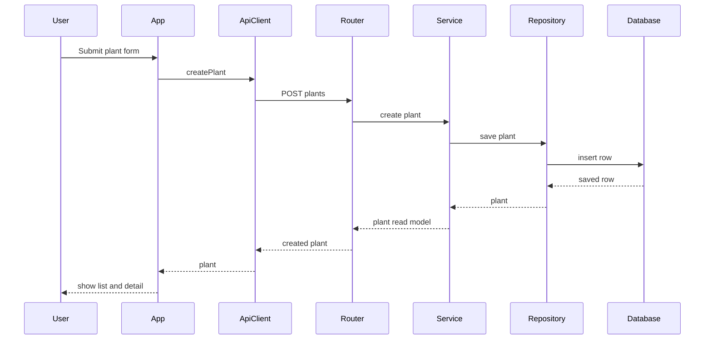

# Design Document

## Overview
Plant Registration は、Green Mate の最初の縦切りとして、ユーザー所有の鉢・個体を登録し、一覧と詳細で確認できる状態を提供する。Backend は Plant 基本情報の authoritative source となり、Frontend は登録・一覧・詳細の mobile first 体験を提供する。

この設計は既存の MVP 方針に合わせ、植物種 master、画像 upload、水やり履歴、次回予定計算、認証を取り込まない。後続の Watering Record、Today's Care TODO、Growth Photo Log は、この spec が安定化する Plant ID と基本属性を参照する。

### Goals
- 所有個体としての Plant を登録、一覧、詳細で扱える。
- Plant contract を後続機能が参照できる形で固定する。
- Vue 3 と FastAPI の初期構成から、必要最小限の dependency で MVP の縦切りを実装できる。
- Turso/libSQL 予定環境で migration と CRUD が成立することを Plant Registration の時点で検証する。

### Non-Goals
- 水やり完了、スキップ、履歴、次回予定計算。
- 画像 upload、画像 storage、複数写真ログ。
- 認証、ユーザー分離、共有。
- 植物種 master、植物図鑑、育成ガイド。
- Pinia などの global store 導入。

## Boundary Commitments

### This Spec Owns
- Plant 基本情報の作成、一覧取得、詳細取得。
- Plant の識別子、登録項目、validation rule、API contract。
- Frontend の登録 form、一覧 page、詳細 page、空状態、失敗時表示。
- Vue Router による `/plants` と `/plants/:plantId` の初期 routing。
- Local SQLite と Turso/libSQL の両方で動作する database connection と initial migration。
- UUID、datetime、boolean の SQLite 互換保存方針と round trip 検証。

### Out of Boundary
- Plant の更新と削除。
- 水やり event、次回水やり予定日、今日のお世話。
- Growth photo history と upload pipeline。
- Authentication、authorization、multi-user ownership。
- Plant species catalog と recommendation logic。

### Allowed Dependencies
- Frontend は Vue 3、Vue Router、TypeScript、Vite、Tailwind CSS を使用する。
- Frontend は `src/api/plants.ts` の API client 経由で Backend に依存する。
- Frontend は Pinia を使用しない。複数画面で共有する mutable state が明確になった場合のみ再検討する。
- Backend は FastAPI、Pydantic、SQLModel、SQLAlchemy session、Alembic migration、SQLAlchemy libSQL dialect を使用する。
- Backend の dependency direction は `core/db` → `models/schemas` → `repositories` → `services` → `routers` → `main` とする。
- Frontend の dependency direction は `types` → `api` → `composables` → `components` → `pages` → `router` → `App` とする。

### Revalidation Triggers
- Plant response schema の field 名、型、必須性が変わる。
- Plant ID の型または生成方法が変わる。
- `wateringCycleDays` の意味が「基本設定」から「予定計算結果」に変わる。
- `imageUrl` が URL 文字列から upload object または storage key に変わる。
- 認証または user ownership が Plant API contract に追加される。
- 複数画面で共有する Plant state、user session、care state が必要になり Pinia 導入を検討する。
- local SQLite と Turso/libSQL で migration または CRUD の挙動差分が見つかる。
- UUID、datetime、boolean の保存表現を変更する。

## Architecture

### Existing Architecture Analysis
- Backend は `backend/app/main.py` の root route のみで、router/service/repository/model/db directory は未作成。
- Frontend は Vite starter の `App.vue`, `HelloWorld.vue`, `style.css` が中心で、routing、API client、domain type、page component、screen component は未作成。
- Alembic dependency は存在するが、`alembic.ini` と migration environment は未作成。
- Turso/libSQL 接続用の `sqlalchemy-libsql` は未導入で、Turso remote 接続と Alembic migration は未検証。
- Tailwind CSS は project stack に含まれるが、frontend package には未導入。

### Architecture Pattern & Boundary Map
**Architecture Integration**
- Selected pattern: Layered CRUD vertical slice。既存 docs の Router / Service / Repository / Database に合わせる。
- Domain boundaries: Plant 基本情報だけを `plants` domain とし、水やりや写真は Plant ID を参照する downstream domain として分離する。
- Existing patterns preserved: FastAPI app entrypoint と Vue `<script setup>` を維持する。
- Frontend navigation: Vue Router 4 の explicit route records と `createWebHistory` を使い、Plant 一覧と詳細を URL で表現する。
- New components rationale: API contract、persistence、frontend state、presentation を分けることで task の境界を明確にする。
- Steering compliance: Mobile First、REST-based、OpenAPI-first、frontend-independent API design に合わせる。



### Technology Stack

| Layer | Choice / Version | Role in Feature | Notes |
|-------|------------------|-----------------|-------|
| Frontend | Vue 3.5.34, Vue Router 4, TypeScript 6.0.2, Vite 8.0.12 | 登録、一覧、詳細 UI と routing | Pinia は導入しない |
| Styling | Tailwind CSS | Mobile first UI styling | 未導入のため setup task が必要 |
| Backend | FastAPI 0.136.3, Pydantic 2.13.4 | REST API と request/response validation | OpenAPI contract を自動生成 |
| Data | SQLModel 0.0.38, SQLAlchemy 2.0.50, sqlalchemy-libsql 0.2.0 | Plant table model と persistence | `sqlite:///...` と `sqlite+libsql://...` を切り替える |
| Migration | Alembic 1.18.4 | `plants` table migration | local SQLite と Turso remote の両方で `upgrade head` を検証する |
| Runtime Config | python-dotenv 1.2.2 | database URL と Turso token 設定 | `DATABASE_URL`, `TURSO_DATABASE_URL`, `TURSO_AUTH_TOKEN` を扱う |

## File Structure Plan

### Directory Structure
```text
backend/
├── alembic.ini                         # Alembic CLI 設定
├── alembic/
│   ├── env.py                          # SQLModel metadata と database URL を migration に接続
│   └── versions/
│       └── 0001_create_plants.py       # plants table initial migration
└── app/
    ├── core/
    │   └── config.py                   # database URL と Turso credential など runtime 設定
    ├── db/
    │   ├── engine.py                   # SQLite と Turso libSQL に対応する SQLAlchemy engine 作成
    │   └── session.py                  # FastAPI session dependency
    ├── models/
    │   └── plant.py                    # Plant table model
    ├── repositories/
    │   └── plant_repository.py         # Plant persistence operations
    ├── routers/
    │   └── plants.py                   # HTTP endpoint と response mapping
    ├── schemas/
    │   └── plant.py                    # PlantCreate と PlantRead schema
    ├── services/
    │   └── plant_service.py            # Plant validation policy と use case orchestration
    ├── scripts/
    │   └── verify_turso_crud.py        # Turso migration 後の CRUD と型 round trip smoke test
    └── main.py                         # app setup と plants router registration

frontend/
├── package.json                        # Tailwind dependency と scripts の維持
├── postcss.config.js                   # Tailwind PostCSS 設定
├── tailwind.config.js                  # Tailwind content 対象設定
└── src/
    ├── api/
    │   └── plants.ts                   # typed Plant API client
    ├── components/
    │   └── plants/
    │       ├── PlantDetail.vue         # selected plant detail presentation
    │       ├── PlantForm.vue           # create plant form presentation
    │       └── PlantList.vue           # plant list and empty state presentation
    ├── composables/
    │   ├── usePlantDetail.ts           # route detail fetch state orchestration
    │   └── usePlants.ts                # list and create state orchestration
    ├── pages/
    │   ├── PlantDetailPage.vue         # /plants/:plantId page composition
    │   └── PlantsPage.vue              # /plants page composition
    ├── router/
    │   └── index.ts                    # Vue Router routes and history setup
    ├── types/
    │   └── plant.ts                    # Plant, PlantCreateInput, PlantFormState types
    ├── App.vue                         # app shell and router-view
    ├── main.ts                         # app mount with router registration
    └── style.css                       # Tailwind directives and app base styles
```

### Modified Files
- `backend/app/main.py` — CORS policy if needed for local dev, plants router registration, app metadata.
- `backend/requirements.txt` — add `sqlalchemy-libsql` for Turso/libSQL SQLAlchemy dialect.
- `frontend/package.json` — add Vue Router and Tailwind CSS toolchain if not already installed.
- `frontend/src/App.vue` — replace starter UI with app shell and `router-view`.
- `frontend/src/main.ts` — register router with Vue app.
- `frontend/src/style.css` — replace starter styles with Tailwind base and small global tokens.

## System Flows



登録後は一覧 state に作成済み Plant を追加し、detail selection を作成済み Plant に切り替える。API 取得失敗時は既存入力を破棄しない。

## Requirements Traceability

| Requirement | Summary | Components | Interfaces | Flows |
|-------------|---------|------------|------------|-------|
| 1.1 | 登録手段を表示 | PlantsPage, PlantForm | PlantForm props emits | Create flow |
| 1.2 | 有効な登録内容で作成 | PlantsPage, usePlants, PlantsApiClient, PlantsRouter, PlantService, PlantRepository | POST `/plants` | Create flow |
| 1.3 | 一意の植物記録 | Plant model, PlantRepository | PlantRead `id` | Create flow |
| 1.4 | 所有個体を単位にする | Plant model, PlantService | Plant aggregate | Create flow |
| 2.1 | name 保存 | PlantForm, PlantService, Plant model | PlantCreate `name` | Create flow |
| 2.2 | name 必須 error | PlantForm, PlantService, PlantsRouter | 422 validation error | Create flow |
| 2.3 | acquiredDate 保存 | PlantForm, Plant model | PlantCreate `acquiredDate` | Create flow |
| 2.4 | memo 保存 | PlantForm, Plant model | PlantCreate `memo` | Create flow |
| 2.5 | imageUrl 保存 | PlantForm, Plant model | PlantCreate `imageUrl` | Create flow |
| 2.6 | wateringCycleDays 保存 | PlantForm, Plant model | PlantCreate `wateringCycleDays` | Create flow |
| 2.7 | 1 日未満 error | PlantForm, PlantService | 422 validation error | Create flow |
| 2.8 | 非数値周期 error | PlantForm | Field validation state | Create flow |
| 3.1 | 一覧表示 | PlantsPage, PlantList, usePlants | GET `/plants` | List load |
| 3.2 | name を一覧表示 | PlantList | PlantRead | List load |
| 3.3 | imageUrl ありの画像表示 | PlantList | PlantRead `imageUrl` | List load |
| 3.4 | imageUrl なし fallback | PlantList | PlantRead | List load |
| 3.5 | 一覧から詳細選択 | Vue Router, PlantsPage, PlantList, PlantDetailPage | route `/plants/:plantId` | Detail route |
| 4.1 | 詳細項目表示 | PlantDetailPage, PlantDetail, usePlantDetail | GET `/plants/{plant_id}` | Detail route |
| 4.2 | 詳細画像表示 | PlantDetail | PlantRead `imageUrl` | Detail select |
| 4.3 | 任意項目未入力でも表示 | PlantDetail | nullable fields | Detail select |
| 4.4 | 存在しない詳細 error | PlantsRouter, usePlantDetail, PlantDetail | 404 error | Detail route |
| 5.1 | 空状態 | PlantList | plants empty state | List load |
| 5.2 | 一覧取得失敗 | usePlants, PlantList | ApiError | List load |
| 5.3 | 詳細取得失敗 | usePlantDetail, PlantDetail | ApiError | Detail route |
| 5.4 | 登録失敗と入力維持 | PlantsPage, usePlants, PlantForm | ApiError and form state | Create flow |
| 6.1 | 識別情報 | Plant model, PlantRead | `id` | All flows |
| 6.2 | 水やり周期を基本設定として保持 | Plant model, PlantRead | `wateringCycleDays` | All flows |
| 6.3 | 水やり操作を持たない | Boundary, API contract | no watering endpoints | None |
| 6.4 | 次回予定を計算しない | Boundary, PlantRead | no next watering field | None |
| 6.5 | URL 保存のみ | PlantForm, PlantDetail, Plant model | `imageUrl` string | Create flow |
| 6.6 | 種 master を提供しない | Boundary, Plant model | no species relation | None |
| 7.1 | 暮らしの記録表現 | App, PlantsPage, PlantDetailPage, PlantForm, PlantList, PlantDetail | UI copy | All UI |
| 7.2 | 「お世話」を優先 | UI copy | UI copy | All UI |
| 7.3 | 「記録」を優先 | UI copy | UI copy | All UI |
| 7.4 | 小画面で読み取りやすい | App, pages, components, Tailwind layout | responsive layout | All UI |

## Components and Interfaces

| Component | Domain or Layer | Intent | Req Coverage | Key Dependencies | Contracts |
|-----------|-----------------|--------|--------------|------------------|-----------|
| Plant model | Backend data | Plant table の永続化構造 | 1.3, 1.4, 2.1, 2.2, 2.3, 2.4, 2.5, 2.6, 2.7, 6.1, 6.2, 6.5, 6.6 | SQLModel P0 | State |
| Plant schemas | Backend API | request and response schema | 1.2, 2.1, 2.2, 2.3, 2.4, 2.5, 2.6, 2.7, 3.1, 4.1, 6.1, 6.2, 6.5 | Pydantic P0 | API |
| PlantRepository | Backend persistence | Plant の保存と取得 | 1.2, 1.3, 3.1, 4.1, 4.4 | Session P0 | Service |
| PlantService | Backend domain | validation policy と use case | 1.2, 1.4, 2.2, 2.7, 4.4, 6.3, 6.4, 6.5, 6.6 | Repository P0 | Service |
| PlantsRouter | Backend HTTP | Plant REST contract | 1.2, 3.1, 4.1, 4.4, 5.2, 5.3, 5.4 | Service P0 | API |
| TursoVerificationScript | Backend validation | Turso migration and CRUD smoke verification | 1.2, 1.3, 3.1, 4.1, 6.1, 6.2 | Engine P0, Repository P0 | Batch |
| PlantsApiClient | Frontend integration | typed HTTP client | 1.2, 3.1, 4.1, 5.2, 5.3, 5.4 | Backend API P0 | Service |
| Vue Router | Frontend navigation | Plant pages URL routing | 3.5, 4.1, 4.4, 5.3 | Vue Router P0 | State |
| PlantsPage | Frontend page | Plant list and create page composition | 1.1, 1.2, 3.1, 3.5, 5.1, 5.2, 5.4, 7.1, 7.4 | usePlants P0, Vue Router P0 | State |
| PlantDetailPage | Frontend page | Plant detail route composition | 4.1, 4.4, 5.3, 7.1, 7.4 | usePlantDetail P0, Vue Router P0 | State |
| usePlants | Frontend state | list and create state | 1.2, 3.1, 5.1, 5.2, 5.4 | PlantsApiClient P0 | State |
| usePlantDetail | Frontend state | route detail fetch state | 4.1, 4.4, 5.3 | PlantsApiClient P0 | State |
| PlantForm | Frontend UI | Create form | 1.1, 2.1, 2.2, 2.3, 2.4, 2.5, 2.6, 2.7, 2.8, 5.4, 7.1, 7.2, 7.3, 7.4 | usePlants P0 | State |
| PlantList | Frontend UI | List and empty state | 3.1, 3.2, 3.3, 3.4, 3.5, 5.1, 5.2, 7.1, 7.2, 7.3, 7.4 | usePlants P0 | State |
| PlantDetail | Frontend UI | Detail and not found state | 4.1, 4.2, 4.3, 4.4, 5.3, 7.1, 7.2, 7.3, 7.4 | usePlants P0 | State |

### Backend

#### Plant Model and Schemas

| Field | Detail |
|-------|--------|
| Intent | Plant aggregate と API data contract を定義する |
| Requirements | 1.3, 1.4, 2.1, 2.2, 2.3, 2.4, 2.5, 2.6, 2.7, 6.1, 6.2, 6.5, 6.6 |

**Responsibilities & Constraints**
- `Plant` は所有個体を表す aggregate root。
- `id`, `name`, `wateringCycleDays`, `createdAt`, `updatedAt` は必須。
- `memo`, `imageUrl`, `acquiredDate` は optional にする。
- `wateringCycleDays` は 1 以上の integer。
- `imageUrl` は upload object ではなく optional URL string。
- `createdAt` と `updatedAt` は UTC datetime とし、local SQLite と Turso/libSQL の round trip を検証する。

**Contracts**: Service [ ] / API [x] / Event [ ] / Batch [ ] / State [x]

##### API Data Types
```python
class PlantCreate(SQLModel):
    name: str
    acquired_date: date | None = None
    memo: str | None = None
    image_url: str | None = None
    watering_cycle_days: int

class PlantRead(PlantCreate):
    id: int
    created_at: datetime
    updated_at: datetime
```

External JSON は camelCase を使い、Python 内部は snake_case を使う。schema は alias により `acquiredDate`, `imageUrl`, `wateringCycleDays` を受け渡す。

#### PlantRepository

| Field | Detail |
|-------|--------|
| Intent | Plant persistence 操作を隠蔽する |
| Requirements | 1.2, 1.3, 3.1, 4.1, 4.4 |

**Responsibilities & Constraints**
- `create`, `list`, `get_by_id` のみを提供する。
- update/delete/watering/photo 操作を持たない。
- transaction は create 単位で完結する。

**Dependencies**
- Inbound: PlantService — use case から呼び出される (P0)
- Outbound: SQLModel Session — persistence operation (P0)

**Contracts**: Service [x] / API [ ] / Event [ ] / Batch [ ] / State [ ]

##### Service Interface
```python
class PlantRepository:
    def create(self, plant: Plant) -> Plant: ...
    def list(self) -> list[Plant]: ...
    def get_by_id(self, plant_id: int) -> Plant | None: ...
```
- Preconditions: valid session が存在する。
- Postconditions: create は commit and refresh 済みの Plant を返す。
- Invariants: repository は HTTP error を生成しない。

#### PlantService

| Field | Detail |
|-------|--------|
| Intent | Plant 登録と取得の use case boundary |
| Requirements | 1.2, 1.4, 2.2, 2.7, 4.4, 6.3, 6.4, 6.5, 6.6 |

**Responsibilities & Constraints**
- 入力 schema を domain model に変換する。
- 植物名の空白除去後 empty、`wateringCycleDays < 1` を拒否する。
- not found を domain error として返す。
- 水やり計算や species lookup を行わない。

**Contracts**: Service [x] / API [ ] / Event [ ] / Batch [ ] / State [ ]

##### Service Interface
```python
class PlantService:
    def create_plant(self, payload: PlantCreate) -> PlantRead: ...
    def list_plants(self) -> list[PlantRead]: ...
    def get_plant(self, plant_id: int) -> PlantRead: ...
```
- Preconditions: payload は schema validation 済み。
- Postconditions: response は `PlantRead` contract に準拠する。
- Invariants: `nextWateringDate` と watering history は返さない。

#### PlantsRouter

| Field | Detail |
|-------|--------|
| Intent | Plant REST API と HTTP error mapping |
| Requirements | 1.2, 3.1, 4.1, 4.4, 5.2, 5.3, 5.4 |

**Contracts**: Service [ ] / API [x] / Event [ ] / Batch [ ] / State [ ]

##### API Contract
| Method | Endpoint | Request | Response | Errors |
|--------|----------|---------|----------|--------|
| GET | `/plants` | none | `PlantRead[]` | 500 |
| POST | `/plants` | `PlantCreate` | `PlantRead` | 422, 500 |
| GET | `/plants/{plant_id}` | path `plant_id: int` | `PlantRead` | 404, 500 |

Router は response model を明示し、OpenAPI contract と runtime serialization を一致させる。

#### TursoVerificationScript

| Field | Detail |
|-------|--------|
| Intent | Turso/libSQL 接続で migration 後の CRUD と型保存を早期検証する |
| Requirements | 1.2, 1.3, 3.1, 4.1, 6.1, 6.2 |

**Responsibilities & Constraints**
- `DATABASE_URL` または `TURSO_DATABASE_URL` と `TURSO_AUTH_TOKEN` から Turso 接続を作成する。
- Alembic upgrade 後の database に対して Plant create/list/get を実行する。
- UUID text、UTC datetime、boolean の round trip を local SQLite と Turso で比較する。
- UI や production runtime の一部にはしない。

**Dependencies**
- Inbound: Developer or CI smoke command — implementation verification (P0)
- Outbound: Engine factory — dialect-specific connection creation (P0)
- Outbound: PlantRepository or PlantService — CRUD smoke path (P0)

**Contracts**: Service [ ] / API [ ] / Event [ ] / Batch [x] / State [ ]

##### Batch Contract
- Trigger: manual command during Plant Registration implementation and optional CI smoke job.
- Input / validation: database URL and auth token environment variables; fail fast when Turso credentials are absent for Turso mode.
- Output / destination: console summary of migration target, CRUD result, and type round trip result.
- Idempotency & recovery: create smoke data with unique names and a clearly prefixed record name; do not add product delete behavior for cleanup in this spec.

### Frontend

#### PlantsApiClient

| Field | Detail |
|-------|--------|
| Intent | Backend Plant API を typed function として提供する |
| Requirements | 1.2, 3.1, 4.1, 5.2, 5.3, 5.4 |

**Contracts**: Service [x] / API [x] / Event [ ] / Batch [ ] / State [ ]

##### Service Interface
```typescript
export interface Plant {
  id: number
  name: string
  acquiredDate: string | null
  memo: string | null
  imageUrl: string | null
  wateringCycleDays: number
}

export interface PlantCreateInput {
  name: string
  acquiredDate: string | null
  memo: string | null
  imageUrl: string | null
  wateringCycleDays: number
}

export type ApiError =
  | { type: 'validation'; message: string; fieldErrors: Record<string, string> }
  | { type: 'not_found'; message: string }
  | { type: 'network'; message: string }
  | { type: 'server'; message: string }

export async function listPlants(): Promise<Plant[]>
export async function createPlant(input: PlantCreateInput): Promise<Plant>
export async function getPlant(id: number): Promise<Plant>
```
- Preconditions: `PlantCreateInput.wateringCycleDays` は number。
- Postconditions: camelCase shape を UI に返す。
- Invariants: `any` を使わない。

#### usePlants

| Field | Detail |
|-------|--------|
| Intent | `/plants` page の list and create state orchestration |
| Requirements | 1.2, 3.1, 5.1, 5.2, 5.4 |

**Contracts**: Service [x] / API [ ] / Event [ ] / Batch [ ] / State [x]

##### State Management
- State model: `plants`, `isLoadingList`, `isCreating`, `error`。
- Persistence & consistency: API success 後に list state を更新し、作成された Plant の detail route へ遷移できる状態を返す。
- Concurrency strategy: 二重 submit を `isCreating` で抑止する。

#### usePlantDetail

| Field | Detail |
|-------|--------|
| Intent | `/plants/:plantId` page の detail fetch state orchestration |
| Requirements | 4.1, 4.4, 5.3 |

**Contracts**: Service [x] / API [ ] / Event [ ] / Batch [ ] / State [x]

##### State Management
- State model: `plant`, `isLoading`, `error`。
- Route param handling: `plantId` route param を number に変換し、変換できない場合は not found 相当の error state を返す。
- Persistence & consistency: detail page は route param を source of truth とし、global store には依存しない。

#### Vue Router
- Routes:
  - `/` redirects to `/plants`。
  - `/plants` renders `PlantsPage`。
  - `/plants/:plantId` renders `PlantDetailPage`。
- History: `createWebHistory` を使用する。
- App integration: `main.ts` で `.use(router)` を登録し、`App.vue` は app shell と `router-view` を提供する。
- Pinia: この spec では導入しない。
- Requirements: 3.5, 4.1, 4.4, 5.3。

#### PlantsPage
- `usePlants` を呼び出し、`PlantForm` と `PlantList` を compose する。
- 登録成功後は作成された Plant ID の detail route へ遷移する。
- 一覧 item 選択時は `/plants/:plantId` へ遷移する。
- Requirements: 1.1, 1.2, 3.1, 3.5, 5.1, 5.2, 5.4, 7.1, 7.4。

#### PlantDetailPage
- route param から `plantId` を取得し、`usePlantDetail` を呼び出す。
- `PlantDetail` を compose し、一覧へ戻る navigation を提供する。
- Requirements: 4.1, 4.4, 5.3, 7.1, 7.4。

#### PlantForm
- Typed form state を受け取り、submit event で `PlantCreateInput` を渡す。
- `name` empty と non-number `wateringCycleDays` は client side で即時表示する。
- API error 後も form input を維持する。
- Requirements: 1.1, 2.1, 2.2, 2.3, 2.4, 2.5, 2.6, 2.7, 2.8, 5.4, 7.1, 7.2, 7.3, 7.4。

#### PlantList
- `plants: Plant[]`, `onSelect`, `onRetry`, `error` を props/emits で扱う。
- Empty state は登録導線を明示する。
- `imageUrl` がない場合は植物名中心の fallback tile を表示する。
- Requirements: 3.1, 3.2, 3.3, 3.4, 3.5, 5.1, 5.2, 7.1, 7.2, 7.3, 7.4。

#### PlantDetail
- `plant`, `isLoading`, `error`, `onBackToList` を扱う。
- optional fields が null の場合も layout を崩さない。
- not found と network error は区別して表示する。
- Requirements: 4.1, 4.2, 4.3, 4.4, 5.3, 7.1, 7.2, 7.3, 7.4。

## Data Models

### Domain Model
- Aggregate root: `Plant`
- Entity identity: `id`
- Value fields: `name`, `acquiredDate`, `memo`, `imageUrl`, `wateringCycleDays`
- Invariants:
  - `name` は空白除去後に 1 文字以上。
  - `wateringCycleDays` は 1 以上。
  - Plant は owned pot instance を表し、species catalog relation を持たない。
  - Plant は watering history と photo history を持たない。

### Logical Data Model
| Attribute | Type | Required | Notes |
|-----------|------|----------|-------|
| id | integer | yes | primary identifier |
| name | string | yes | main display label |
| acquiredDate | date | no | 家に来た日 |
| memo | string | no | free text |
| imageUrl | string | no | external image URL |
| wateringCycleDays | integer | yes | basic watering cycle setting |
| createdAt | datetime | yes | operational timestamp |
| updatedAt | datetime | yes | operational timestamp |

### Physical Data Model
`plants` table:

| Column | Type | Constraints |
|--------|------|-------------|
| id | INTEGER | primary key |
| name | TEXT | not null |
| acquired_date | DATE | nullable |
| memo | TEXT | nullable |
| image_url | TEXT | nullable |
| watering_cycle_days | INTEGER | not null, check greater than or equal to 1 |
| created_at | DATETIME | not null |
| updated_at | DATETIME | not null |

Indexes:
- `ix_plants_name` on `name` for future lightweight search and stable list ordering options.

### SQLite and Turso Compatibility Policy
- Connection modes:
  - Local development default: `sqlite:///./green_log.db` using SQLAlchemy's SQLite dialect.
  - Turso verification: `sqlite+libsql://...` using `sqlalchemy-libsql` and `TURSO_AUTH_TOKEN`.
  - Optional embedded replica: `sqlite+libsql:///embedded.db` with `sync_url` when later needed; not required for MVP runtime.
- Alembic uses the same URL resolution path as runtime, so `alembic upgrade head` can target local SQLite or Turso by environment.
- UUID storage policy: store UUID values as canonical lowercase text (`xxxxxxxx-xxxx-xxxx-xxxx-xxxxxxxxxxxx`) when UUID fields are introduced. Plant does not use UUID as primary key in this spec, but the verification script validates UUID text round trip for compatibility.
- Datetime storage policy: store application datetimes in UTC and expose ISO 8601 strings at API boundaries. The implementation must verify SQLModel/SQLAlchemy datetime round trip on both local SQLite and Turso before relying on server defaults.
- Boolean storage policy: use SQLAlchemy/SQLModel boolean fields only after confirming Turso stores and returns values consistently with local SQLite. The verification script checks `True` and `False` round trip as integer-compatible values.
- Constraint policy: keep initial migration simple and manually reviewed. Do not rely solely on Alembic autogenerate for CHECK constraint detection across dialects.

### Data Contracts & Integration
API JSON uses camelCase:

```json
{
  "id": 1,
  "name": "リビングのモンステラ",
  "acquiredDate": "2026-05-28",
  "memo": "窓際に置いている",
  "imageUrl": "https://example.com/monstera.jpg",
  "wateringCycleDays": 7
}
```

No events are published. No cross-service synchronization is introduced.

## Error Handling

### Error Strategy
- Backend validation errors return 422 with field-level details where possible.
- Backend not found returns 404 for `GET /plants/{plant_id}`.
- Unexpected backend failures return 500 and avoid leaking internal details.
- Frontend maps errors into user-facing messages and keeps recoverable state intact.

### Error Categories and Responses
- User Errors: empty `name`, invalid `wateringCycleDays` → field message near the input.
- Not Found: missing Plant detail → detail panel shows not found and offers list return.
- Network or Server Errors: list/detail/create failure → retry or input review action.

### Monitoring
MVP implementation uses structured server logging around create/list/get failures. No external monitoring dependency is introduced by this spec.

## Testing Strategy

### Unit Tests
- `PlantService.create_plant` rejects empty trimmed name for 2.2.
- `PlantService.create_plant` rejects `wateringCycleDays < 1` for 2.7.
- `PlantRepository.create` persists and refreshes generated `id` for 1.3 and 6.1.
- `PlantsApiClient` maps 404, 422, network, and server errors into `ApiError` for 4.4, 5.2, 5.3, 5.4.
- `PlantForm` converts numeric watering cycle input without `any` for 2.6 and 2.8.
- `usePlantDetail` converts valid route param to number and rejects invalid route param for 4.4.

### Integration Tests
- `POST /plants` with valid payload returns `PlantRead` including `id` for 1.2 and 1.3.
- `GET /plants` returns created plants for 3.1 and 3.2.
- `GET /plants/{plant_id}` returns detail fields for 4.1.
- `GET /plants/{missing_id}` returns 404 for 4.4.
- `POST /plants` with invalid name or watering cycle returns 422 for 2.2 and 2.7.

### E2E and UI Tests
- Empty list shows registration-oriented empty state for 5.1.
- User opens `/plants`, fills valid form, submits, and is navigated to `/plants/:plantId` detail for 1.1, 1.2, 3.5, 4.1.
- User opens `/plants` and sees created plants in list for 3.1 and 3.2.
- User opens `/plants/:plantId` directly and sees detail loaded from API for 4.1.
- Plant without `imageUrl` remains readable in list and detail for 3.4 and 4.3.
- Create failure leaves form values in place for 5.4.
- Mobile viewport shows form, list, and detail without overlapping text for 7.4.

### Migration Validation
- Alembic upgrade creates `plants` table with required columns and constraints.
- Fresh local database can run the app and create a Plant without manual table creation.
- Alembic upgrade runs successfully against a Turso database using `sqlite+libsql` and `TURSO_AUTH_TOKEN`.
- Turso smoke test performs create, list, and detail read for Plant through the same repository/service path used by the API.
- Type compatibility smoke test verifies UUID text, UTC datetime, and boolean round trip behavior on local SQLite and Turso, and records any dialect-specific differences in `research.md`.

## Security Considerations
- This spec does not introduce authentication or user ownership. All local data is treated as single-user MVP data.
- `imageUrl` is stored as user-provided text. Frontend renders it as an image source only and does not execute it as markup.
- Error responses must not include database connection strings or stack traces.

## Performance & Scalability
- List endpoint returns all plants for MVP. This is acceptable for a personal plant collection.
- Repository boundary allows pagination to be added later without changing UI component ownership.
- Images are remote URLs; UI should constrain rendered image dimensions to avoid layout shift.

## Early Verification Checklist
- Install `vue-router` and confirm `/`, `/plants`, `/plants/:plantId` route navigation works in local Vite build.
- Install `sqlalchemy-libsql` and confirm SQLAlchemy engine creation for local SQLite, local libSQL, and Turso remote URL.
- Run `alembic upgrade head` against local SQLite.
- Run `alembic upgrade head` against a Turso development database.
- Execute minimal Plant CRUD smoke test against Turso: create one Plant, list Plants, get detail by ID.
- Execute type round trip smoke test for UUID text, UTC datetime, and boolean values against local SQLite and Turso.
- If Turso migration or type round trip fails, stop implementation handoff and update `research.md` with the failure mode and selected mitigation before expanding UI work.
