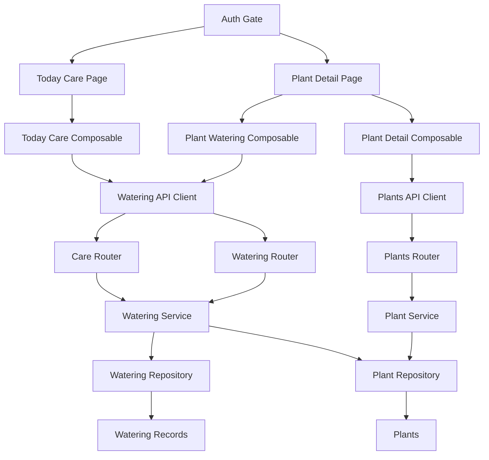
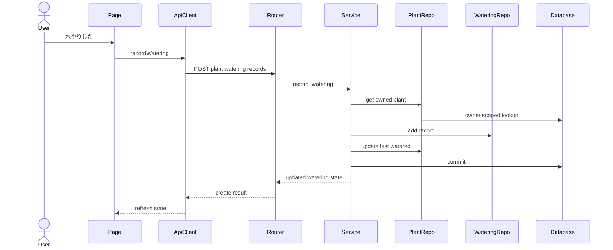
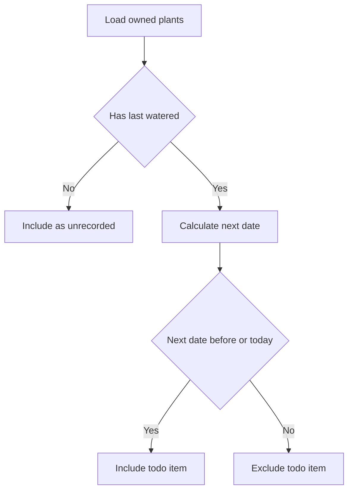
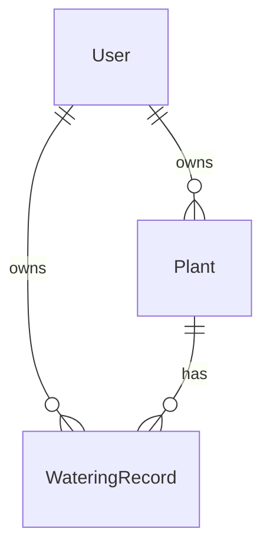
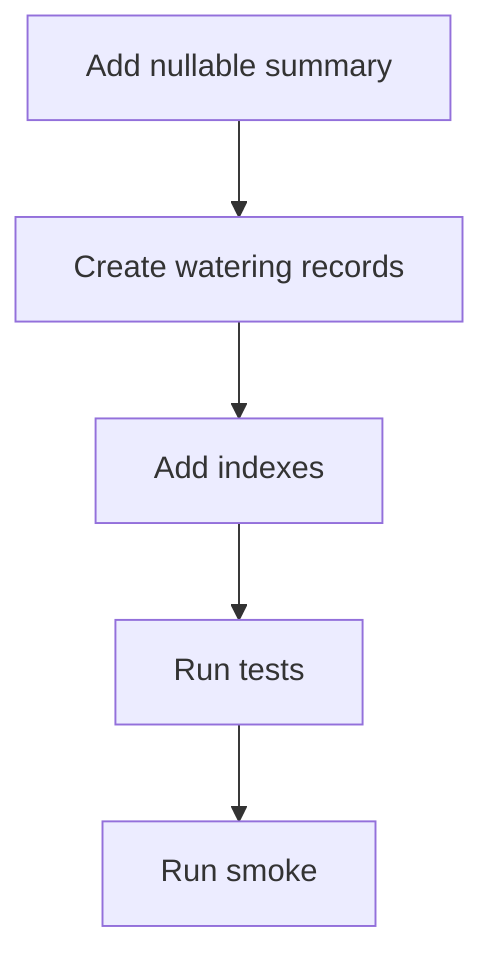

# Design Document

## Overview

Plant Watering Care は、登録済み植物の水やり記録、最新水やり状態、次回水やり予定日、今日のお世話一覧を提供する。対象ユーザーは観葉植物初心者であり、主な workflow は「今日必要な水やりを確認する」「植物に水やりしたことを記録する」「植物詳細で水やり状態と履歴を見返す」である。

既存の Plant Registration は植物個体と水やり周期の authoritative source として維持する。本設計は WateringRecord を履歴の source of truth とし、Plant に最新水やり日時の summary を追加する。次回水やり予定日は保存せず、最新水やり日時と水やり周期から read model として算出する。

### Goals

- 今日水やりが必要な植物を、認証済みユーザーの所有範囲だけで表示する。
- 水やり記録作成後に最新水やり日時、次回水やり予定日、履歴を一貫して更新する。
- Plant Registration の基本情報責務を保ちつつ、水やり domain を独立して実装できる境界を作る。
- 通知、スキップ、複数お世話種別を後続 spec として追加できる余地を残す。

### Non-Goals

- 通知送信、通知設定、通知権限要求。
- 水やりのスキップ、延期、繰り返しルール詳細設定。
- 水やり以外のお世話種別。
- 植物種ごとの推奨周期や育成レコメンド。
- 過去の水やり記録の編集・削除。
- user timezone profile や timezone-aware schedule。

## Boundary Commitments

### This Spec Owns

- 水やり記録の作成と参照。
- Plant に保持する最新水やり日時 summary の更新と表示。
- 次回水やり予定日の計算 read model。
- 今日のお世話一覧の read model。
- 植物詳細の水やり状態と履歴表示。
- WateringRecord の owner scope、API response の owner field 非公開、other-owner 404。
- Backend API、Frontend route/page/composable/component、migration、test、smoke verification の最小一式。

### Out of Boundary

- 通知 channel、通知時刻、通知済み状態、background job、browser notification permission。
- schedule state の永続化、全ユーザー横断 scan、notification queue。
- 水やり記録の編集、削除、過去日時の任意入力。
- Plant Registration の登録項目再設計。
- 共有、組織、RBAC、共同お世話。
- 成長写真ログ、カレンダー表示、植物図鑑、育成ガイド。

### Allowed Dependencies

- `plant-registration`: Plant id、owner_user_id、name、image_url、watering_cycle_days。
- `auth-authorization-foundation`: CurrentUser、application user、owner scope、protected route/API gate。
- Backend shared infrastructure: SQLModel, SQLAlchemy Session, Alembic, FastAPI router/dependency pattern。
- Frontend shared infrastructure: Vue Router, AuthGate, authenticated API client, ApiError model, Tailwind CSS。
- Existing verification commands: backend pytest, local/Turso smoke, frontend build。

### Revalidation Triggers

- Plant API response shape が既存 client を壊す変更。
- Plant owner model、CurrentUser、auth error contract の変更。
- `next_watering_date` を保存する schedule state の追加。
- user timezone profile、notification setting、notification delivery の追加。
- 水やり記録の編集・削除や過去日時入力の追加。
- 水やり以外のお世話種別の追加。

## Architecture

### Existing Architecture Analysis

既存 backend は Router / Service / Repository / Database の layered architecture を採用している。Service は FastAPI に依存せず、Router が domain error を HTTP status に変換する。PlantRepository は owner scoped list/detail を提供し、CurrentUser は Clerk user id ではなく internal application user id を返す。

既存 frontend は types → api → composables → components → pages → router の依存方向を持つ。API 通信は authenticated API client に集約され、presentation component は Clerk token を扱わない。本設計は同じ分離を保つ。

### Architecture Pattern & Boundary Map



**Architecture Integration**

- Selected pattern: 既存の layered architecture に Watering domain slice を追加する hybrid pattern。
- Domain boundaries: Plant は植物基本情報と水やり周期、Watering は履歴・最新状態・今日のお世話 read model を担当する。
- Existing patterns preserved: owner scoped lookup、router error mapping、typed API client、page/composable/component 分離。
- New components rationale: 水やり履歴と今日のお世話は Plant Registration から明示的に分離された責務であるため、専用 router/service/repository/schema/component を置く。
- Steering compliance: owner id は request から採用しない。API response は owner field を返さない。Frontend presentation component は token を扱わない。

### Technology Stack

| Layer | Choice / Version | Role in Feature | Notes |
|-------|------------------|-----------------|-------|
| Frontend | Vue 3.5.34, Vue Router 4.6.4, TypeScript 6.0.2, Tailwind CSS 3.4.19 | 今日のお世話 page、植物詳細への水やり状態追加、typed UI state | 新規 dependency なし |
| Backend | FastAPI 0.136.3, Pydantic 2.13.4, SQLModel 0.0.38, SQLAlchemy 2.0.50 | protected REST API、domain validation、owner scoped persistence | 既存 layer に沿う |
| Data | Turso/libSQL, SQLite, Alembic 1.18.4 | watering_records table、plants.last_watered_at migration | SQLite/Turso 互換を維持 |
| Auth | Clerk backend, Clerk Vue SDK 2.3.2 | CurrentUser と protected route/API | 新しい auth provider 依存なし |

## File Structure Plan

### Directory Structure

```text
backend/
├── alembic/versions/
│   └── 0003_create_watering_records.py
├── app/
│   ├── models/
│   │   ├── plant.py
│   │   └── watering_record.py
│   ├── schemas/
│   │   └── watering.py
│   ├── repositories/
│   │   ├── plant_repository.py
│   │   └── watering_repository.py
│   ├── services/
│   │   └── watering_service.py
│   ├── routers/
│   │   ├── care.py
│   │   └── watering.py
│   ├── main.py
│   └── scripts/
│       └── verify_turso_crud.py
└── tests/
    ├── test_watering_api.py
    ├── test_watering_migration.py
    ├── test_backend_integration_contract.py
    ├── test_e2e_owner_model_regression.py
    └── test_smoke_verification.py

frontend/
└── src/
    ├── types/
    │   └── watering.ts
    ├── api/
    │   └── watering.ts
    ├── composables/
    │   ├── useTodayCare.ts
    │   └── usePlantWatering.ts
    ├── components/
    │   └── watering/
    │       ├── TodayCareList.vue
    │       ├── WateringActionButton.vue
    │       ├── WateringStatusPanel.vue
    │       └── WateringHistoryList.vue
    ├── pages/
    │   ├── TodayCarePage.vue
    │   └── PlantDetailPage.vue
    ├── router/
    │   └── index.ts
    └── App.vue
```

### Modified Files

- `backend/app/models/plant.py` — `last_watered_at` nullable summary を追加する。
- `backend/app/models/__init__.py` — `WateringRecord` を metadata registration に含める。
- `backend/app/repositories/plant_repository.py` — owner scoped plant lookup と `last_watered_at` 更新用 method を追加する。
- `backend/app/main.py` — `care_router` と `watering_router` を include する。
- `backend/app/scripts/verify_turso_crud.py` — watering CRUD と ownerless watering row 検証を smoke に追加する。
- `backend/tests/test_backend_integration_contract.py` — new protected routes と other-owner 404 contract を追加する。
- `backend/tests/test_e2e_owner_model_regression.py` — adjacent route 不在 expectation を watering/care 許可へ更新する。
- `backend/tests/test_smoke_verification.py` — ownerless watering row 検証を追加する。
- `frontend/src/pages/PlantDetailPage.vue` — Plant basic detail と Watering detail を compose する。
- `frontend/src/router/index.ts` — `/care/today` protected route を追加する。
- `frontend/src/App.vue` — header navigation に今日のお世話導線を追加する。

## System Flows

### 水やり記録作成



Record 作成と Plant summary 更新は同じ service operation と transaction に閉じる。存在しない plant または other-owner plant は owner scoped lookup の失敗として扱う。

### 今日のお世話判定



MVP の `today` は backend UTC date を基準にする。user timezone profile が追加される場合、この flow は revalidation する。

## Requirements Traceability

| Requirement | Summary | Components | Interfaces | Flows |
|-------------|---------|------------|------------|-------|
| 1.1 | 今日のお世話を開く | `TodayCarePage`, `useTodayCare`, `CareRouter`, `WateringService` | `GET /care/today` | 今日のお世話判定 |
| 1.2 | 必要な植物の主要情報表示 | `TodayCareList`, `TodayCareItemRead` | `TodayCareRead` | 今日のお世話判定 |
| 1.3 | 今日必要な水やりがない表示 | `TodayCareList`, `useTodayCare` | `TodayCareRead.items` | 今日のお世話判定 |
| 1.4 | 未記録植物の扱い | `WateringService`, `TodayCareList` | `dueStatus: unrecorded` | 今日のお世話判定 |
| 1.5 | 期限超過植物の扱い | `WateringService`, `TodayCareList` | `dueStatus: overdue` | 今日のお世話判定 |
| 2.1 | 水やり記録作成 | `WateringActionButton`, `WateringRouter`, `WateringService`, `WateringRepository` | `POST /plants/{plant_id}/watering-records` | 水やり記録作成 |
| 2.2 | 記録完了表示 | `WateringActionButton`, `usePlantWatering`, `useTodayCare` | `WateringRecordCreateResult` | 水やり記録作成 |
| 2.3 | 最新水やり日時更新 | `WateringService`, `WateringStatusPanel` | `PlantWateringStateRead.lastWateredAt` | 水やり記録作成 |
| 2.4 | 次回予定日更新 | `WateringService`, `WateringStatusPanel` | `PlantWateringStateRead.nextWateringDate` | 水やり記録作成 |
| 2.5 | 作成失敗時の再試行 | `usePlantWatering`, `WateringActionButton` | `ApiError` | 水やり記録作成 |
| 2.6 | 存在しない植物や利用不可植物 | `WateringService`, `WateringRouter` | 404 error contract | 水やり記録作成 |
| 3.1 | 詳細で最新水やり日時表示 | `PlantDetailPage`, `WateringStatusPanel`, `usePlantWatering` | `GET /plants/{plant_id}/watering` | 水やり記録作成 |
| 3.2 | 複数記録から最新選択 | `WateringService`, `Plant.last_watered_at` | `PlantWateringStateRead` | 水やり記録作成 |
| 3.3 | 未記録表示 | `WateringStatusPanel` | `lastWateredAt: null` | 今日のお世話判定 |
| 3.4 | 記録後の表示更新 | `usePlantWatering`, `useTodayCare` | `WateringRecordCreateResult.state` | 水やり記録作成 |
| 4.1 | 最新日時と周期から予定日表示 | `WateringService`, `WateringStatusPanel` | `nextWateringDate` | 今日のお世話判定 |
| 4.2 | 予定日未確定と記録導線 | `WateringStatusPanel`, `WateringActionButton` | `nextWateringDate: null` | 今日のお世話判定 |
| 4.3 | 記録後の予定日更新 | `WateringService`, `usePlantWatering` | `WateringRecordCreateResult.state` | 水やり記録作成 |
| 4.4 | 予定日はユーザー入力不要 | `WateringService` | read model only | 今日のお世話判定 |
| 4.5 | 日単位の予定基準 | `WateringService` | UTC date calculation | 今日のお世話判定 |
| 5.1 | 詳細で履歴表示 | `WateringHistoryList`, `usePlantWatering` | `PlantWateringDetailRead.history` | 水やり記録作成 |
| 5.2 | 各記録の日付または日時表示 | `WateringHistoryList` | `WateringRecordRead.wateredAt` | 水やり記録作成 |
| 5.3 | 履歴なし表示 | `WateringHistoryList` | `history: []` | 水やり記録作成 |
| 5.4 | 新規記録を履歴に含める | `WateringService`, `usePlantWatering` | `WateringRecordCreateResult.record` | 水やり記録作成 |
| 5.5 | 編集削除を提供しない | `WateringRouter`, `WateringHistoryList` | no PATCH or DELETE | なし |
| 6.1 | 今日のお世話 owner scope | `CareRouter`, `WateringService`, `WateringRepository` | `GET /care/today` | 今日のお世話判定 |
| 6.2 | 詳細履歴 owner scope | `WateringRouter`, `WateringService`, `WateringRepository` | `GET /plants/{plant_id}/watering` | 水やり記録作成 |
| 6.3 | 未ログイン非表示 | `AuthGate`, `get_current_user` | 401 contract | なし |
| 6.4 | other-owner existence hiding | `WateringService`, `WateringRouter` | 404 contract | 水やり記録作成 |
| 6.5 | owner/auth field 非公開 | `schemas/watering.py`, `types/watering.ts` | response schemas | なし |
| 7.1 | 植物 0 件空状態 | `TodayCareList`, `WateringService` | empty `TodayCareRead` | 今日のお世話判定 |
| 7.2 | 今日のお世話取得失敗 | `useTodayCare`, `TodayCareList` | `ApiError` | なし |
| 7.3 | 水やり状態取得失敗 | `usePlantWatering`, `WateringStatusPanel` | `ApiError` | なし |
| 7.4 | 履歴取得失敗時の基本情報維持 | `PlantDetailPage`, `usePlantDetail`, `usePlantWatering` | separate API calls | なし |
| 7.5 | 読み込み中表示 | `TodayCareList`, `WateringStatusPanel`, `WateringHistoryList` | loading state | なし |
| 8.1 | タスクよりお世話 | watering UI components | copy guidelines | なし |
| 8.2 | 管理より記録 | watering UI components | copy guidelines | なし |
| 8.3 | 主要操作として記録表示 | `WateringActionButton` | click event | 水やり記録作成 |
| 8.4 | mobile readable | watering UI components | responsive layout | なし |
| 9.1 | 通知送信なし | route policy tests | no notification endpoint | なし |
| 9.2 | 通知設定なし | route policy tests | no notification settings | なし |
| 9.3 | 通知権限要求なし | frontend code boundary | no permission call | なし |
| 9.4 | スキップ延期なし | API route policy | no skip endpoint | なし |
| 9.5 | 他お世話種別なし | data model boundary | only watering records | なし |
| 9.6 | 推奨周期なし | Plant Registration boundary | no recommendation model | なし |

## Components and Interfaces

| Component | Domain or Layer | Intent | Req Coverage | Key Dependencies | Contracts |
|-----------|-----------------|--------|--------------|------------------|-----------|
| `WateringRecord` | Backend Model | 水やり履歴 event を保存する | 2.1, 5.1, 5.2, 6.1, 6.2, 6.5, 9.5 | `User` P0, `Plant` P0 | State |
| `Plant.last_watered_at` | Backend Model | 最新水やり日時 summary を保持する | 2.3, 3.1, 3.2, 4.1 | `WateringService` P0 | State |
| `WateringRepository` | Backend Repository | owner scoped watering persistence を提供する | 2.1, 5.1, 5.2, 6.1, 6.2 | SQLModel Session P0 | Service |
| `WateringService` | Backend Service | record 作成、summary 更新、due 計算、read model 構築を担当する | 1.1-1.5, 2.1-2.6, 3.1-3.4, 4.1-4.5, 5.1-5.5, 6.1-6.5 | `PlantRepository` P0, `WateringRepository` P0 | Service, State |
| `CareRouter` | Backend Router | 今日のお世話 API を公開する | 1.1-1.5, 6.1, 7.1, 7.2 | `CurrentUser` P0, `WateringService` P0 | API |
| `WateringRouter` | Backend Router | 植物別水やり API を公開する | 2.1-2.6, 3.1-3.4, 4.1-4.4, 5.1-5.5, 6.2-6.5 | `CurrentUser` P0, `WateringService` P0 | API |
| `watering.ts` API client | Frontend API | watering endpoints を typed client として提供する | 1.1, 2.1, 3.1, 5.1, 6.3 | authenticated API client P0 | API |
| `useTodayCare` | Frontend Composable | 今日のお世話 page state と record action を扱う | 1.1-1.5, 2.2-2.5, 7.1, 7.2, 7.5 | watering API P0 | State |
| `usePlantWatering` | Frontend Composable | 植物詳細の watering state と record action を扱う | 2.2-2.5, 3.1-3.4, 4.1-4.3, 5.1-5.4, 7.3-7.5 | watering API P0 | State |
| `TodayCarePage` | Frontend Page | 今日のお世話 workflow を compose する | 1.1-1.5, 7.1, 8.4 | `useTodayCare` P0 | State |
| `TodayCareList` | Frontend UI | due item list と空状態を表示する | 1.1-1.5, 7.1, 7.2, 7.5, 8.1, 8.4 | `WateringActionButton` P1 | State |
| `WateringStatusPanel` | Frontend UI | 最新水やり日時と次回予定日を表示する | 3.1-3.4, 4.1-4.4, 7.3, 7.5, 8.4 | `WateringActionButton` P1 | State |
| `WateringHistoryList` | Frontend UI | 水やり履歴と履歴なし状態を表示する | 5.1-5.5, 7.4, 7.5 | `usePlantWatering` P0 | State |
| `WateringActionButton` | Frontend UI | 水やり記録操作を提供する | 2.1-2.5, 4.2, 8.1-8.3 | composable callbacks P0 | State |

### Backend Domain

#### WateringService

| Field | Detail |
|-------|--------|
| Intent | 水やり use case と read model 計算を統括する |
| Requirements | 1.1-1.5, 2.1-2.6, 3.1-3.4, 4.1-4.5, 5.1-5.5, 6.1-6.5 |

**Responsibilities & Constraints**

- `CurrentUser.id` を唯一の owner id として扱う。
- record 作成時は owner scoped Plant lookup を先に行う。
- WateringRecord 作成と Plant `last_watered_at` 更新を同一 transaction で完了する。
- `next_watering_date` は保存せず、read model 内で計算する。
- MVP の今日判定は backend UTC date を使用する。
- Service は FastAPI に依存しない。

**Dependencies**

- Inbound: `CareRouter`, `WateringRouter` — protected API entrypoint (P0)
- Outbound: `PlantRepository` — owner scoped Plant lookup と summary 更新 (P0)
- Outbound: `WateringRepository` — record persistence と history lookup (P0)
- External: SQLAlchemy Session — transaction boundary (P0)

**Contracts**: Service [x] / API [ ] / Event [ ] / Batch [ ] / State [x]

##### Service Interface

```python
class WateringService:
    def list_today_care(self, owner_user_id: str) -> TodayCareRead: ...
    def get_plant_watering(self, owner_user_id: str, plant_id: int) -> PlantWateringDetailRead: ...
    def record_watering(self, owner_user_id: str, plant_id: int) -> WateringRecordCreateResult: ...
```

- Preconditions:
  - `owner_user_id` は認証済み active application user の internal id。
  - `plant_id` は route parameter 由来だが、所有判定には使わない。
- Postconditions:
  - record 作成成功時、WateringRecord と Plant `last_watered_at` は同じ `watered_at` を反映する。
  - response に owner id、Clerk id、認証情報を含めない。
- Invariants:
  - other-owner plant は missing plant と同じ domain error として扱う。
  - `next_watering_date` は nullable read value で、DB に保存しない。

**Implementation Notes**

- Integration: 既存 `PlantNotFoundError` と同等の domain error を watering 側にも定義し、Router で 404 へ変換する。
- Validation: `watering_cycle_days` は Plant Registration の既存 validation を信頼する。
- Risks: 既存 `PlantRepository.create` は commit するため、watering 用の summary 更新 method は commit しない transaction-friendly method として追加する。

#### WateringRepository

| Field | Detail |
|-------|--------|
| Intent | WateringRecord の owner scoped persistence と履歴取得を提供する |
| Requirements | 2.1, 5.1, 5.2, 5.4, 6.1, 6.2, 6.5 |

**Responsibilities & Constraints**

- WateringRecord を作成するが、transaction commit は WateringService が担う。
- plant_id と owner_user_id の両方を条件に履歴を取得する。
- owner scope を外した lookup を通常 path に置かない。

**Dependencies**

- Inbound: `WateringService` — record 作成と history lookup (P0)
- Outbound: SQLModel Session — persistence (P0)
- Outbound: `WateringRecord` — table model (P0)

**Contracts**: Service [x] / API [ ] / Event [ ] / Batch [ ] / State [x]

##### Service Interface

```python
class WateringRepository:
    def add(self, record: WateringRecord) -> WateringRecord: ...
    def list_for_plant(self, owner_user_id: str, plant_id: int) -> list[WateringRecord]: ...
```

- Preconditions:
  - `record.owner_user_id` は `record.plant_id` の所有者と一致している。
- Postconditions:
  - `list_for_plant` は newest first で返す。
- Invariants:
  - owner_user_id 条件なしで履歴を返さない。

#### CareRouter

| Field | Detail |
|-------|--------|
| Intent | 今日のお世話 read model を protected API として公開する |
| Requirements | 1.1-1.5, 6.1, 6.3, 7.1, 7.2 |

**Dependencies**

- Inbound: Frontend watering API client (P0)
- Outbound: `get_current_user` — auth gate (P0)
- Outbound: `WateringService` — read model construction (P0)

**Contracts**: Service [ ] / API [x] / Event [ ] / Batch [ ] / State [ ]

##### API Contract

| Method | Endpoint | Request | Response | Errors |
|--------|----------|---------|----------|--------|
| GET | `/care/today` | none | `TodayCareRead` | 401, 403, 500 |

#### WateringRouter

| Field | Detail |
|-------|--------|
| Intent | 植物別の水やり状態取得と記録作成を protected API として公開する |
| Requirements | 2.1-2.6, 3.1-3.4, 4.1-4.4, 5.1-5.5, 6.2-6.5, 7.3, 7.4 |

**Dependencies**

- Inbound: Frontend watering API client (P0)
- Outbound: `get_current_user` — auth gate (P0)
- Outbound: `WateringService` — use case execution (P0)

**Contracts**: Service [ ] / API [x] / Event [ ] / Batch [ ] / State [ ]

##### API Contract

| Method | Endpoint | Request | Response | Errors |
|--------|----------|---------|----------|--------|
| GET | `/plants/{plant_id}/watering` | path `plant_id` | `PlantWateringDetailRead` | 401, 403, 404, 500 |
| POST | `/plants/{plant_id}/watering-records` | empty JSON object allowed | `WateringRecordCreateResult` | 401, 403, 404, 422, 500 |

### Frontend

#### Watering API Client

| Field | Detail |
|-------|--------|
| Intent | Watering API を TypeScript 型付きで呼び出す |
| Requirements | 1.1, 2.1, 3.1, 5.1, 6.3 |

**Responsibilities & Constraints**

- `AuthenticatedApiClient` を受け取り、component から直接 fetch しない。
- `any` は使用しない。
- request/response 型は `frontend/src/types/watering.ts` に集約する。

**Contracts**: Service [ ] / API [x] / Event [ ] / Batch [ ] / State [ ]

##### Service Interface

```typescript
interface WateringApiClient {
  getTodayCare(): Promise<TodayCare>
  getPlantWatering(plantId: number): Promise<PlantWateringDetail>
  recordWatering(plantId: number): Promise<WateringRecordCreateResult>
}
```

#### useTodayCare

| Field | Detail |
|-------|--------|
| Intent | 今日のお世話 page の loading/error/data/action state を管理する |
| Requirements | 1.1-1.5, 2.2-2.5, 7.1, 7.2, 7.5 |

**Responsibilities & Constraints**

- mount 時に `/care/today` を取得する。
- record 作成成功後、今日のお世話を再取得して due list からの除外を反映する。
- auth/forbidden error では既存方針に合わせて user-owned data を成功状態として残さない。

**Contracts**: Service [ ] / API [ ] / Event [ ] / Batch [ ] / State [x]

##### State Management

- State model: `todayCare`, `isLoading`, `isRecordingByPlantId`, `error`, `successMessage`
- Persistence & consistency: frontend state は API response の projection。authoritative source は backend。
- Concurrency strategy: plant 単位で記録中 state を持ち、同一 plant の連打を抑止する。

#### usePlantWatering

| Field | Detail |
|-------|--------|
| Intent | 植物詳細 page の watering state と record action を管理する |
| Requirements | 2.2-2.5, 3.1-3.4, 4.1-4.3, 5.1-5.4, 7.3-7.5 |

**Responsibilities & Constraints**

- `plantId` を検証し、valid な場合だけ watering detail を取得する。
- record 作成成功後、response state と history を反映する。
- Plant basic detail の取得失敗と watering detail の取得失敗を混同しない。

**Contracts**: Service [ ] / API [ ] / Event [ ] / Batch [ ] / State [x]

##### State Management

- State model: `watering`, `isLoading`, `isRecording`, `error`, `recordingError`
- Persistence & consistency: record 作成 response を即時反映し、必要なら明示的 retry で再取得する。
- Concurrency strategy: `isRecording` 中は record button を disabled にする。

### UI Components

- `TodayCarePage.vue` — 今日のお世話 workflow を compose する page。`AuthGate` は router meta に任せる。
- `TodayCareList.vue` — item list、未記録、期限超過、空状態、取得失敗、読み込み中を表示する。
- `WateringActionButton.vue` — 「水やりを記録する」操作を提供する。API client を直接扱わない。
- `WateringStatusPanel.vue` — 最新水やり日時、次回水やり予定日、未記録状態を表示する。
- `WateringHistoryList.vue` — 履歴 list と履歴なし状態を表示する。編集・削除 UI は置かない。

## Data Models

### Domain Model



- `Plant` は植物個体の基本情報と水やり周期を持つ。
- `WateringRecord` は水やり実績 event を表す。
- `Plant.last_watered_at` は `WateringRecord.watered_at` から導かれる summary であり、ユーザーが直接編集しない。
- `PlantWateringState` は read model であり、`last_watered_at`、`next_watering_date`、`is_due_today` を含む。
- `TodayCareItem` は read model であり、植物識別情報と水やり状態を含む。

### Logical Data Model

**WateringRecord**

- `id`: integer primary key
- `owner_user_id`: text, required, references `users.id`
- `plant_id`: integer, required, references `plants.id`
- `watered_at`: datetime, required, UTC
- `created_at`: datetime, required, UTC

**Plant extension**

- `last_watered_at`: datetime nullable, UTC

**Business rules**

- `owner_user_id` は request body から受け取らない。
- WateringRecord 作成前に Plant を owner scoped lookup する。
- `last_watered_at` は record 作成時に `watered_at` と同じ値へ更新する。
- `next_watering_date` は `last_watered_at.date + watering_cycle_days` で計算する。
- `last_watered_at` が null の場合、`next_watering_date` は null で、今日のお世話では未記録として扱う。
- `next_watering_date <= today` の植物を今日のお世話対象とする。

### Physical Data Model

**Migration `0003_create_watering_records.py`**

- `plants.last_watered_at DATETIME NULL` を追加する。
- `watering_records` table を作成する。
- Foreign keys:
  - `watering_records.owner_user_id -> users.id`
  - `watering_records.plant_id -> plants.id`
- Indexes:
  - `ix_watering_records_owner_user_id_plant_id_watered_at` on `(owner_user_id, plant_id, watered_at)`
  - `ix_watering_records_owner_user_id_watered_at` on `(owner_user_id, watered_at)`
  - `ix_plants_owner_user_id_last_watered_at` on `(owner_user_id, last_watered_at)`

Cascade delete はこの spec では定義しない。退会後データ保持や Plant delete は別 spec の責務である。

### Data Contracts & Integration

**API Data Transfer**

```typescript
type DueStatus = 'unrecorded' | 'due_today' | 'overdue'

interface WateringPlantSummary {
  id: number
  name: string
  imageUrl: string | null
  wateringCycleDays: number
}

interface PlantWateringState {
  plantId: number
  lastWateredAt: string | null
  nextWateringDate: string | null
  isDueToday: boolean
  dueStatus: DueStatus | null
}

interface WateringRecord {
  id: number
  plantId: number
  wateredAt: string
  createdAt: string
}

interface TodayCareItem extends PlantWateringState {
  plant: WateringPlantSummary
}

interface TodayCare {
  today: string
  items: TodayCareItem[]
}

interface PlantWateringDetail extends PlantWateringState {
  history: WateringRecord[]
}

interface WateringRecordCreateResult {
  record: WateringRecord
  state: PlantWateringDetail
}
```

Python schema は snake_case field と camelCase serialization を既存 `alias_config` と同じ方式で実現する。Response schema に owner field は含めない。

## Error Handling

### Error Strategy

- Router は domain error を HTTP status に変換する。
- Service は FastAPI `HTTPException` を投げない。
- Frontend composable は `ApiError` を保持し、presentation component が user-facing message を出す。
- auth/forbidden 時は保護された水やり情報を成功状態として残さない。

### Error Categories and Responses

| Category | Backend | Frontend |
|----------|---------|----------|
| Missing or invalid auth | 401 with shared auth contract | ログインまたは再認証の案内 |
| Inactive user | 403 | 利用できない状態を表示し保護データを clear |
| Missing or other-owner plant | 404 without existence leak | 対象を利用できない表示 |
| Validation failure | 422 | 入力内容または操作状態の確認 |
| System failure | 500 | 再試行可能な失敗表示 |
| Network failure | frontend only | 通信環境確認と retry |

### Monitoring

この spec で新しい monitoring dependency は追加しない。例外詳細、token、secret、raw claims は user-facing response に出さない。必要な server-side logging は既存 FastAPI runtime と test failure に委ねる。

## Testing Strategy

### Unit Tests

- `WateringService` の due 判定: 未記録、今日予定、期限超過、未来予定を検証する。対象: 1.1-1.5, 4.1-4.5。
- `WateringService.record_watering`: record 作成と Plant `last_watered_at` 更新が同一結果になることを検証する。対象: 2.1-2.4, 3.4, 5.4。
- `WateringService.get_plant_watering`: 複数履歴から最新状態と履歴順を返すことを検証する。対象: 3.1-3.3, 5.1-5.3。
- schema serialization: datetime が UTC ISO string、date が ISO date、owner field が出ないことを検証する。対象: 6.5。

### Integration Tests

- `GET /care/today`: due today、overdue、not due、未記録、0 件の response を検証する。対象: 1.1-1.5, 7.1。
- `POST /plants/{plant_id}/watering-records`: success response、最新状態、履歴追加を検証する。対象: 2.1-2.4, 5.4。
- `GET /plants/{plant_id}/watering`: latest、next date、history、empty history を検証する。対象: 3.1-3.3, 4.1-4.4, 5.1-5.3。
- Auth/owner separation: unauthenticated 401、inactive 403、other-owner 404、owner field 非公開を検証する。対象: 6.1-6.5。
- Route policy: watering/care は許可し、notification/skip/growth/share routes は引き続き存在しないことを検証する。対象: 5.5, 9.1-9.6。

### Migration Tests

- `0003_create_watering_records.py` が `watering_records` table、foreign keys、indexes、`plants.last_watered_at` を作成することを検証する。
- 既存 plants row がある database でも `last_watered_at` nullable で migration できることを検証する。
- downgrade が watering table と summary column を戻せることを検証する。

### E2E or UI Verification

- `npm run build` で TypeScript 型境界と Vue template を検証する。
- Browser verification:
  - 今日のお世話が空、未記録、due item を表示する。
  - 今日のお世話から水やり記録後に対象植物が必要に応じて一覧から外れる。
  - 植物詳細で最新水やり日時、次回予定日、履歴が表示される。
  - watering state 取得失敗時も Plant basic detail が確認できる。

### Smoke Verification

- `verify_turso_crud.py` に user、plant、watering record 作成と detail/today read を追加する。
- local SQLite と Turso mode で ownerless plants と ownerless watering records が存在しないことを確認する。

## Security Considerations

- WateringRecord はユーザー所有 domain table として owner_user_id を必須にする。
- owner id は request body、query、route parameter から採用しない。
- other-owner plant への水やり状態取得、履歴取得、record 作成は 404 にする。
- API response は owner_user_id、Clerk user id、token、secret、raw claims を返さない。
- Frontend presentation component は Clerk SDK、Bearer token、Authorization header を扱わない。

## Performance & Scalability

- MVP は認証済みユーザー単位で plants と latest summary を対象に今日のお世話を算出する。
- `plants.owner_user_id,last_watered_at` index と `watering_records.owner_user_id,plant_id,watered_at` index で owner scoped read を支える。
- 全ユーザー横断の通知 scan は scope 外。通知機能追加時は `next_watering_date` を保存する schedule state または indexed projection を再検討する。
- 履歴は植物単位で newest first に取得する。大量履歴や pagination が必要になった場合は revalidation する。

## Migration Strategy



- Phase 1: `plants.last_watered_at` nullable column を追加する。既存 row は null のまま未記録として扱う。
- Phase 2: `watering_records` table を作成する。
- Phase 3: owner scoped read 用 index を作成する。
- Phase 4: migration tests と API integration tests を実行する。
- Phase 5: local SQLite smoke と Turso smoke に watering CRUD を含める。

Rollback は migration downgrade に従う。WateringRecord を作成した後の downgrade は履歴 data を失うため、production rollback では backup を前提にする。
