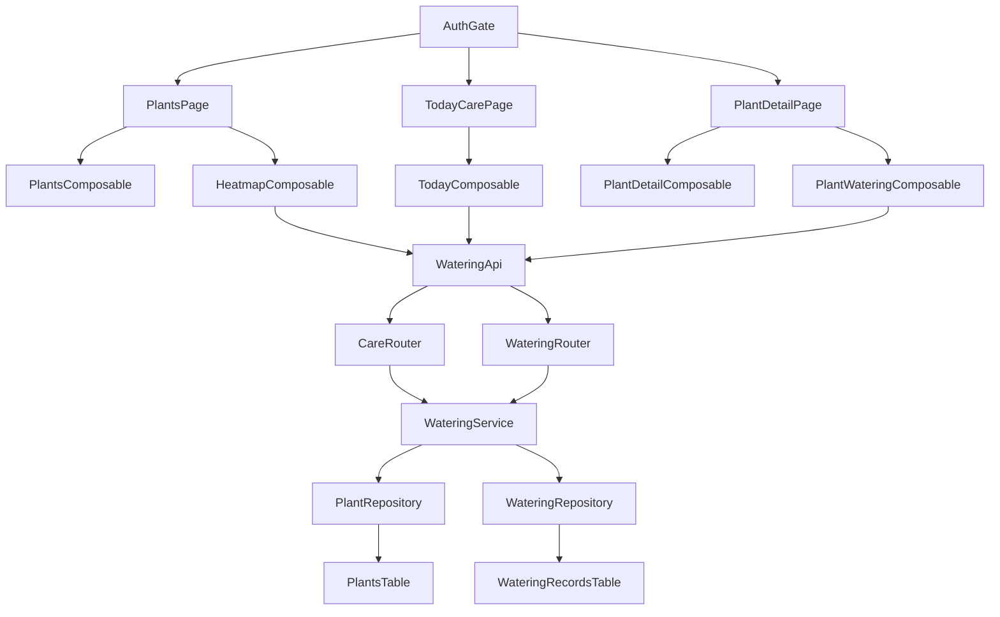
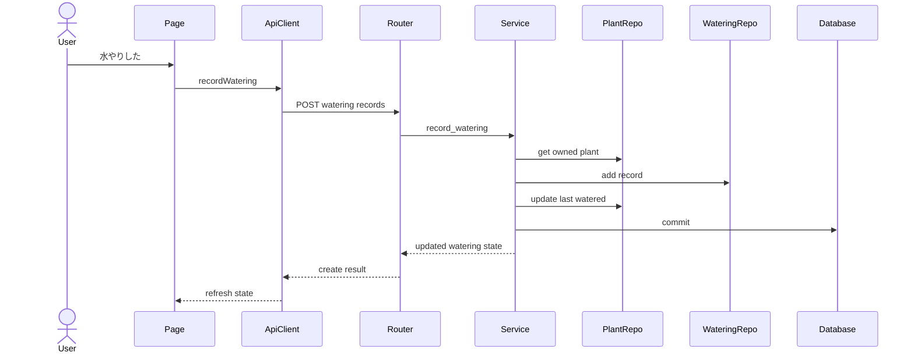
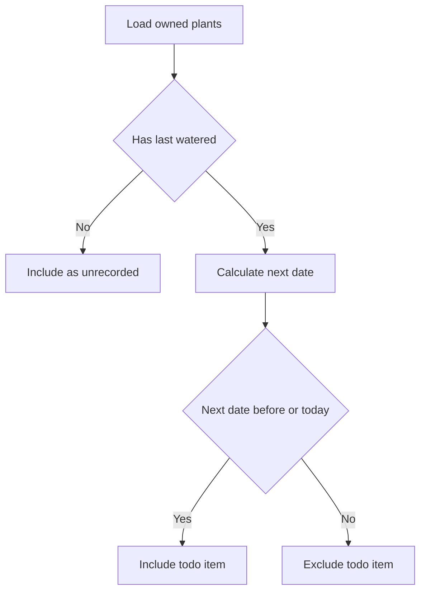
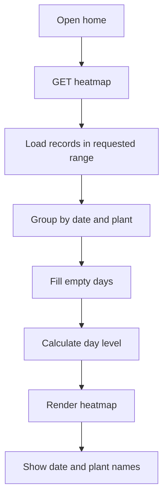
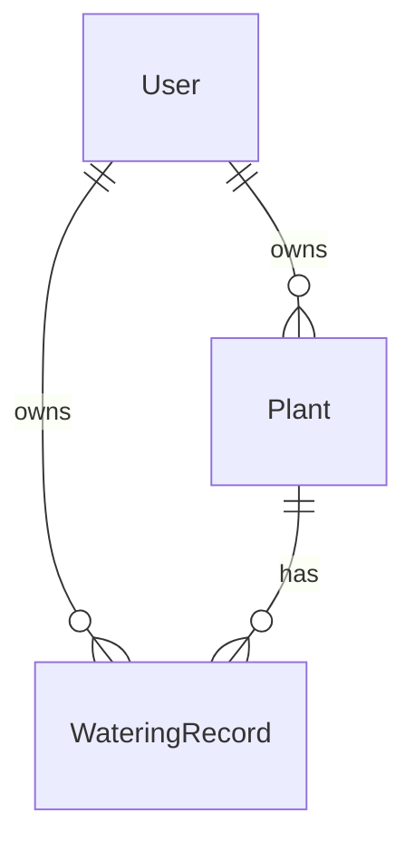
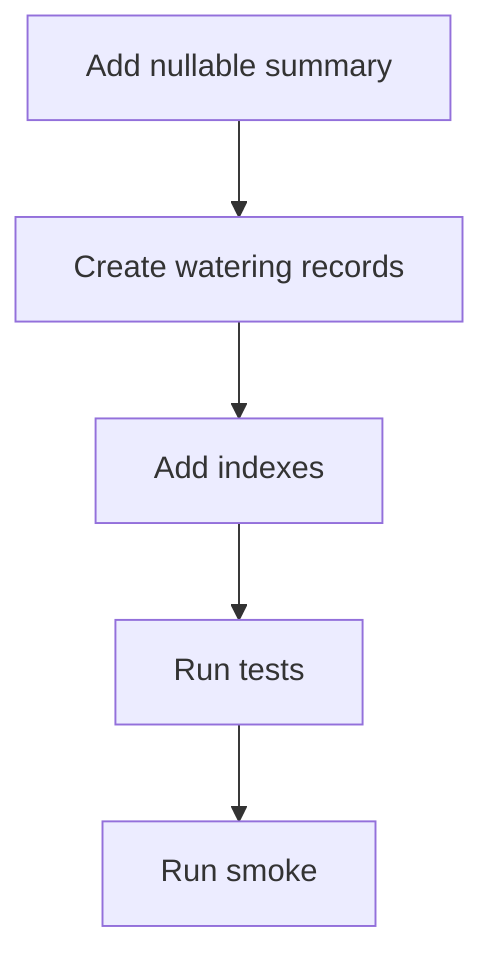

# Design Document

## Overview

Plant Watering Care は、登録済み植物の水やり記録、最新水やり状態、次回水やり予定日、今日のお世話一覧、ホーム画面の水やりヒートマップを提供する。対象ユーザーは観葉植物初心者であり、主な workflow は「今日必要な水やりを確認する」「植物に水やりしたことを記録する」「植物詳細で水やり状態と履歴を見返す」「ホーム画面で直近のお世話習慣を振り返る」である。

既存の Plant Registration は植物個体と水やり周期の authoritative source として維持する。本設計は WateringRecord を水やり実績の source of truth とし、Plant に最新水やり日時の summary を持たせる。次回水やり予定日とヒートマップ集計は保存せず、read model として算出する。

この機能は pre-release の既存 spec 拡張として扱う。新しい外部 dependency は追加せず、既存の FastAPI / SQLModel / Vue 3 / TypeScript / Tailwind CSS の境界に統合する。

### Goals

- 今日水やりが必要な植物を、認証済みユーザーの所有範囲だけで表示する。
- 水やり記録作成後に最新水やり日時、次回水やり予定日、履歴、ヒートマップ集計を一貫して更新できる状態にする。
- ホーム画面で少なくとも直近 3 か月の水やり実績を日単位で視覚化する。
- Plant Registration の基本情報責務を保ちつつ、水やり domain を独立して実装できる境界を維持する。

### Non-Goals

- 通知送信、通知設定、通知権限要求。
- 水やりのスキップ、延期、繰り返しルール詳細設定。
- 水やり以外のお世話種別。
- 植物種ごとの推奨周期や育成レコメンド。
- 過去の水やり記録の編集・削除。
- 植物別ヒートマップ切り替え、連続記録日数、ランキング、週次または月次の習慣化サマリー。
- user timezone profile やユーザー別 timezone-aware schedule。MVP の日付基準は Asia/Tokyo 固定とする。

## Boundary Commitments

### This Spec Owns

- 水やり記録の作成と参照。
- Plant に保持する最新水やり日時 summary の更新と表示。
- 次回水やり予定日の計算 read model。
- 今日のお世話一覧の read model。
- 植物詳細の水やり状態と履歴表示。
- ホーム画面の水やりヒートマップ read model と UI 表示。
- WateringRecord の owner scope、API response の owner field 非公開、other-owner 404。
- Backend API、Frontend page/composable/component、migration、test、smoke verification の最小一式。

### Out of Boundary

- 通知 channel、通知時刻、通知済み状態、background job、browser notification permission。
- schedule state の永続化、全ユーザー横断 scan、notification queue。
- 水やり記録の編集、削除、過去日時の任意入力 UI。
- Plant Registration の登録項目再設計。
- 共有、組織、RBAC、共同お世話。
- 成長写真ログ、カレンダー表示、植物図鑑、育成ガイド。
- ヒートマップ専用の集計テーブル、植物別フィルタ、streak 指標。

### Allowed Dependencies

- `plant-registration`: Plant id、owner_user_id、name、image_url、watering_cycle_days、last_watered_at。
- `auth-authorization-foundation`: CurrentUser、application user、owner scope、protected route/API gate。
- Backend shared infrastructure: SQLModel、SQLAlchemy Session、Alembic、FastAPI router/dependency pattern。
- Frontend shared infrastructure: Vue Router、AuthGate、authenticated API client、ApiError model、Tailwind CSS。
- Existing verification commands: backend pytest、local/Turso smoke、frontend build。

### Revalidation Triggers

- Plant API response shape、Plant owner model、CurrentUser、auth error contract の変更。
- `next_watering_date` を保存する schedule state の追加。
- user timezone profile、notification setting、notification delivery の追加。
- 水やり記録の編集・削除や過去日時入力 UI の追加。
- 水やり以外のお世話種別の追加。
- ヒートマップを植物別、streak、週次/月次 summary へ拡張する場合。
- Plant 名の履歴保持を要求し、現在名表示から記録時点名表示へ変更する場合。

## Architecture

### Existing Architecture Analysis

既存 backend は Router / Service / Repository / Database の layered architecture を採用している。Service は FastAPI に依存せず、Router が domain error を HTTP status に変換する。Watering domain の基本実装は既に `WateringRecord`、`WateringRepository`、`WateringService`、`care` / `watering` router として存在しており、ヒートマップはこの slice に read model を追加する拡張である。

既存 frontend は types → api → composables → components → pages → router の依存方向を持つ。API 通信は authenticated API client に集約され、presentation component は Clerk token を扱わない。ホーム相当の `/plants` は root redirect 先であり、MVP のヒートマップは `PlantsPage.vue` に追加する。

### Architecture Pattern & Boundary Map



**Architecture Integration**

- Selected pattern: 既存の layered architecture に Watering read model を追加する extension pattern。
- Domain boundaries: Plant は植物基本情報と水やり周期、Watering は履歴・最新状態・今日のお世話・ヒートマップを担当する。
- Existing patterns preserved: owner scoped lookup、router error mapping、typed API client、page/composable/component 分離。
- New components rationale: `WateringHeatmap` と `useWateringHeatmap` はホーム画面固有の表示状態を閉じ込め、既存 TodayCare や PlantDetail state と混在させない。
- Steering compliance: owner id は request から採用しない。API response は owner field を返さない。Frontend presentation component は token を扱わない。

### Technology Stack

| Layer | Choice / Version | Role in Feature | Notes |
|-------|------------------|-----------------|-------|
| Frontend | Vue 3.5.34, Vue Router 4.6.4, TypeScript 6.0.2, Tailwind CSS 3.4.19 | ホーム画面ヒートマップ、今日のお世話、植物詳細 watering UI | 新規 dependency なし |
| Backend | FastAPI 0.136.3, Pydantic 2.13.4, SQLModel 0.0.38, SQLAlchemy 2.0.50 | protected REST API、domain validation、owner scoped persistence | 既存 layer に沿う |
| Data | Turso/libSQL, SQLite, Alembic 1.18.4 | watering_records table、plants.last_watered_at migration、期間集計 query | SQLite/Turso 互換を維持 |
| Auth | Clerk backend, Clerk Vue SDK 2.3.2 | CurrentUser と protected route/API | 新しい auth provider 依存なし |

## File Structure Plan

### Directory Structure

```text
backend/
├── alembic/versions/
│   └── 0003_create_watering_records.py
├── app/
│   ├── models/
│   │   ├── plant.py
│   │   └── watering_record.py
│   ├── schemas/
│   │   └── watering.py
│   ├── repositories/
│   │   ├── plant_repository.py
│   │   └── watering_repository.py
│   ├── services/
│   │   └── watering_service.py
│   ├── routers/
│   │   ├── care.py
│   │   └── watering.py
│   ├── main.py
│   └── scripts/
│       └── verify_turso_crud.py
└── tests/
    ├── test_care_api.py
    ├── test_watering_api.py
    ├── test_watering_migration.py
    ├── test_watering_repository.py
    ├── test_watering_service.py
    ├── test_backend_integration_contract.py
    ├── test_e2e_owner_model_regression.py
    └── test_smoke_verification.py

frontend/
└── src/
    ├── types/
    │   └── watering.ts
    ├── api/
    │   └── watering.ts
    ├── composables/
    │   ├── useTodayCare.ts
    │   ├── usePlantWatering.ts
    │   └── useWateringHeatmap.ts
    ├── components/
    │   └── watering/
    │       ├── TodayCareList.vue
    │       ├── WateringActionButton.vue
    │       ├── WateringHeatmap.vue
    │       ├── WateringHistoryList.vue
    │       └── WateringStatusPanel.vue
    ├── pages/
    │   ├── PlantsPage.vue
    │   ├── TodayCarePage.vue
    │   └── PlantDetailPage.vue
    └── router/
        └── index.ts
```

### Modified Files

- `backend/app/schemas/watering.py` — ヒートマップ用 read schema を追加する。
- `backend/app/repositories/watering_repository.py` — owner scoped 期間集計用 method を追加し、Plant 現在名を取得できる形にする。
- `backend/app/services/watering_service.py` — `get_watering_heatmap` を追加し、指定期間の空日付補完、植物数、level を構築する。
- `backend/app/routers/care.py` — `GET /care/watering-heatmap?from=YYYY-MM-DD&to=YYYY-MM-DD` を protected endpoint として追加する。
- `backend/tests/test_watering_service.py` — ヒートマップの日次補完、distinct plant 集計、現在名表示を検証する。
- `backend/tests/test_care_api.py` — ヒートマップ endpoint の success/auth/owner scope/error contract を検証する。
- `frontend/src/types/watering.ts` — `WateringHeatmap`, `WateringHeatmapDay`, `WateringHeatmapPlant` を追加する。
- `frontend/src/api/watering.ts` — `getWateringHeatmap()` を追加する。
- `frontend/src/composables/useWateringHeatmap.ts` — ホーム画面のヒートマップ loading/error/data state を管理する。
- `frontend/src/components/watering/WateringHeatmap.vue` — 日次グリッド、段階色、タップ/ホバー詳細、空状態、失敗状態を表示する。
- `frontend/src/pages/PlantsPage.vue` — ホーム相当画面として PlantForm/PlantList と WateringHeatmap を compose する。
- `frontend/src/style.css` — 必要に応じてヒートマップの小型セルや focus 表示の共通 style を追加する。

既存の `WateringRecord`、`Plant.last_watered_at`、`WateringService.record_watering`、`TodayCarePage`、`PlantDetailPage` は維持し、ヒートマップは追加 read model として統合する。

## System Flows

### 水やり記録作成



Record 作成と Plant summary 更新は同じ service operation と transaction に閉じる。存在しない plant または other-owner plant は owner scoped lookup の失敗として扱う。

### 今日のお世話判定



MVP の `today` は backend で Asia/Tokyo date を基準にする。user timezone profile が追加される場合、この flow は revalidation する。

### 水やりヒートマップ取得



同じ植物に同じ Asia/Tokyo 日で複数の WateringRecord がある場合、ヒートマップでは 1 植物として集計する。詳細表示の植物名は現在の Plant 登録名を使う。

## Requirements Traceability

| Requirement | Summary | Components | Interfaces | Flows |
|-------------|---------|------------|------------|-------|
| 1.1 | 今日のお世話を開く | `TodayCarePage`, `useTodayCare`, `CareRouter`, `WateringService` | `GET /care/today` | 今日のお世話判定 |
| 1.2 | 必要な植物の主要情報表示 | `TodayCareList`, `TodayCareItemRead` | `TodayCareRead` | 今日のお世話判定 |
| 1.3 | 今日必要な水やりがない表示 | `TodayCareList`, `useTodayCare` | `TodayCareRead.items` | 今日のお世話判定 |
| 1.4 | 未記録植物の扱い | `WateringService`, `TodayCareList` | `dueStatus: unrecorded` | 今日のお世話判定 |
| 1.5 | 期限超過植物の扱い | `WateringService`, `TodayCareList` | `dueStatus: overdue` | 今日のお世話判定 |
| 2.1 | 水やり記録作成 | `WateringActionButton`, `WateringRouter`, `WateringService`, `WateringRepository` | `POST /plants/{plant_id}/watering-records` | 水やり記録作成 |
| 2.2 | 記録完了表示 | `WateringActionButton`, `usePlantWatering`, `useTodayCare` | `WateringRecordCreateResult` | 水やり記録作成 |
| 2.3 | 最新水やり日時更新 | `WateringService`, `WateringStatusPanel` | `PlantWateringStateRead.lastWateredAt` | 水やり記録作成 |
| 2.4 | 次回予定日更新 | `WateringService`, `WateringStatusPanel` | `PlantWateringStateRead.nextWateringDate` | 水やり記録作成 |
| 2.5 | 作成失敗時の再試行 | `usePlantWatering`, `WateringActionButton` | `ApiError` | 水やり記録作成 |
| 2.6 | 存在しない植物や利用不可植物 | `WateringService`, `WateringRouter` | 404 error contract | 水やり記録作成 |
| 3.1 | 詳細で最新水やり日時表示 | `PlantDetailPage`, `WateringStatusPanel`, `usePlantWatering` | `GET /plants/{plant_id}/watering` | 水やり記録作成 |
| 3.2 | 複数記録から最新選択 | `WateringService`, `Plant.last_watered_at` | `PlantWateringStateRead` | 水やり記録作成 |
| 3.3 | 未記録表示 | `WateringStatusPanel` | `lastWateredAt: null` | 今日のお世話判定 |
| 3.4 | 記録後の表示更新 | `usePlantWatering`, `useTodayCare` | `WateringRecordCreateResult.state` | 水やり記録作成 |
| 4.1 | 最新日時と周期から予定日表示 | `WateringService`, `WateringStatusPanel` | `nextWateringDate` | 今日のお世話判定 |
| 4.2 | 予定日未確定と記録導線 | `WateringStatusPanel`, `WateringActionButton` | `nextWateringDate: null` | 今日のお世話判定 |
| 4.3 | 記録後の予定日更新 | `WateringService`, `usePlantWatering` | `WateringRecordCreateResult.state` | 水やり記録作成 |
| 4.4 | 予定日はユーザー入力不要 | `WateringService` | read model only | 今日のお世話判定 |
| 4.5 | 日単位の予定基準 | `WateringService` | Asia/Tokyo date calculation | 今日のお世話判定 |
| 5.1 | 詳細で履歴表示 | `WateringHistoryList`, `usePlantWatering` | `PlantWateringDetailRead.history` | 水やり記録作成 |
| 5.2 | 各記録の日付または日時表示 | `WateringHistoryList` | `WateringRecordRead.wateredAt` | 水やり記録作成 |
| 5.3 | 履歴なし表示 | `WateringHistoryList` | `history: []` | 水やり記録作成 |
| 5.4 | 新規記録を履歴に含める | `WateringService`, `usePlantWatering` | `WateringRecordCreateResult.record` | 水やり記録作成 |
| 5.5 | 編集削除を提供しない | `WateringRouter`, `WateringHistoryList` | no PATCH or DELETE | なし |
| 6.1 | ホームでヒートマップ表示 | `PlantsPage`, `WateringHeatmap`, `useWateringHeatmap`, `CareRouter` | `GET /care/watering-heatmap` | 水やりヒートマップ取得 |
| 6.2 | 1 マス 1 日 | `WateringHeatmap`, `WateringHeatmapDayRead` | `date` per day | 水やりヒートマップ取得 |
| 6.3 | 直近 3 か月以上表示 | `useWateringHeatmap`, `WateringService`, `WateringHeatmap` | default 3-month range with `from` and `to` query | 水やりヒートマップ取得 |
| 6.4 | 日ごとの植物数集計 | `WateringRepository`, `WateringService` | distinct plant aggregation | 水やりヒートマップ取得 |
| 6.5 | 0 件日の表示 | `WateringService`, `WateringHeatmap` | `plantCount: 0` | 水やりヒートマップ取得 |
| 6.6 | 植物数に応じた段階色 | `WateringService`, `WateringHeatmap` | `level` 0-4 | 水やりヒートマップ取得 |
| 6.7 | タップ/ホバー詳細 | `WateringHeatmap` | selected/hovered day state | 水やりヒートマップ取得 |
| 6.8 | 複数植物名の判別 | `WateringHeatmap` | plant names list | 水やりヒートマップ取得 |
| 6.9 | 現在の登録名表示 | `WateringRepository`, `PlantRepository` | join current Plant name | 水やりヒートマップ取得 |
| 6.10 | 小画面表示 | `WateringHeatmap`, `PlantsPage` | responsive layout | 水やりヒートマップ取得 |
| 6.11 | 記録なし空状態 | `WateringHeatmap`, `useWateringHeatmap` | all days level 0 | 水やりヒートマップ取得 |
| 7.1 | 今日のお世話 owner scope | `CareRouter`, `WateringService`, `PlantRepository` | `GET /care/today` | 今日のお世話判定 |
| 7.2 | 詳細履歴 owner scope | `WateringRouter`, `WateringService`, `WateringRepository` | `GET /plants/{plant_id}/watering` | 水やり記録作成 |
| 7.3 | ヒートマップ owner scope | `CareRouter`, `WateringService`, `WateringRepository` | `GET /care/watering-heatmap` with owner-scoped query | 水やりヒートマップ取得 |
| 7.4 | 未ログイン非表示 | `AuthGate`, `get_current_user` | 401 contract | なし |
| 7.5 | other-owner existence hiding | `WateringService`, `WateringRouter` | 404 contract | 水やり記録作成 |
| 7.6 | owner/auth field 非公開 | `schemas/watering.py`, `types/watering.ts` | response schemas | なし |
| 8.1 | 植物 0 件空状態 | `TodayCareList`, `WateringService` | empty `TodayCareRead` | 今日のお世話判定 |
| 8.2 | 今日のお世話取得失敗 | `useTodayCare`, `TodayCareList` | `ApiError` | なし |
| 8.3 | 水やり状態取得失敗 | `usePlantWatering`, `WateringStatusPanel` | `ApiError` | なし |
| 8.4 | 履歴取得失敗時の基本情報維持 | `PlantDetailPage`, `usePlantDetail`, `usePlantWatering` | separate API calls | なし |
| 8.5 | ヒートマップ取得失敗 | `useWateringHeatmap`, `WateringHeatmap` | `ApiError` | 水やりヒートマップ取得 |
| 8.6 | 読み込み中表示 | watering UI components | loading state | なし |
| 9.1 | タスクよりお世話 | watering UI components | copy guidelines | なし |
| 9.2 | 管理より記録 | watering UI components | copy guidelines | なし |
| 9.3 | 主要操作として記録表示 | `WateringActionButton` | click event | 水やり記録作成 |
| 9.4 | mobile readable | watering UI components | responsive layout | 水やりヒートマップ取得 |
| 10.1 | 通知送信なし | route policy tests | no notification endpoint | なし |
| 10.2 | 通知設定なし | route policy tests | no notification settings | なし |
| 10.3 | 通知権限要求なし | frontend code boundary | no permission call | なし |
| 10.4 | スキップ延期なし | API route policy | no skip endpoint | なし |
| 10.5 | 他お世話種別なし | data model boundary | only watering records | なし |
| 10.6 | 推奨周期なし | Plant Registration boundary | no recommendation model | なし |
| 10.7 | 習慣化拡張なし | route/UI policy tests | no heatmap filters or streaks | なし |

## Components and Interfaces

| Component | Domain or Layer | Intent | Req Coverage | Key Dependencies | Contracts |
|-----------|-----------------|--------|--------------|------------------|-----------|
| `WateringRecord` | Backend Model | 水やり履歴 event を保存する | 2.1, 5.1, 7.1-7.3, 10.5 | `User` P0, `Plant` P0 | State |
| `Plant.last_watered_at` | Backend Model | 最新水やり日時 summary を保持する | 2.3, 3.1, 3.2, 4.1 | `WateringService` P0 | State |
| `WateringRepository` | Backend Repository | owner scoped watering persistence と期間集計を提供する | 2.1, 5.1, 6.4, 6.9, 7.3 | SQLModel Session P0 | Service, State |
| `WateringService` | Backend Service | record 作成、summary 更新、due 計算、heatmap read model 構築を担当する | 1-10 | `PlantRepository` P0, `WateringRepository` P0 | Service, State |
| `CareRouter` | Backend Router | 今日のお世話とヒートマップ API を公開する | 1.1-1.5, 6.1-6.11, 7.1, 7.3, 8.1, 8.2, 8.5 | `CurrentUser` P0, `WateringService` P0 | API |
| `WateringRouter` | Backend Router | 植物別水やり API を公開する | 2.1-5.5, 7.2, 7.5 | `CurrentUser` P0, `WateringService` P0 | API |
| `watering.ts` API client | Frontend API | watering endpoints を typed client として提供する | 1.1, 2.1, 3.1, 5.1, 6.1 | authenticated API client P0 | API |
| `useTodayCare` | Frontend Composable | 今日のお世話 page state と record action を扱う | 1.1-1.5, 2.2-2.5, 8.1, 8.2 | watering API P0 | State |
| `usePlantWatering` | Frontend Composable | 植物詳細の watering state と record action を扱う | 2.2-5.4, 8.3, 8.4 | watering API P0 | State |
| `useWateringHeatmap` | Frontend Composable | ホーム画面ヒートマップ state を扱う | 6.1-6.11, 7.3, 8.5, 8.6 | watering API P0 | State |
| `WateringHeatmap` | Frontend UI | 日次実績 grid と日別詳細を表示する | 6.1-6.11, 9.4 | `useWateringHeatmap` P0 | State |
| `TodayCareList` | Frontend UI | due item list と空状態を表示する | 1.1-1.5, 8.1, 8.2, 9.1 | `WateringActionButton` P1 | State |
| `WateringStatusPanel` | Frontend UI | 最新水やり日時と次回予定日を表示する | 3.1-4.4, 8.3, 9.4 | `WateringActionButton` P1 | State |
| `WateringHistoryList` | Frontend UI | 水やり履歴と履歴なし状態を表示する | 5.1-5.5, 8.4 | `usePlantWatering` P0 | State |
| `WateringActionButton` | Frontend UI | 水やり記録操作を提供する | 2.1-2.5, 4.2, 9.1-9.3 | composable callbacks P0 | State |

### Backend Domain

#### WateringService

| Field | Detail |
|-------|--------|
| Intent | 水やり use case と read model 計算を統括する |
| Requirements | 1.1-10.7 |

**Responsibilities & Constraints**

- `CurrentUser.id` を唯一の owner id として扱う。
- record 作成時は owner scoped Plant lookup を先に行う。
- WateringRecord 作成と Plant `last_watered_at` 更新を同一 transaction で完了する。
- `next_watering_date` とヒートマップは保存せず、read model 内で計算する。
- MVP の今日判定とヒートマップの日付境界は backend Asia/Tokyo date を使用する。
- 同一 Asia/Tokyo 日の同一 plant の複数 record は、ヒートマップでは 1 植物として扱う。
- Service は FastAPI に依存しない。

**Dependencies**

- Inbound: `CareRouter`, `WateringRouter` — protected API entrypoint (P0)
- Outbound: `PlantRepository` — owner scoped Plant lookup と summary 更新 (P0)
- Outbound: `WateringRepository` — record persistence、history lookup、heatmap aggregation (P0)
- External: SQLAlchemy Session — transaction boundary (P0)

**Contracts**: Service [x] / API [ ] / Event [ ] / Batch [ ] / State [x]

##### Service Interface

```python
class WateringService:
    def get_today_care(self, owner_user_id: str) -> TodayCareRead: ...
    def get_watering_heatmap(
        self,
        owner_user_id: str,
        start_date: date | None = None,
        end_date: date | None = None,
    ) -> WateringHeatmapRead: ...
    def get_plant_watering(self, owner_user_id: str, plant_id: int) -> PlantWateringDetailRead: ...
    def record_watering(self, owner_user_id: str, plant_id: int, watered_at: datetime | None = None) -> WateringRecordCreateResult: ...
```

- Preconditions:
  - `owner_user_id` は認証済み active application user の internal id。
  - `plant_id` は route parameter 由来だが、所有判定には使わない。
- Postconditions:
  - record 作成成功時、WateringRecord と Plant `last_watered_at` は同じ `watered_at` を反映する。
  - ヒートマップ response は指定期間内の全日付を持ち、記録なしの日も `plantCount: 0` として含む。
  - `start_date` と `end_date` が省略された場合、backend の `today` を終端にした直近 3 か月相当の既定期間を使う。
  - response に owner id、Clerk id、認証情報を含めない。
- Invariants:
  - other-owner plant は missing plant と同じ domain error として扱う。
  - ヒートマップの植物名は現在の Plant 登録名を使う。
  - `next_watering_date` と heatmap level は DB に保存しない。

#### WateringRepository

| Field | Detail |
|-------|--------|
| Intent | WateringRecord の owner scoped persistence、履歴取得、期間集計を提供する |
| Requirements | 2.1, 5.1, 5.2, 5.4, 6.4, 6.9, 7.1-7.3 |

**Responsibilities & Constraints**

- WateringRecord を作成するが、transaction commit は WateringService が担う。
- plant_id と owner_user_id の両方を条件に履歴を取得する。
- ヒートマップ用に owner_user_id と watered_at 期間で記録を取得し、Plant 現在名を参照できる形にする。
- owner scope を外した lookup を通常 path に置かない。

**Contracts**: Service [x] / API [ ] / Event [ ] / Batch [ ] / State [x]

##### Service Interface

```python
class WateringRepository:
    def add(self, record: WateringRecord) -> WateringRecord | None: ...
    def list_for_plant(self, owner_user_id: str, plant_id: int, *, limit: int | None = 20) -> list[WateringRecord]: ...
    def list_for_heatmap(self, owner_user_id: str, start_date: date, end_date: date) -> list[WateringHeatmapRecordRow]: ...
```

- Preconditions:
  - `start_date` と `end_date` は inclusive な Asia/Tokyo date。
- Postconditions:
  - `list_for_heatmap` は owner_user_id で絞り込み、他 owner の Plant 名を返さない。
- Invariants:
  - 同一 plant 同一 date の重複排除は Service が行う。

#### CareRouter

| Field | Detail |
|-------|--------|
| Intent | 今日のお世話とヒートマップ read model を protected API として公開する |
| Requirements | 1.1-1.5, 6.1-6.11, 7.1, 7.3, 7.4, 8.1, 8.2, 8.5 |

**Contracts**: Service [ ] / API [x] / Event [ ] / Batch [ ] / State [ ]

##### API Contract

| Method | Endpoint | Request | Response | Errors |
|--------|----------|---------|----------|--------|
| GET | `/care/today` | none | `TodayCareRead` | 401, 403, 500 |
| GET | `/care/watering-heatmap` | optional query `from`, `to` as ISO date | `WateringHeatmapRead` | 401, 403, 422, 500 |

#### WateringRouter

| Field | Detail |
|-------|--------|
| Intent | 植物別の水やり状態取得と記録作成を protected API として公開する |
| Requirements | 2.1-5.5, 7.2, 7.4-7.6, 8.3, 8.4 |

**Contracts**: Service [ ] / API [x] / Event [ ] / Batch [ ] / State [ ]

##### API Contract

| Method | Endpoint | Request | Response | Errors |
|--------|----------|---------|----------|--------|
| GET | `/plants/{plant_id}/watering` | path `plant_id` | `PlantWateringDetailRead` | 401, 403, 404, 500 |
| POST | `/plants/{plant_id}/watering-records` | empty JSON object allowed | `WateringRecordCreateResult` | 401, 403, 404, 422, 500 |

### Frontend

#### Watering API Client

| Field | Detail |
|-------|--------|
| Intent | Watering API を TypeScript 型付きで呼び出す |
| Requirements | 1.1, 2.1, 3.1, 5.1, 6.1 |

**Contracts**: Service [ ] / API [x] / Event [ ] / Batch [ ] / State [ ]

##### Service Interface

```typescript
interface WateringApiClient {
  getTodayCare(): Promise<TodayCare>
  getWateringHeatmap(input?: WateringHeatmapRangeInput): Promise<WateringHeatmap>
  getPlantWatering(plantId: number): Promise<PlantWateringDetail>
  recordWatering(plantId: number): Promise<WateringRecordCreateResult>
}
```

#### useWateringHeatmap

| Field | Detail |
|-------|--------|
| Intent | ホーム画面のヒートマップ loading/error/data/selection state を管理する |
| Requirements | 6.1-6.11, 7.3, 8.5, 8.6, 9.4 |

**Responsibilities & Constraints**

- mount 時に `/care/watering-heatmap` を取得する。
- default range は frontend で直近 3 か月相当の `from` / `to` を組み立てて API に渡す。
- auth/forbidden error では user-owned data を成功状態として残さない。
- hover と tap の両方で同じ day detail を選択できる state を持つ。
- presentation component に API client や token を渡さない。

**Contracts**: Service [ ] / API [ ] / Event [ ] / Batch [ ] / State [x]

##### State Management

- State model: `heatmap`, `selectedDate`, `isLoading`, `error`
- Persistence & consistency: frontend state は API response の projection。authoritative source は backend。
- Concurrency strategy: 明示的 retry 中は loading state を出し、古い成功 data は auth/forbidden 以外では残してよい。

#### WateringHeatmap

| Field | Detail |
|-------|--------|
| Intent | 水やり実績のヒートマップと日別詳細を表示する |
| Requirements | 6.1-6.11, 8.5, 8.6, 9.1, 9.2, 9.4 |

**Responsibilities & Constraints**

- 1 日を 1 セルとして表示し、`level` 0-4 を段階色に変換する。
- 日付、期間、実績の強さが小画面でも判別できる layout にする。
- 詳細には日付と植物名を表示し、複数植物がある場合も判別できる縦並びまたは省略付き表示にする。
- 植物名は API から返る現在名をそのまま表示する。
- 記録なしの全 0 状態でも、空の実績としてグリッドを表示する。

**Contracts**: Service [ ] / API [ ] / Event [ ] / Batch [ ] / State [x]

##### State Management

- Props: `heatmap`, `isLoading`, `error`
- Emits: `retry`
- Local state: hover または tap された day。

## Data Models

### Domain Model



- `Plant` は植物個体の基本情報と水やり周期を持つ。
- `WateringRecord` は水やり実績 event を表す。
- `Plant.last_watered_at` は `WateringRecord.watered_at` から導かれる summary であり、ユーザーが直接編集しない。
- `PlantWateringState` は read model であり、`last_watered_at`、`next_watering_date`、`is_due_today` を含む。
- `WateringHeatmapDay` は read model であり、date、plantCount、level、現在の植物名 list を含む。

### Logical Data Model

**WateringRecord**

- `id`: integer primary key
- `owner_user_id`: text, required, references `users.id`
- `plant_id`: integer, required, references `plants.id`
- `watered_at`: datetime, required, UTC
- `created_at`: datetime, required, UTC

**Plant extension**

- `last_watered_at`: datetime nullable, UTC

**Business rules**

- `owner_user_id` は request body から受け取らない。
- WateringRecord 作成前に Plant を owner scoped lookup する。
- `last_watered_at` は record 作成時に `watered_at` と同じ値へ更新する。
- `next_watering_date` は `last_watered_at.date + watering_cycle_days` で計算する。
- `last_watered_at` が null の場合、`next_watering_date` は null で、今日のお世話では未記録として扱う。
- `next_watering_date <= today` の植物を今日のお世話対象とする。
- ヒートマップ API は `from` / `to` query parameter を ISO date として受け取り、inclusive な期間を返す。
- `from` / `to` が省略された場合、backend は `today` を終端にした直近 3 か月相当の既定期間を返す。
- `from > to` または 366 日を超える期間は validation error として扱う。
- ヒートマップは同一日・同一 plant の複数 record を 1 植物として集計する。
- ヒートマップの level は `0=なし`, `1=1植物`, `2=2植物`, `3=3植物`, `4=4植物以上` とする。

### Physical Data Model

**Migration `0003_create_watering_records.py`**

- `plants.last_watered_at DATETIME NULL` を追加する。
- `watering_records` table を作成する。
- Foreign keys:
  - `watering_records.owner_user_id -> users.id`
  - `watering_records.plant_id -> plants.id`
- Indexes:
  - `ix_watering_records_owner_user_id_plant_id_watered_at` on `(owner_user_id, plant_id, watered_at)`
  - `ix_watering_records_owner_user_id_watered_at` on `(owner_user_id, watered_at)`
  - `ix_plants_owner_user_id_last_watered_at` on `(owner_user_id, last_watered_at)`

ヒートマップの期間集計は `watering_records.owner_user_id, watered_at` index を使う。追加の集計 table は MVP では作らない。

### Data Contracts & Integration

```typescript
type DueStatus = 'unrecorded' | 'due_today' | 'overdue'
type WateringHeatmapLevel = 0 | 1 | 2 | 3 | 4

interface WateringPlantSummary {
  id: number
  name: string
  imageUrl: string | null
  wateringCycleDays: number
}

interface PlantWateringState {
  plantId: number
  lastWateredAt: string | null
  nextWateringDate: string | null
  isDueToday: boolean
  dueStatus: DueStatus | null
}

interface WateringRecord {
  id: number
  plantId: number
  wateredAt: string
  createdAt: string
}

interface TodayCareItem extends PlantWateringState {
  plant: WateringPlantSummary
}

interface TodayCare {
  today: string
  items: TodayCareItem[]
}

interface PlantWateringDetail extends PlantWateringState {
  history: WateringRecord[]
}

interface WateringHeatmapPlant {
  plantId: number
  name: string
}

interface WateringHeatmapRangeInput {
  from?: string
  to?: string
}

interface WateringHeatmapDay {
  date: string
  plantCount: number
  level: WateringHeatmapLevel
  plants: WateringHeatmapPlant[]
}

interface WateringHeatmap {
  startDate: string
  endDate: string
  days: WateringHeatmapDay[]
}
```

Python schema は snake_case field と camelCase serialization を既存 `alias_config` と同じ方式で実現する。Response schema に owner field は含めない。

## Error Handling

| Category | Backend | Frontend |
|----------|---------|----------|
| Missing or invalid auth | 401 with shared auth contract | ログインまたは再認証の案内 |
| Inactive user | 403 | 利用できない状態を表示し保護データを clear |
| Missing or other-owner plant | 404 without existence leak | 対象を利用できない表示 |
| Validation failure | 422 | 入力内容または操作状態の確認 |
| System failure | 500 | 再試行可能な失敗表示 |
| Network failure | frontend only | 通信環境確認と retry |

ヒートマップ取得失敗はホーム画面全体の失敗にしない。PlantForm/PlantList は可能な限り維持し、WateringHeatmap 部分に再試行 UI を表示する。

## Testing Strategy

### Unit Tests

- `WateringService` の due 判定: 未記録、今日予定、期限超過、未来予定を検証する。対象: 1.1-1.5, 4.1-4.5。
- `WateringService.record_watering`: record 作成と Plant `last_watered_at` 更新が同一結果になることを検証する。対象: 2.1-2.4, 3.4, 5.4。
- `WateringService.get_plant_watering`: 複数履歴から最新状態と履歴順を返すことを検証する。対象: 3.1-3.3, 5.1-5.3。
- `WateringService.get_watering_heatmap`: 指定期間の日付補完、default range、invalid range、distinct plant 集計、level、現在名表示を検証する。対象: 6.1-6.11, 7.3。
- schema serialization: datetime が UTC ISO string、date が ISO date、owner field が出ないことを検証する。対象: 7.6。

### Integration Tests

- `GET /care/today`: due today、overdue、not due、未記録、0 件の response を検証する。対象: 1.1-1.5, 8.1。
- `GET /care/watering-heatmap`: `from` / `to` 指定、default range、記録あり、記録なし、同日複数植物、同日同一植物重複、auth/forbidden、invalid range 422 を検証する。対象: 6.1-6.11, 7.3, 8.5。
- `POST /plants/{plant_id}/watering-records`: success response、最新状態、履歴追加を検証する。対象: 2.1-2.4, 5.4。
- `GET /plants/{plant_id}/watering`: latest、next date、history、empty history を検証する。対象: 3.1-3.3, 4.1-4.4, 5.1-5.3。
- Auth/owner separation: unauthenticated 401、inactive 403、other-owner 404、owner field 非公開を検証する。対象: 7.1-7.6。
- Route policy: watering/care は許可し、notification/skip/growth/share/streak routes は引き続き存在しないことを検証する。対象: 5.5, 10.1-10.7。

### Migration Tests

- `0003_create_watering_records.py` が `watering_records` table、foreign keys、indexes、`plants.last_watered_at` を作成することを検証する。
- 既存 plants row がある場合も、追加 backfill なしで `last_watered_at` nullable として migration できることを検証する。
- downgrade が watering table と summary column を戻せることを検証する。

### UI Verification

- `npm run build` で TypeScript 型境界と Vue template を検証する。
- Browser verification:
  - ホーム画面でヒートマップが表示され、記録なしでも空の実績として見える。
  - 同日に複数植物へ水やりした日で、タップ/ホバーに日付と植物名が表示される。
  - 小画面でヒートマップのセル、期間、詳細表示が読み取れる。
  - 今日のお世話から水やり記録後に対象植物が必要に応じて一覧から外れる。
  - 植物詳細で最新水やり日時、次回予定日、履歴が表示される。
  - watering state または heatmap 取得失敗時も他のホーム/詳細情報が可能な範囲で維持される。

### Smoke Verification

- `verify_turso_crud.py` に user、plant、watering record 作成と detail/today/heatmap read を追加する。
- local SQLite と Turso mode で ownerless plants と ownerless watering records が存在しないことを確認する。

## Security Considerations

- WateringRecord はユーザー所有 domain table として owner_user_id を必須にする。
- owner id は request body、query、route parameter から採用しない。
- other-owner plant への水やり状態取得、履歴取得、record 作成は 404 にする。
- ヒートマップ集計は owner_user_id で必ず絞り込み、他 owner の植物名を含めない。
- API response は owner_user_id、Clerk user id、token、secret、raw claims を返さない。
- Frontend presentation component は Clerk SDK、Bearer token、Authorization header を扱わない。

## Performance & Scalability

- MVP は認証済みユーザー単位で plants と latest summary を対象に今日のお世話を算出する。
- ヒートマップは `from` / `to` で指定された owner scoped query に限定し、全期間 scan を行わない。
- `plants.owner_user_id,last_watered_at` index と `watering_records.owner_user_id,plant_id,watered_at` / `watering_records.owner_user_id,watered_at` index で owner scoped read を支える。
- 全ユーザー横断の通知 scan は scope 外。通知機能追加時は `next_watering_date` を保存する schedule state または indexed projection を再検討する。
- 履歴 pagination、ヒートマップの長期間表示、植物数が多いユーザー向け最適化が必要になった場合は revalidation する。

## Migration Strategy



- Phase 1: `plants.last_watered_at` nullable column を追加する。既存 row は追加 backfill なしで null のまま未記録として扱う。
- Phase 2: `watering_records` table を作成する。
- Phase 3: owner scoped read と heatmap range query 用 index を作成する。
- Phase 4: migration tests と API integration tests を実行する。
- Phase 5: local SQLite smoke と Turso smoke に watering CRUD と heatmap read を含める。

Rollback は migration downgrade に従う。実運用前のため production rollback path は設計しない。実データ投入後に downgrade する場合は、履歴 data が失われるため backup/restore 方針を別途確認する。
