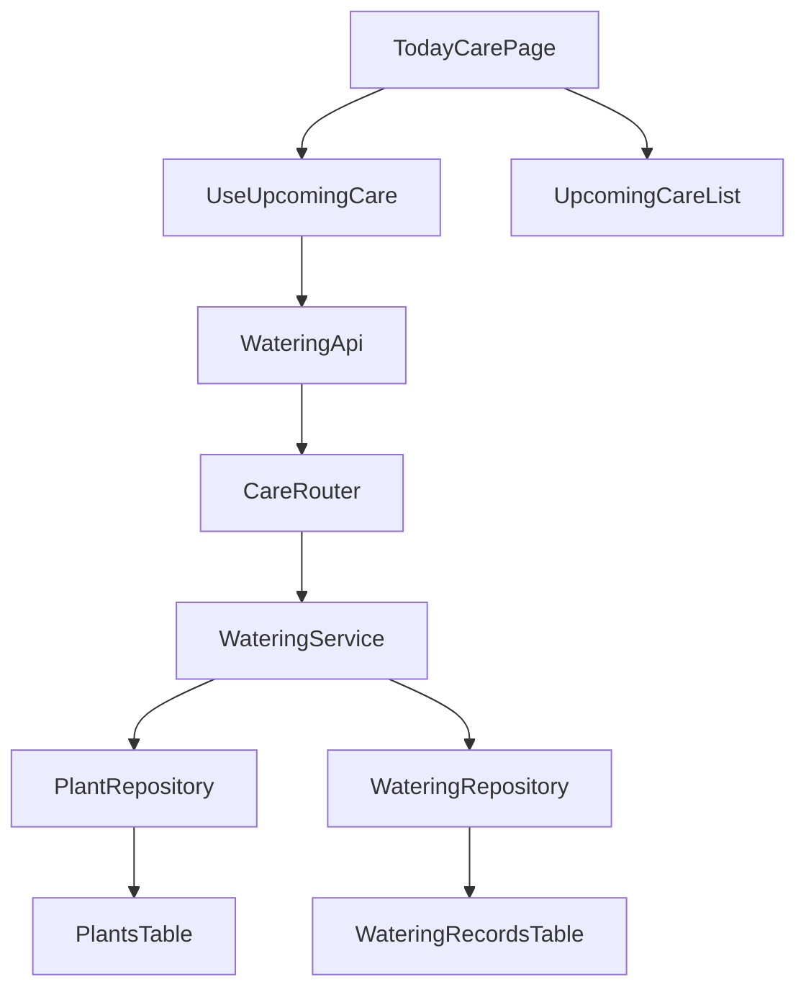
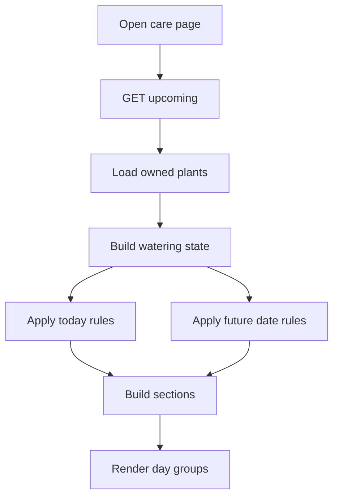
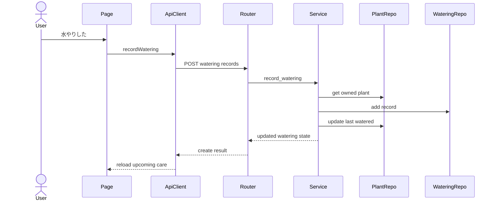

# Design Document

## Overview

Plant Watering Care は、水やり記録、植物別の最新水やり状態、次回水やり予定、直近のお世話予定、水やり履歴、水やりヒートマップを提供する。今回の設計更新では、既存の「今日のお世話」取得を「直近のお世話予定」取得へ置き換え、今日だけでなく明日・明後日の予定も同じ contract で表示できるようにする。

Backend は WateringRecord を水やり実績の source of truth とし、Plant の `last_watered_at` を最新状態 summary として維持する。次回水やり予定日、直近のお世話予定、ヒートマップは保存せず read model として算出する。Frontend は `/care/upcoming?days=3` を使い、今日・明日・明後日の section を表示する。

### Goals

- `/care/upcoming` を直近のお世話予定の protected API として追加する。
- query 指定なしでは今日のみ、`days=3` では今日・明日・明後日を対象にする。
- 既存 `/care/today` は廃止し、Frontend は `/care/upcoming` へ移行する。
- 今日 section では未記録、期限超過、今日予定を扱い、明日以降は対象日の `nextWateringDate` が一致する植物を扱う。
- 水やり記録後に予定、詳細状態、履歴、ヒートマップを一貫して更新できる状態を維持する。

### Non-Goals

- 通知送信、通知設定、通知権限要求。
- 水やりのスキップ、延期、繰り返しルール詳細設定。
- 水やり以外のお世話種別。
- 植物種ごとの推奨周期や育成レコメンド。
- 過去の水やり記録の編集・削除。
- 植物別ヒートマップ切り替え、連続記録日数、ランキング、週次または月次サマリー。
- user timezone profile。MVP の日付基準は Asia/Tokyo 固定とする。

## Boundary Commitments

### This Spec Owns

- 水やり記録の作成と参照。
- Plant に保持する最新水やり日時 summary の更新と表示。
- 次回水やり予定日の計算 read model。
- `/care/upcoming` による直近のお世話予定取得と日付別 section response。
- 植物詳細の水やり状態と履歴表示。
- ホーム画面の水やりヒートマップ read model と UI 表示。
- owner scope、API response の owner field 非公開、other-owner 404。
- 既存 `/care/today` の削除と Frontend の呼び出し先移行。

### Out of Boundary

- 通知 channel、通知時刻、通知済み状態、background job。
- schedule state の永続化、全ユーザー横断 scan、notification queue。
- 水やり記録の編集、削除、過去日時の任意入力 UI。
- Plant Registration の登録項目再設計。
- 共有、組織、RBAC、共同お世話。
- 成長写真ログ、カレンダー表示、植物図鑑、育成ガイド。
- ヒートマップ専用の集計テーブル、植物別フィルタ、streak 指標。

### Allowed Dependencies

- `plant-registration`: Plant id、owner_user_id、name、image_url、watering_cycle_days、last_watered_at。
- `auth-authorization-foundation`: CurrentUser、application user、owner scope、protected route/API gate。
- Backend shared infrastructure: SQLModel、SQLAlchemy Session、Alembic、FastAPI router/dependency pattern。
- Frontend shared infrastructure: Vue Router、AuthGate、authenticated API client、ApiError model、Tailwind CSS。
- Existing verification commands: backend pytest、local/Turso smoke、frontend build。

### Revalidation Triggers

- Plant owner model、CurrentUser、auth error contract が変わる。
- `/care/upcoming` response shape、section labeling、`days` の意味が変わる。
- `next_watering_date` を保存する schedule state を追加する。
- user timezone profile、notification setting、notification delivery を追加する。
- 水やり記録の編集・削除や過去日時入力 UI を追加する。
- 水やり以外のお世話種別を追加する。
- ヒートマップを植物別、streak、週次/月次 summary へ拡張する。

## Architecture

### Existing Architecture Analysis

- Backend は既に `WateringRecord`、`Plant.last_watered_at` summary、`WateringRepository`、`WateringService`、`care` / `watering` router を持つ。
- 既存 `/care/today` は `TodayCareRead { today, items }` を返し、今日必要な植物だけを扱う。
- `WateringService._build_state(plant, today)` は未記録、期限超過、今日予定の判定に強く結びついている。
- Frontend は `TodayCarePage`、`useTodayCare`、`TodayCareList`、`WateringApiClient.getTodayCare()` を持つ。
- ヒートマップは `/care/watering-heatmap` と `useWateringHeatmap` で既に分離されている。

### Architecture Pattern & Boundary Map

既存 Watering slice を拡張し、`TodayCare` naming を `UpcomingCare` naming に置き換える。Backend の予定計算は Service に集約し、Frontend は section response を描画する。



### Technology Stack

| Layer | Choice / Version | Role in Feature | Notes |
|-------|------------------|-----------------|-------|
| Frontend | Vue 3, Vue Router, TypeScript, Tailwind CSS | 直近のお世話予定、詳細、ヒートマップ UI | 新規 dependency なし |
| Backend | FastAPI, Pydantic, SQLModel, SQLAlchemy Session | protected REST API、owner scoped read model | `/care/upcoming` を追加 |
| Data | Turso/libSQL, SQLite, Alembic | watering_records と plants.last_watered_at | schedule state は保存しない |
| Auth | Clerk-backed current user dependency | protected API と protected route | owner id は request から受け取らない |

## File Structure Plan

### Directory Structure

```text
backend/
└── app/
    ├── schemas/watering.py              # UpcomingCareRead, UpcomingCareSectionRead, UpcomingCareItemRead を追加
    ├── services/watering_service.py     # get_upcoming_care と days validation、section grouping
    ├── routers/care.py                  # GET /care/upcoming を追加し GET /care/today を削除
    ├── repositories/plant_repository.py # owner-scoped plant list を再利用
    └── repositories/watering_repository.py # record/history/heatmap persistence を維持

frontend/
└── src/
    ├── types/watering.ts                # UpcomingCare, UpcomingCareSection, UpcomingCareItem を追加
    ├── api/watering.ts                  # getUpcomingCare(days?: number) を追加し getTodayCare を削除
    ├── composables/useUpcomingCare.ts   # 直近のお世話予定 state と record action
    ├── components/watering/UpcomingCareList.vue # 日付別 section、空状態、記録操作
    ├── pages/TodayCarePage.vue          # 既存 route の画面名は維持し、内部は upcoming care を表示
    └── router/index.ts                  # route path は /care/today を維持し画面内で直近予定を表示
```

### Modified Files

- `backend/app/schemas/watering.py` — `TodayCareRead` / `TodayCareItemRead` を `UpcomingCareRead` / `UpcomingCareSectionRead` / `UpcomingCareItemRead` へ置き換える。互換 alias は残さない。
- `backend/app/services/watering_service.py` — `get_upcoming_care(owner_user_id, days=1)` を追加し、`get_today_care` / `list_today_care` を削除する。
- `backend/app/routers/care.py` — `GET /care/upcoming?days=1` を追加し、`GET /care/today` を削除する。
- `frontend/src/types/watering.ts` — `TodayCare` / `TodayCareItem` を `UpcomingCare` / `UpcomingCareSection` / `UpcomingCareItem` へ置き換える。
- `frontend/src/api/watering.ts` — `getUpcomingCare(days?: number)` を追加し、`getTodayCare()` を削除する。
- `frontend/src/composables/useTodayCare.ts` — `useUpcomingCare.ts` へ rename し、`days=3` を default usage とする。
- `frontend/src/components/watering/TodayCareList.vue` — `UpcomingCareList.vue` へ rename し、今日・明日・明後日の section rendering を行う。
- `frontend/src/pages/TodayCarePage.vue` — route は維持しつつ、heading/copy と composable/component を upcoming care へ更新する。
- tests — backend care API/service tests と frontend today-care tests を upcoming care naming/contract へ更新する。

変更不要:
- WateringRecord model と migration。
- PlantWatering detail API。
- WateringHeatmap API。

## System Flows

### 直近のお世話予定取得



今日 section は未記録、期限超過、今日予定を含む。明日以降の section は `nextWateringDate` が対象日に一致する植物だけを含む。

### 水やり記録作成



Record 作成と Plant summary 更新は同じ service operation と transaction に閉じる。存在しない plant または other-owner plant は owner scoped lookup の失敗として扱う。

## Requirements Traceability

| Requirement | Summary | Components | Interfaces | Flows |
|-------------|---------|------------|------------|-------|
| 1.1 | 直近予定を開くと今日表示 | `TodayCarePage`, `useUpcomingCare`, `UpcomingCareList`, `CareRouter`, `WateringService` | `GET /care/upcoming` | 直近のお世話予定取得 |
| 1.2 | 3日分を日別表示 | `UpcomingCareList`, `WateringService` | `GET /care/upcoming?days=3` | 直近のお世話予定取得 |
| 1.3 | 予定植物の主要情報表示 | `UpcomingCareList`, `UpcomingCareItemRead` | `UpcomingCareRead.sections[].items` | 直近のお世話予定取得 |
| 1.4 | 日別空状態 | `UpcomingCareList` | empty section items | 直近のお世話予定取得 |
| 1.5 | 未記録植物は今日対象 | `WateringService`, `UpcomingCareList` | `dueStatus: unrecorded` | 直近のお世話予定取得 |
| 1.6 | 期限超過は今日対象 | `WateringService`, `UpcomingCareList` | `dueStatus: overdue` | 直近のお世話予定取得 |
| 1.7 | 同一日付基準 | `WateringService` | Asia/Tokyo date provider | 直近のお世話予定取得 |
| 2.1 | 水やり記録作成 | `WateringActionButton`, `WateringRouter`, `WateringService` | `POST /plants/{plant_id}/watering-records` | 水やり記録作成 |
| 2.2 | 記録完了表示 | `useUpcomingCare`, `usePlantWatering` | `WateringRecordCreateResult` | 水やり記録作成 |
| 2.3 | 最新水やり日時更新 | `WateringService`, `WateringStatusPanel` | `lastWateredAt` | 水やり記録作成 |
| 2.4 | 次回予定日更新 | `WateringService`, `WateringStatusPanel` | `nextWateringDate` | 水やり記録作成 |
| 2.5 | 作成失敗時の再試行 | `useUpcomingCare`, `WateringActionButton` | `ApiError` | 水やり記録作成 |
| 2.6 | 存在しない植物や利用不可植物 | `WateringService`, `WateringRouter` | 404 error contract | 水やり記録作成 |
| 3.1 | 詳細で最新水やり日時表示 | `PlantDetailPage`, `WateringStatusPanel`, `usePlantWatering` | `GET /plants/{plant_id}/watering` | 水やり記録作成 |
| 3.2 | 複数記録から最新選択 | `WateringService`, `Plant.last_watered_at` | `PlantWateringStateRead` | 水やり記録作成 |
| 3.3 | 未記録表示 | `WateringStatusPanel` | `lastWateredAt: null` | 直近のお世話予定取得 |
| 3.4 | 記録後の表示更新 | `usePlantWatering`, `useUpcomingCare` | `WateringRecordCreateResult.state` | 水やり記録作成 |
| 4.1 | 最新日時と周期から予定日表示 | `WateringService`, `WateringStatusPanel` | `nextWateringDate` | 直近のお世話予定取得 |
| 4.2 | 予定日未確定と記録導線 | `WateringStatusPanel`, `WateringActionButton` | `nextWateringDate: null` | 直近のお世話予定取得 |
| 4.3 | 記録後の予定日更新 | `WateringService`, `usePlantWatering` | `WateringRecordCreateResult.state` | 水やり記録作成 |
| 4.4 | 予定日はユーザー入力不要 | `WateringService` | read model only | 直近のお世話予定取得 |
| 4.5 | 日単位の予定基準 | `WateringService` | Asia/Tokyo date calculation | 直近のお世話予定取得 |
| 5.1 | 詳細で履歴表示 | `WateringHistoryList`, `usePlantWatering` | `PlantWateringDetailRead.history` | 水やり記録作成 |
| 5.2 | 各記録の日付または日時表示 | `WateringHistoryList` | `WateringRecordRead.wateredAt` | 水やり記録作成 |
| 5.3 | 履歴なし表示 | `WateringHistoryList` | `history: []` | 水やり記録作成 |
| 5.4 | 新規記録を履歴に含める | `WateringService`, `usePlantWatering` | `WateringRecordCreateResult.record` | 水やり記録作成 |
| 5.5 | 編集削除を提供しない | `WateringRouter`, `WateringHistoryList` | no PATCH or DELETE | なし |
| 6.1 | ホームでヒートマップ表示 | `PlantsPage`, `WateringHeatmap`, `useWateringHeatmap`, `CareRouter` | `GET /care/watering-heatmap` | ヒートマップ取得 |
| 6.2 | 1 マス 1 日 | `WateringHeatmap`, `WateringHeatmapDayRead` | `date` per day | ヒートマップ取得 |
| 6.3 | 直近 3 か月以上表示 | `useWateringHeatmap`, `WateringService` | default heatmap range | ヒートマップ取得 |
| 6.4 | 日ごとの植物数集計 | `WateringRepository`, `WateringService` | distinct plant aggregation | ヒートマップ取得 |
| 6.5 | 0 件日の表示 | `WateringService`, `WateringHeatmap` | `plantCount: 0` | ヒートマップ取得 |
| 6.6 | 植物数に応じた段階色 | `WateringService`, `WateringHeatmap` | `level` 0-4 | ヒートマップ取得 |
| 6.7 | タップ/ホバー詳細 | `WateringHeatmap` | selected day state | ヒートマップ取得 |
| 6.8 | 複数植物名の判別 | `WateringHeatmap` | plant names list | ヒートマップ取得 |
| 6.9 | 現在の登録名表示 | `WateringRepository` | join current Plant name | ヒートマップ取得 |
| 6.10 | 小画面表示 | `WateringHeatmap`, `PlantsPage` | responsive layout | ヒートマップ取得 |
| 6.11 | 記録なし空状態 | `WateringHeatmap` | all days level 0 | ヒートマップ取得 |
| 7.1 | 直近予定 owner scope | `CareRouter`, `WateringService`, `PlantRepository` | `GET /care/upcoming` | 直近のお世話予定取得 |
| 7.2 | 詳細履歴 owner scope | `WateringRouter`, `WateringService`, `WateringRepository` | `GET /plants/{plant_id}/watering` | 水やり記録作成 |
| 7.3 | ヒートマップ owner scope | `CareRouter`, `WateringService`, `WateringRepository` | `GET /care/watering-heatmap` | ヒートマップ取得 |
| 7.4 | 未ログイン非表示 | `AuthGate`, `get_current_user` | 401 contract | なし |
| 7.5 | other-owner existence hiding | `WateringService`, routers | 404 contract | 水やり記録作成 |
| 7.6 | owner/auth field 非公開 | `schemas/watering.py`, `types/watering.ts` | response schemas | なし |
| 8.1 | 植物 0 件空状態 | `UpcomingCareList`, `WateringService` | empty sections | 直近のお世話予定取得 |
| 8.2 | 直近予定取得失敗 | `useUpcomingCare`, `UpcomingCareList` | `ApiError` | 直近のお世話予定取得 |
| 8.3 | 水やり状態取得失敗 | `usePlantWatering`, `WateringStatusPanel` | `ApiError` | なし |
| 8.4 | 履歴取得失敗時の基本情報維持 | `PlantDetailPage`, `usePlantDetail`, `usePlantWatering` | separate API calls | なし |
| 8.5 | ヒートマップ取得失敗 | `useWateringHeatmap`, `WateringHeatmap` | `ApiError` | ヒートマップ取得 |
| 8.6 | 読み込み中表示 | watering UI components | loading state | なし |
| 9.1 | タスクよりお世話 | watering UI components | copy guidelines | なし |
| 9.2 | 管理より記録 | watering UI components | copy guidelines | なし |
| 9.3 | 主要操作として記録表示 | `WateringActionButton` | click event | 水やり記録作成 |
| 9.4 | mobile readable | watering UI components | responsive layout | ヒートマップ取得 |
| 10.1 | 通知送信なし | route policy tests | no notification endpoint | なし |
| 10.2 | 通知設定なし | route policy tests | no notification settings | なし |
| 10.3 | 通知権限要求なし | frontend code boundary | no permission call | なし |
| 10.4 | スキップ延期なし | API route policy | no skip endpoint | なし |
| 10.5 | 他お世話種別なし | data model boundary | only watering records | なし |
| 10.6 | 推奨周期なし | Plant Registration boundary | no recommendation model | なし |
| 10.7 | 習慣化拡張なし | route/UI policy tests | no filters or streaks | なし |
| 11.1 | 範囲未指定は今日のみ | `CareRouter`, `WateringService` | `GET /care/upcoming` default `days=1` | 直近のお世話予定取得 |
| 11.2 | 3日指定は今日明日明後日 | `CareRouter`, `WateringService`, `UpcomingCareList` | `GET /care/upcoming?days=3` | 直近のお世話予定取得 |
| 11.3 | 複数日を日付別表示 | `UpcomingCareRead`, `UpcomingCareList` | `sections[]` | 直近のお世話予定取得 |
| 11.4 | 今日だけ取得の置き換え | `CareRouter`, `WateringApiClient`, `useUpcomingCare` | no `/care/today` | 直近のお世話予定取得 |

## Components and Interfaces

| Component | Domain/Layer | Intent | Req Coverage | Key Dependencies | Contracts |
|-----------|--------------|--------|--------------|------------------|-----------|
| `WateringService` | Backend Service | record 作成、due 計算、upcoming section、heatmap read model を構築する | 1.1-11.4 | `PlantRepository` P0, `WateringRepository` P0 | Service, State |
| `CareRouter` | Backend Router | `/care/upcoming` と `/care/watering-heatmap` を公開する | 1.1-1.7, 6.1-6.11, 7.1, 7.3, 8.1, 8.2, 11.1-11.4 | `CurrentUser` P0, `WateringService` P0 | API |
| `WateringRouter` | Backend Router | 植物別 watering detail と record 作成を公開する | 2.1-5.5, 7.2, 7.5 | `CurrentUser` P0, `WateringService` P0 | API |
| `WateringRepository` | Backend Repository | watering persistence、history、heatmap aggregation を提供する | 2.1, 5.1-5.4, 6.4, 6.9, 7.2, 7.3 | SQLModel Session P0 | Service, State |
| `watering.ts` API client | Frontend API | watering endpoints を typed client として提供する | 1.1, 2.1, 3.1, 5.1, 6.1, 11.1-11.4 | authenticated API client P0 | API |
| `useUpcomingCare` | Frontend Composable | 3日分の予定 state と record action を扱う | 1.1-1.7, 2.2-2.5, 8.1, 8.2, 11.1-11.4 | watering API P0 | State |
| `UpcomingCareList` | Frontend UI | 日付別予定、空状態、記録操作を表示する | 1.1-1.7, 8.1, 8.2, 9.1, 9.4, 11.2, 11.3 | `WateringActionButton` P1 | State |
| `usePlantWatering` | Frontend Composable | 植物詳細の watering state と record action を扱う | 2.2-5.4, 8.3, 8.4 | watering API P0 | State |
| `WateringHeatmap` | Frontend UI | 日次実績 grid と日別詳細を表示する | 6.1-6.11, 9.4 | `useWateringHeatmap` P0 | State |
| `WateringActionButton` | Frontend UI | 水やり記録操作を提供する | 2.1-2.5, 4.2, 9.1-9.3 | composable callbacks P0 | State |

### Backend

#### WateringService

**Responsibilities & Constraints**
- `get_upcoming_care(owner_user_id, days=1)` を提供する。
- `days` は今日を含む日数として扱い、未指定は 1、今回の画面用途は 3 とする。
- `days` は 1 以上 14 以下に制限する。MVP では近い未来の表示に限定し、広範囲検索はヒートマップ API と分離する。
- 今日 section には未記録、期限超過、今日予定を含める。
- 明日以降の section には `next_watering_date` が対象日に一致する植物だけを含める。
- 水やり記録作成時は WateringRecord 作成と Plant `last_watered_at` 更新を同一 transaction で完了する。
- Service は FastAPI に依存しない。

**Contracts**: Service [x] / API [ ] / Event [ ] / Batch [ ] / State [x]

##### Service Interface
```python
class WateringService:
    def get_upcoming_care(self, owner_user_id: str, days: int = 1) -> UpcomingCareRead: ...
    def get_watering_heatmap(
        self,
        owner_user_id: str,
        start_date: date | None = None,
        end_date: date | None = None,
    ) -> WateringHeatmapRead: ...
    def get_plant_watering(self, owner_user_id: str, plant_id: int) -> PlantWateringDetailRead: ...
    def record_watering(self, owner_user_id: str, plant_id: int, watered_at: datetime | None = None) -> WateringRecordCreateResult: ...
```

#### CareRouter

**Contracts**: Service [ ] / API [x] / Event [ ] / Batch [ ] / State [ ]

##### API Contract
| Method | Endpoint | Query | Response | Errors |
|--------|----------|-------|----------|--------|
| GET | `/care/upcoming` | `days?: int = 1` | `UpcomingCareRead` | 401, 403, 422, 500 |
| GET | `/care/watering-heatmap` | `from?: date`, `to?: date` | `WateringHeatmapRead` | 401, 403, 422, 500 |

`GET /care/today` は削除する。Frontend と tests は `/care/upcoming` を唯一の直近予定 endpoint として扱う。

### Frontend

#### WateringApiClient

```typescript
export interface WateringApiClient {
  getUpcomingCare(days?: number): Promise<UpcomingCare>
  getPlantWatering(plantId: number): Promise<PlantWateringDetail>
  recordWatering(plantId: number): Promise<WateringRecordCreateResult>
  getWateringHeatmap(range: WateringHeatmapRange): Promise<WateringHeatmap>
}
```

`getUpcomingCare()` は query なしで `/care/upcoming` を呼び、`getUpcomingCare(3)` は `/care/upcoming?days=3` を呼ぶ。

#### UpcomingCare Types

```typescript
export type UpcomingCareSectionKind = 'today' | 'tomorrow' | 'day_after_tomorrow' | 'future'

export interface UpcomingCareSection {
  date: string
  kind: UpcomingCareSectionKind
  items: UpcomingCareItem[]
}

export interface UpcomingCare {
  startDate: string
  days: number
  sections: UpcomingCareSection[]
}
```

Backend schema は同じ shape を camelCase で返す。`UpcomingCareItem` は既存 `TodayCareItem` と同じ plant summary/state fields を持つ。

#### useUpcomingCare and UpcomingCareList

- `useUpcomingCare` は default で `days=3` を読み込む。
- 記録成功後は同じ `days` で `getUpcomingCare` を再取得する。
- `UpcomingCareList` は section ごとに見出し、items、空状態を表示する。
- 今日 section の記録 button は表示する。明日・明後日 section では予定確認を主とし、記録操作は今日と同じ component を使えるが、文言は「水やりした」に統一する。
- 既存 `/care/today` route path は navigation 互換のため維持してよいが、画面内の data source は `/care/upcoming?days=3` とする。

## Data Models

### Domain Model

- Entity: `WateringRecord`
- Summary: `Plant.last_watered_at`
- Read models: `PlantWateringStateRead`, `UpcomingCareRead`, `WateringHeatmapRead`
- Invariants:
  - `next_watering_date` は保存しない。
  - upcoming section は request 時点の `today_provider()` を基準に構築する。
  - owner id、Clerk id、認証情報は response に含めない。

### API Data Contracts

```json
{
  "startDate": "2026-05-31",
  "days": 3,
  "sections": [
    {
      "date": "2026-05-31",
      "kind": "today",
      "items": []
    },
    {
      "date": "2026-06-01",
      "kind": "tomorrow",
      "items": []
    },
    {
      "date": "2026-06-02",
      "kind": "day_after_tomorrow",
      "items": []
    }
  ]
}
```

## Error Handling

- `days < 1` または `days > 14` は 422。
- 未ログインまたは無効な user は既存 auth contract に従い 401/403。
- other-owner plant への detail/record 操作は 404。
- `/care/upcoming` 取得失敗時は `UpcomingCareList` に局所 error と retry を表示する。
- 水やり記録失敗時は該当操作を再試行可能な状態に戻す。
- ヒートマップ取得失敗はホーム全体ではなく `WateringHeatmap` 部分に閉じる。

## Testing Strategy

### Backend Tests
- `GET /care/upcoming` は query なしで今日 section だけを返す for 11.1。
- `GET /care/upcoming?days=3` は今日、明日、明後日の 3 sections を返す for 1.2, 11.2, 11.3。
- 未記録 plant は今日 section に `dueStatus: unrecorded` として含まれる for 1.5。
- 期限超過 plant は今日 section に `dueStatus: overdue` として含まれる for 1.6。
- 明日または明後日が `nextWateringDate` の plant は対応 section にだけ含まれる for 1.2, 4.5。
- `days=0` と `days=15` は 422 を返す for 8.2, 11.1。
- `/care/today` は存在しないことを contract test で確認する for 11.4。
- record 作成、detail、history、heatmap の既存 tests は endpoint rename で regress しないことを確認する。

### Frontend Tests
- `WateringApiClient.getUpcomingCare()` が `/care/upcoming` を呼ぶ。
- `WateringApiClient.getUpcomingCare(3)` が `/care/upcoming?days=3` を呼ぶ。
- `useUpcomingCare` は初期 load で 3 日分を取得し、record 成功後に再取得する。
- `UpcomingCareList` は today/tomorrow/day_after_tomorrow section と空状態を表示する。
- `TodayCarePage` は `/care/today` route 上でも upcoming care data を表示する。
- 既存 `getTodayCare`, `TodayCare`, `TodayCareList` 名の参照が残っていないことを型検査で確認する。

### Verification
- Backend tests: `cd backend && .venv/bin/pytest tests`
- Frontend build/tests: `cd frontend && npm run build`
- Smoke verification は `/care/upcoming` contract に更新する。

## Security Considerations

- `/care/upcoming` は protected endpoint とし、CurrentUser なしでは watering information を返さない。
- owner id は request query/body から受け取らない。
- response schema に owner id、Clerk id、認証 token、raw claims を含めない。
- other-owner plant の record/detail 操作は存在を明かさない 404 として扱う。

## Performance & Scalability

- `days` は最大 14 に制限し、owner-scoped plant list を service 内で日付別に分類する。
- personal plant collection 前提では全 plant scan で十分。大量データや通知 scan が必要になった場合は schedule state の再設計を revalidation trigger とする。
- `/care/upcoming` はヒートマップの長期集計とは分離し、用途ごとの query 負荷を分ける。
